# SQL 血缘解析 MVP（sql-lineage-mvp）

> 一个可运行的「SQL 静态血缘解析 + 血缘图谱分析」最小可用版本：
> 输入 Hive / Spark SQL 脚本（或一整个数仓脚本目录），输出
> **表级血缘（输入表 → 输出表）**、**字段级血缘（目标字段 ← 来源字段）**、
> **过滤条件 / 分区过滤**，并进一步构建 **全局血缘图谱**：
> 上游溯源、下游影响分析、两表链路、环路检测、图谱统计，
> 可导出 **Mermaid 图** 与 **自包含交互式 HTML**（离线双击即开）。
>
> **P1 已完成**（SQL 静态解析 + 血缘提取）、**P2 已完成**（图谱引擎 + 影响分析 + 可视化 + 目录批量扫描），
> P3 规划见文末「后续规划」。

---

## 1. 项目定位

| 项 | 说明 |
| --- | --- |
| 解决什么问题 | 数仓里 `ods → dwd → dws → ads` 的加工链路全靠人脑记、靠文档维护，改一个字段不知道影响谁。血缘解析把这件事自动化：从 SQL 里直接算出「这张表/这个字段从哪来、到哪去」。 |
| 技术路线 | **静态解析**：SQL 文本 → sqlglot AST → 自底向上遍历提取血缘。不连数据库、不读元数据、不跑 SQL，因此离线可用、可批量扫描整个调度平台的 SQL 仓库。 |
| P1 范围（已完成） | SQL 解析 + 表级血缘 + 字段级血缘 + 过滤条件提取 + JSON/文本输出 + 单元测试。 |
| P2 范围（已完成） | 目录批量扫描 → 内存血缘图引擎 → 上游溯源 / 下游影响 / 路径 / 环路 / 统计 → Mermaid + 自包含交互式 HTML 可视化；**零新增运行期依赖**（纯 Python 邻接表 + 原生 JS canvas 渲染）。 |
| 明确不做的 | 不接图数据库（P2 用内存图 + JSON 落盘）、不接元数据（`SELECT *` 仍无法展开）、不做动态分区/运行期语义分析（P3 规划）。 |

**技术选型**：Python 3.10+ / [sqlglot](https://github.com/tobymao/sqlglot)（多方言 AST 解析，`hive` / `spark` / `doris` / `postgres` 均可切换）。

---

## 2. 安装

```bash
cd /root/projects/sql-lineage-mvp

# 1) 建虚拟环境（WSL / Linux）
python3 -m venv .venv

# 2) 安装依赖（国内环境务必带 -i 源，否则拉包不稳定）
.venv/bin/pip install -r requirements.txt      -i https://pypi.tuna.tsinghua.edu.cn/simple
.venv/bin/pip install -r requirements-dev.txt  -i https://pypi.tuna.tsinghua.edu.cn/simple

# 3) 激活（可选，激活后可直接用 python -m lineage.cli）
source .venv/bin/activate
```

依赖极轻：运行期只有 `sqlglot`；测试用 `pytest`。

---

## 3. 使用示例

### 3.1 终端文本摘要（默认输出）

```bash
python -m lineage.cli examples/03_dws_to_ads_cte_subquery.sql
```

真实输出（示例 3：CTE + 派生表子查询，字段血缘已下推到真实物理表）：

```text
========================================================================
SQL 血缘解析报告  dialect=hive  文件数=1  语句数=1
========================================================================

[语句 1] task_type = INSERT_SELECT
  来源文件: examples/03_dws_to_ads_cte_subquery.sql
  输出表  : ads.ads_卷烟产销月报
  输入表  : dws.dws_卷烟产量汇总, ods.ods_卷烟销量, dim.dim_plant
  表级血缘:
    dws.dws_卷烟产量汇总  -->  ads.ads_卷烟产销月报
    ods.ods_卷烟销量    -->  ads.ads_卷烟产销月报
    dim.dim_plant   -->  ads.ads_卷烟产销月报
  字段级血缘 (7 条):
    ads.ads_卷烟产销月报.plant_code  <-  dws.dws_卷烟产量汇总.plant_code   [t.plant_code AS plant_code]
    ads.ads_卷烟产销月报.plant_name  <-  dim.dim_plant.plant_name   [p.plant_name AS plant_name]
    ads.ads_卷烟产销月报.output_qty  <-  dws.dws_卷烟产量汇总.total_output_qty   [t.output_qty AS output_qty]
    ads.ads_卷烟产销月报.sale_qty  <-  ods.ods_卷烟销量.sale_qty   [t.sale_qty AS sale_qty]
    ads.ads_卷烟产销月报.sale_amt  <-  ods.ods_卷烟销量.sale_amt   [t.sale_amt AS sale_amt]
    ads.ads_卷烟产销月报.sale_output_ratio  <-  ods.ods_卷烟销量.sale_qty   [ROUND(t.sale_qty / t.output_qty, 4) AS sale_output_ratio]
    ads.ads_卷烟产销月报.sale_output_ratio  <-  dws.dws_卷烟产量汇总.total_output_qty   [ROUND(t.sale_qty / t.output_qty, 4) AS sale_output_ratio]
  关联关系:
    t  LEFT JOIN  p  ON t.plant_code = p.plant_code
  过滤条件:
    - dt = '2026-01-01'
  分区过滤: dt=2026-01-01

========================================================================
汇总: 输入表 3 张 / 输出表 1 张 / 表级血缘 3 对 / 字段级血缘 7 条
========================================================================
```

> 注意 `t.output_qty` / `t.sale_qty` 这两列：它们来自子查询 `t`，而 `t` 又来自 CTE
> `prod` / `sale`。解析器会一路下推，最终落到真实表
> `dws.dws_卷烟产量汇总.total_output_qty` 和 `ods.ods_卷烟销量.sale_qty`。

### 3.2 JSON 输出

```bash
python -m lineage.cli examples/01_ods_to_dwd_ctas.sql --output json
```

真实输出（为节省篇幅省略了部分重复的 `column_lineage` 条目，结构完全一致）：

```json
{
  "dialect": "hive",
  "file_count": 1,
  "files": ["examples/01_ods_to_dwd_ctas.sql"],
  "statement_count": 1,
  "input_tables": [{ "name": "ods_卷烟产量", "schema": "ods", "catalog": null }],
  "input_table_names": ["ods.ods_卷烟产量"],
  "output_tables": [{ "name": "dwd_卷烟产量明细", "schema": "dwd", "catalog": null }],
  "output_table_names": ["dwd.dwd_卷烟产量明细"],
  "table_lineage": [
    { "source": "ods.ods_卷烟产量", "target": "dwd.dwd_卷烟产量明细" }
  ],
  "column_lineage": [
    {
      "target_table": "dwd.dwd_卷烟产量明细",
      "target_column": "plant_code",
      "source_table": "ods.ods_卷烟产量",
      "source_column": "plant_code",
      "expression": "a.plant_code AS plant_code",
      "resolved": true
    },
    {
      "target_table": "dwd.dwd_卷烟产量明细",
      "target_column": "output_qty_cig",
      "source_table": "ods.ods_卷烟产量",
      "source_column": "output_qty",
      "expression": "a.output_qty * 250 AS output_qty_cig",
      "resolved": true
    }
  ],
  "statements": [
    {
      "statement_index": 1,
      "task_type": "CTAS",
      "dialect": "hive",
      "output_tables": [{ "name": "dwd_卷烟产量明细", "schema": "dwd", "catalog": null }],
      "output_table_names": ["dwd.dwd_卷烟产量明细"],
      "input_tables": [{ "name": "ods_卷烟产量", "schema": "ods", "catalog": null }],
      "input_table_names": ["ods.ods_卷烟产量"],
      "table_lineage": [
        { "source": "ods.ods_卷烟产量", "target": "dwd.dwd_卷烟产量明细" }
      ],
      "column_lineage": [
        {
          "target_table": "dwd.dwd_卷烟产量明细",
          "target_column": "plant_code",
          "source_table": "ods.ods_卷烟产量",
          "source_column": "plant_code",
          "expression": "a.plant_code AS plant_code",
          "resolved": true
        },
        {
          "target_table": "dwd.dwd_卷烟产量明细",
          "target_column": "output_qty_cig",
          "source_table": "ods.ods_卷烟产量",
          "source_column": "output_qty",
          "expression": "a.output_qty * 250 AS output_qty_cig",
          "resolved": true
        }
      ],
      "filters": ["a.dt = '2026-01-01' AND a.output_qty > 0"],
      "partition_filters": { "dt": "2026-01-01" },
      "joins": [],
      "sql": "CREATE TABLE IF NOT EXISTS dwd.dwd_卷烟产量明细 AS SELECT ..."
    }
  ]
}
```

### 3.3 从管道 / stdin 读入

```bash
echo "CREATE TABLE dwd.dwd_t AS SELECT a.id AS id, a.qty * 2 AS double_qty FROM ods.ods_s a WHERE a.dt = '2026-01-01'" \
  | python -m lineage.cli - --output json
```

真实输出的核心部分：

```json
"input_table_names": ["ods.ods_s"],
"output_table_names": ["dwd.dwd_t"],
"table_lineage": [{ "source": "ods.ods_s", "target": "dwd.dwd_t" }],
"column_lineage": [
  { "target_table": "dwd.dwd_t", "target_column": "id",
    "source_table": "ods.ods_s", "source_column": "id",
    "expression": "a.id AS id", "resolved": true },
  { "target_table": "dwd.dwd_t", "target_column": "double_qty",
    "source_table": "ods.ods_s", "source_column": "qty",
    "expression": "a.qty * 2 AS double_qty", "resolved": true }
],
"filters": ["a.dt = '2026-01-01'"],
"partition_filters": { "dt": "2026-01-01" }
```

### 3.4 多文件批量解析 + 指定方言 + 落盘

```bash
python -m lineage.cli examples/*.sql --dialect hive --output json --save /tmp/lineage_report.json
cat /tmp/lineage_report.json | head -20
```

### 3.5 命令行参数

```bash
python -m lineage.cli --help
```

| 参数 | 说明 |
| --- | --- |
| `SQL_FILE ...` | 1 个或多个 SQL 文件；传 `-` 或省略则从 stdin 读取 |
| `-d, --dialect` | sqlglot 方言名，默认 `hive`（可选 `spark` / `doris` / `starrocks` / `postgres` / `mysql` …） |
| `-o, --output` | `text`（默认，终端摘要）/ `json` / `both` |
| `--indent` | JSON 缩进，默认 2 |
| `--save PATH` | 额外把 JSON 报告写文件 |
| `--no-color` | 关闭 ANSI 颜色（写日志/CI 时用） |
| `--quiet` | 不输出 stderr 提示 |

退出码：`0` 成功；`1` 未解析到任何语句；`2` 文件不存在或输入为空。

---

## 4. 血系图谱与分析（P2）

P1 只能看「一个文件 / 一次解析」的血缘；实际工作里要回答的是数仓级问题：
**这张报表的数据从哪来？改这张表会波及谁？两张表之间是怎么串起来的？有没有循环依赖？**
P2 把这些做成了可现场演示的完整链路：目录扫描 → 全局血缘图 → 图谱分析 → 可视化。

### 4.0 三步跑通

> 下面命令假定已 `source .venv/bin/activate`；没有激活就把 `python` 换成 `.venv/bin/python`。
> 所有输出都是本仓库真实跑出来的（示例目录 21 个 SQL 文件）。

```bash
# ① 扫目录 → 全局血缘图 + 扫描报告
python -m lineage.cli scan examples/warehouse --dialect hive \
    --graph-out warehouse_graph.json --report-out scan_report.txt

# ② 图谱分析（上游溯源 / 下游影响 / 两表链路 / 环路 / 统计）
python -m lineage.cli upstream ads.ads_经营指标驾驶舱 --graph warehouse_graph.json --depth 3
python -m lineage.cli impact   ods.ods_卷烟产量流水   --graph warehouse_graph.json --depth 4
python -m lineage.cli path     src.erp_生产工单明细 ads.ads_经营指标驾驶舱 --graph warehouse_graph.json
python -m lineage.cli cycle    --graph warehouse_graph.json
python -m lineage.cli stats    --graph warehouse_graph.json

# ③ 可视化导出（Markdown 用 Mermaid；演示/交付用自包含 HTML）
python -m lineage.cli viz warehouse_graph.json --format mermaid --out docs/lineage.mmd
python -m lineage.cli viz warehouse_graph.json --format html --out docs/lineage.html \
    --title "烟草数仓血缘图谱" --highlight ads.ads_经营指标驾驶舱
```

### 4.1 目录扫描：21 个 SQL 文件 → 34 张表 / 41 条血缘边

```bash
python -m lineage.cli scan examples/warehouse --dialect hive \
    --graph-out warehouse_graph.json --report-out scan_report.txt
```

真实输出（终端摘要 + stderr 落盘提示，未做任何改写）：

```text
[已保存] 全局血缘图 -> /root/projects/sql-lineage-mvp/warehouse_graph.json （34 个节点 / 41 条边）
[已保存] 扫描报告 -> /root/projects/sql-lineage-mvp/scan_report.txt
========================================================================
数仓脚本目录扫描报告  dialect=hive
========================================================================
扫描根目录：/root/projects/sql-lineage-mvp/examples/warehouse
SQL 文件数：21    语句数：24（多语句文件 2 个，无输出表语句 0 条）
表（节点）数：34    血缘边数：41    字段级映射：215 条
源表 10 张 / 叶子表 1 张 / 孤立表 0 张 / 最大血缘深度 7 层
分层分布：src=6  ods=6  dim=4  dwd=6  dws=6  ads=6
循环依赖：无 ✔
解析失败：0 个文件
忽略目录：0 个（__pycache__ / .venv / .git 等）
------------------------------------------------------------------------
扫描到的文件（21 个）：
  - ads/ads_产销存月报.sql
  - ads/ads_烟叶供应商排名.sql
  - ads/ads_税利分析.sql
  - ads/ads_经营指标驾驶舱.sql
  - ads/ads_设备运行看板.sql
  - cdw/dwd_卷烟产量明细.sql
  ...（其余 15 个省略）
------------------------------------------------------------------------
全局血缘边（上游 -> 下游）：
  ads.ads_产销存月报  ->  ads.ads_经营指标明细    [字段映射 8 条，来源 1 个文件]
  ads.ads_烟叶供应商排名  ->  ads.ads_经营指标驾驶舱    [字段映射 1 条，来源 1 个文件]
  ads.ads_税利分析  ->  ads.ads_经营指标明细    [字段映射 2 条，来源 1 个文件]
  ads.ads_经营指标明细  ->  ads.ads_经营指标驾驶舱    [字段映射 7 条，来源 1 个文件]
  ads.ads_设备运行看板  ->  ads.ads_经营指标驾驶舱    [字段映射 1 条，来源 1 个文件]
  cdw.dwd_卷烟产量明细  ->  cdw.dws_产量汇总    [字段映射 4 条，来源 1 个文件]
  cdw.dwd_卷烟销量明细  ->  cdw.dws_产销存汇总    [字段映射 2 条，来源 1 个文件]
  cdw.dwd_成品库存明细  ->  cdw.dws_库存汇总    [字段映射 5 条，来源 1 个文件]
  cdw.dwd_烟叶采购明细  ->  cdw.dws_烟叶采购供应商汇总    [字段映射 7 条，来源 1 个文件]
  cdw.dwd_税利明细  ->  cdw.dws_税利汇总    [字段映射 7 条，来源 1 个文件]
  cdw.dwd_设备运行明细  ->  cdw.dws_设备效率汇总    [字段映射 10 条，来源 1 个文件]
  cdw.dws_产量汇总  ->  cdw.dws_产销存汇总    [字段映射 3 条，来源 1 个文件]
  cdw.dws_产量汇总  ->  cdw.dws_税利汇总    [字段映射 2 条，来源 1 个文件]
  cdw.dws_产销存汇总  ->  ads.ads_产销存月报    [字段映射 10 条，来源 1 个文件]
  cdw.dws_产销存汇总  ->  ads.ads_税利分析    [字段映射 2 条，来源 1 个文件]
  cdw.dws_库存汇总  ->  cdw.dws_产销存汇总    [字段映射 1 条，来源 1 个文件]
  cdw.dws_烟叶采购供应商汇总  ->  ads.ads_烟叶供应商排名    [字段映射 9 条，来源 1 个文件]
  cdw.dws_税利汇总  ->  ads.ads_税利分析    [字段映射 8 条，来源 1 个文件]
  cdw.dws_设备效率汇总  ->  ads.ads_设备运行看板    [字段映射 7 条，来源 1 个文件]
  dim.dim_brand  ->  ads.ads_产销存月报    [字段映射 2 条，来源 1 个文件]
  ...（其余 21 条省略，完整图见 graph JSON）
========================================================================
耗时 0.042 秒
========================================================================
```

扫描要点：

* **递归扫描** `*.sql`，默认忽略 `__pycache__` / `.venv` / `.git` / `node_modules` / `target` 等噪声目录（可用 `--ignore-dir` 追加）。
* **跨文件贯通**：`a.sql` 产出 `cdw.dwd_卷烟产量明细`、`b.sql` 读它产出 `cdw.dws_产量汇总`，两条边在全局图里自然接上，不依赖任何人工配置。
* **同表合并**：同一张表在多个文件里被加工时，节点与多条入边合并（如 `cdw.dws_产销存汇总` 同时被 `ads_产销存月报.sql` 和 `ads_税利分析.sql` 消费）。
* **单文件失败不中断整体扫描**：错误记入 `failures`，其余文件照常入图（见 4.7）。

### 4.2 全局血缘图 JSON

`--graph-out` 写出的结构（图可落盘、可被别的进程读回来继续分析）：

```json
{
  "schema_version": 1,
  "dialect": "hive",
  "root": "/root/projects/sql-lineage-mvp/examples/warehouse",
  "nodes": [
    {
      "name": "cdw.dwd_卷烟产量明细",
      "schema": "cdw",
      "table": "dwd_卷烟产量明细",
      "layer": "dwd",
      "produced_by": [{"file": "cdw/dwd_卷烟产量明细.sql", "statement_index": 1, "task_type": "CTAS"}],
      "consumed_by": [{"file": "cdw/dws_产销存汇总.sql", "statement_index": 1, "task_type": "INSERT_SELECT"}],
      "ref_count": 1
    }
  ],
  "edges": [
    {
      "source": "cdw.dwd_卷烟产量明细",
      "target": "cdw.dws_产量汇总",
      "files": ["cdw/dws_产销存汇总.sql"],
      "statements": [{"file": "cdw/dws_产销存汇总.sql", "statement_index": 1, "task_type": "INSERT_SELECT"}],
      "column_mappings": 4,
      "unresolved_mappings": 0,
      "constant_mappings": 0,
      "columns": [
        {"target_column": "plant_code", "source_column": "plant_code", "expression": "d.plant_code AS plant_code", "resolved": true},
        {"target_column": "total_output_qty", "source_column": "output_qty", "expression": "SUM(d.output_qty) AS total_output_qty", "resolved": true}
      ],
      "partition_filters": {"dt": "2026-01-01"}
    }
  ],
  "failures": [],
  "scan_meta": {"root": "...", "scanned_files": ["ads/ads_产销存月报.sql", "..."]}
}
```

每条边都带上 **字段映射条数 / 未解析条数 / 字段映射明细 / 来源文件 / 语句位置 / 分区过滤**，
所以「改一个字段影响哪些报表」可以一路下钻到字段级证据。

### 4.3 上游溯源：这张表从哪来

```bash
python -m lineage.cli upstream ads.ads_经营指标驾驶舱 --graph warehouse_graph.json --depth 3
```

真实输出：

```text
========================================================================
上游溯源（这张表的数据从哪来）
起点表：ads.ads_经营指标驾驶舱    深度限制：3    方向：上游
========================================================================
直接上游（第 1 层，3 张）：ads.ads_烟叶供应商排名, ads.ads_经营指标明细, ads.ads_设备运行看板
逐层展开：
  第 1 层（3 张）：ads.ads_烟叶供应商排名, ads.ads_经营指标明细, ads.ads_设备运行看板
  第 2 层（4 张）：ads.ads_产销存月报, ads.ads_税利分析, cdw.dws_烟叶采购供应商汇总, cdw.dws_设备效率汇总
  第 3 层（6 张）：cdw.dwd_烟叶采购明细, cdw.dwd_设备运行明细, cdw.dws_产销存汇总, cdw.dws_税利汇总, dim.dim_brand, dim.dim_plant
合计上游表数：13 张    涉及血缘边：15 条
最上游源表（2 张）：dim.dim_brand, dim.dim_plant
血缘链路（共 4 条，展示前 4 条，箭头方向为血缘流向）：
  cdw.dwd_烟叶采购明细  <-  cdw.dws_烟叶采购供应商汇总  <-  ads.ads_烟叶供应商排名  <-  ads.ads_经营指标驾驶舱
  cdw.dws_产销存汇总  <-  ads.ads_产销存月报  <-  ads.ads_经营指标明细  <-  ads.ads_经营指标驾驶舱
  dim.dim_brand  <-  ads.ads_产销存月报  <-  ads.ads_经营指标明细  <-  ads.ads_经营指标驾驶舱
  dim.dim_plant  <-  ads.ads_产销存月报  <-  ads.ads_经营指标明细  <-  ads.ads_经营指标驾驶舱
  ...（链路过多，已截断）
========================================================================
```

去掉 `--depth` 就是全量溯源：这张驾驶舱表有 **33 张上游表**、**26 条血缘链路**，
最深一条正好穿过 `src → ods → dwd → dws → ads → ads → ads` 共 7 跳。

**表名支持省略库名**：`upstream ads_经营指标驾驶舱` 与全名等价（唯一命中时自动补全；
命中多张表或完全找不到时给出候选与提示，退出码 1）。

### 4.4 下游影响分析：改这张表会波及谁

```bash
python -m lineage.cli impact ods.ods_卷烟产量流水 --graph warehouse_graph.json --depth 4
```

真实输出：

```text
========================================================================
下游影响分析（改这张表会波及谁）
起点表：ods.ods_卷烟产量流水    深度限制：4    方向：下游
========================================================================
直接下游（第 1 层，1 张）：cdw.dwd_卷烟产量明细
逐层展开：
  第 1 层（1 张）：cdw.dwd_卷烟产量明细
  第 2 层（1 张）：cdw.dws_产量汇总
  第 3 层（2 张）：cdw.dws_产销存汇总, cdw.dws_税利汇总
  第 4 层（2 张）：ads.ads_产销存月报, ads.ads_税利分析
合计下游表数：6 张    涉及血缘边：7 条
最下游叶子表（0 张）：(无)
血缘链路（共 3 条，展示前 3 条，箭头方向为血缘流向）：
  ods.ods_卷烟产量流水  ->  cdw.dwd_卷烟产量明细  ->  cdw.dws_产量汇总  ->  cdw.dws_产销存汇总  ->  ads.ads_产销存月报
  ods.ods_卷烟产量流水  ->  cdw.dwd_卷烟产量明细  ->  cdw.dws_产量汇总  ->  cdw.dws_产销存汇总  ->  ads.ads_税利分析
  ods.ods_卷烟产量流水  ->  cdw.dwd_卷烟产量明细  ->  cdw.dws_产量汇总  ->  cdw.dws_税利汇总  ->  ads.ads_税利分析
========================================================================
```

去掉 `--depth` 就是全量影响面（真实输出）：

```text
直接下游（第 1 层，1 张）：cdw.dwd_卷烟产量明细
  第 1 层（1 张）：cdw.dwd_卷烟产量明细
  第 2 层（1 张）：cdw.dws_产量汇总
  第 3 层（2 张）：cdw.dws_产销存汇总, cdw.dws_税利汇总
  第 4 层（2 张）：ads.ads_产销存月报, ads.ads_税利分析
  第 5 层（1 张）：ads.ads_经营指标明细
  第 6 层（1 张）：ads.ads_经营指标驾驶舱
合计下游表数：8 张    涉及血缘边：10 条
最下游叶子表（1 张）：ads.ads_经营指标驾驶舱
```

也就是说：改这一张 ODS 贴源表，会波及 **8 张下游表、10 条血缘边**，一路影响到大屏
`ads.ads_经营指标驾驶舱`。这份清单可以直接拿去做变更审批、回归测试范围、下游通知名单。

### 4.5 两表之间的血缘链路

```bash
python -m lineage.cli path src.erp_生产工单明细 ads.ads_经营指标驾驶舱 --graph warehouse_graph.json
```

真实输出：

```text
========================================================================
血缘链路：src.erp_生产工单明细  ->  ads.ads_经营指标驾驶舱
========================================================================
链路条数：3    最短长度：8（含首尾表）    非直接相连
最短链路：src.erp_生产工单明细  ->  ods.ods_卷烟产量流水  ->  cdw.dwd_卷烟产量明细  ->  cdw.dws_产量汇总  ->  cdw.dws_产销存汇总  ->  ads.ads_产销存月报  ->  ads.ads_经营指标明细  ->  ads.ads_经营指标驾驶舱
全部链路（展示前 3 条）：
  src.erp_生产工单明细  ->  ...  ->  ads.ads_经营指标驾驶舱    [7 跳]
  src.erp_生产工单明细  ->  ...  ->  ads.ads_经营指标驾驶舱    [7 跳]
  src.erp_生产工单明细  ->  ...  ->  ads.ads_经营指标驾驶舱    [7 跳]
========================================================================
```

（三条链路都 7 跳，分别在 `dws_产销存汇总 → ads_产销存月报`、`→ ads_税利分析`、
`dws_税利汇总 → ads_税利分析` 处分叉。链路枚举带条数与长度上限，避免大图上组合爆炸。）

### 4.6 环路检测

```bash
# 正常数仓目录：无环（退出码 0）
python -m lineage.cli cycle --graph warehouse_graph.json

# 问题样例目录：先扫出图，再检测（退出码 1，便于接 CI/巡检）
python -m lineage.cli scan examples/warehouse_issues --graph-out issues_graph.json --quiet
python -m lineage.cli cycle --graph issues_graph.json
```

真实输出（`examples/warehouse_issues/` 是故意做坏的样例）：

```text
========================================================================
环路检测：发现 1 个循环依赖 !!
========================================================================
[环路 1] 涉及 2 张表：ads.ads_销量修正结果, dwd.dwd_销量回写池
  示例环路：ads.ads_销量修正结果 -> dwd.dwd_销量回写池 -> ads.ads_销量修正结果
========================================================================
提示：循环依赖会让调度无法确定执行顺序，需要人工确认是否 SQL 写错或存在回写。
```

正常目录上的输出：

```text
========================================================================
环路检测：未发现循环依赖 ✔（血缘图是有向无环图 DAG）
========================================================================
```

实现上用 **Tarjan 强连通分量**（迭代版，避免深图爆栈）判定，自环（表写自己）也能检出。
检出环路时退出码为 `1`，可直接串进 CI/巡检脚本。

### 4.7 图谱统计

```bash
python -m lineage.cli stats --graph warehouse_graph.json
```

真实输出：

```text
========================================================================
血缘图统计
========================================================================
表（节点）数：34        血缘边数：41        平均出度：1.206
源表（无上游）：10    叶子表（无下游）：1    孤立表：0
最大血缘深度：7 层     最深表：ads.ads_经营指标驾驶舱
循环依赖：无 ✔
字段级映射：215 条（未解析 0 条 / 常量 3 条）
涉及文件：21 个
分层分布：src=6  ods=6  dim=4  dwd=6  dws=6  ads=6
========================================================================
```

**解析失败清单**（问题样例目录，`02_broken_syntax.sql` 是故意写坏的 SQL）：

```text
警告：1 个文件解析失败，详见报告 / JSON 的 failures 字段
...
SQL 文件数：2    语句数：2（多语句文件 1 个，无输出表语句 0 条）
表（节点）数：2    血缘边数：2    字段级映射：6 条
循环依赖：有 1 个 !!
解析失败：1 个文件
  !! 02_broken_syntax.sql: TokenError: Error tokenizing '_qty
```

### 4.8 可视化 ①：Mermaid（贴 Markdown 就能渲染）

```bash
python -m lineage.cli viz warehouse_graph.json --format mermaid --out docs/lineage.mmd
# [已导出] mermaid 可视化 -> /root/projects/sql-lineage-mvp/docs/lineage.mmd（2.8 KB）
```

生成的是标准 `flowchart`，**按 ods/dwd/dws/ads 分层用 subgraph 分组**，边上标注字段映射条数：

```mermaid
flowchart LR
  subgraph sg_src["源系统层"]
    direction LR
    n0["src.erp_生产工单明细"]
  end
  subgraph sg_ods["ODS 贴源层"]
    direction LR
    n6["ods.ods_卷烟产量流水"]
  end
  subgraph sg_dwd["DWD 明细层"]
    direction LR
    n16["cdw.dwd_卷烟产量明细"]
  end
  subgraph sg_dws["DWS 汇总层"]
    direction LR
    n22["cdw.dws_产量汇总"]
    n23["cdw.dws_产销存汇总"]
  end
  subgraph sg_ads["ADS 应用层"]
    direction LR
    n28["ads.ads_产销存月报"]
    n31["ads.ads_经营指标明细"]
    n32["ads.ads_经营指标驾驶舱"]
  end
  n0 -- "8 字段" --> n6
  n6 -- "10 字段" --> n16
  n16 -- "4 字段" --> n22
  n22 -- "3 字段" --> n23
  n23 -- "10 字段" --> n28
  n28 -- "8 字段" --> n31
  n31 -- "7 字段" --> n32
  classDef hlc fill:#fde047,stroke:#a16207,stroke-width:2px,color:#1f2937
  classDef hlu fill:#bfdbfe,stroke:#1d4ed8,color:#1e3a8a
  classDef hld fill:#fed7aa,stroke:#c2410c,color:#7c2d12
  class n23 hlc
  class n28 hld
  class n31 hld
  class n32 hld
```



> 上面为便于阅读只保留了「卷烟产量 → 产销存 → 驾驶舱」这条主干（完整图见 `docs/lineage.mmd`，
> 34 个节点 / 41 条边全部在内）。

**高亮子图**：`--highlight` 指定中心表，其上游标蓝、下游标橙、自己标黄；
加 `--only-highlight` 只画这张子图，适合往 Markdown / 方案 PPT 里塞局部图：

```bash
python -m lineage.cli viz warehouse_graph.json --format mermaid \
    --highlight cdw.dws_产销存汇总 --depth 2 --out docs/lineage_focus.mmd
# [已导出] mermaid 可视化 -> /root/projects/sql-lineage-mvp/docs/lineage_focus.mmd（3.0 KB）
```

### 4.9 可视化 ②：自包含交互式 HTML（离线双击即开）

```bash
python -m lineage.cli viz warehouse_graph.json --format html \
    --out docs/lineage.html --title "烟草数仓血缘图谱" --highlight ads.ads_经营指标驾驶舱
# [已导出] html 可视化 -> /root/projects/sql-lineage-mvp/docs/lineage.html（35.2 KB）
#         自包含单文件（内联 CSS/JS，无外网依赖），浏览器直接打开即可交互查看
```

```
┌──────────────┬────────────────────────────────────────────┬───────────────┐
│ 标题 / 生成时间│                                            │ 表详情         │
│ 统计（34 表…）│        Canvas 力导向血缘图（分层分列）        │  上游 33 张    │
│ 搜索表名 ▁▁▁ │   ●──▶●──▶●──▶●  蓝=上游 橙=下游 黄=选中    │  下游  0 张    │
│ 分层筛选 ☑ods │   拖节点移动 / 拖空白平移 / 滚轮缩放 / 双击适配 │  直接出边/入边  │
│ 适配 重置 PNG │                                            │  血缘链路文本  │
└──────────────┴────────────────────────────────────────────┴───────────────┘
```

交互能力（全部实现在单文件里，无外部 JS 库、无 CDN）：

| 操作 | 效果 |
| --- | --- |
| 点击节点 | 高亮其**全部上游（蓝）**与**全部下游（橙）**，其余淡出；右侧面板列出逐层上游/下游表、直接出边入边（字段映射条数、来源文件、分区条件）、上下游血缘链路文本 |
| 点击右侧面板任一行 | 跳转选中该表并居中 |
| 搜索框 | 输入表名即时列出匹配表（含上下游度数），回车定位并居中 |
| 分层筛选 | 勾选/取消 ods / dwd / dws / ads 等层，隐藏无关层减少干扰 |
| 拖拽 / 滚轮 / 双击 | 拖节点微调布局、拖空白平移、滚轮以光标为中心缩放、双击适配画布 |
| 导出 PNG | 把当前画布导出成 PNG（`canvas.toDataURL`） |
| 环路告警 | 处于循环依赖中的节点画红圈，底部提示条给出环路数量 |

**为什么不用 d3 / vis.js？** 演示环境可能没有外网，把第三方库内联进去又会把单文件撑到几百 KB。
这里用原生 canvas 自己写了约 300 行的力导向渲染器：按分层分列初始化 + 斥力/弹簧/列约束迭代 +
阻尼收敛，体积小、可读、可讲解。HTML 里也没有任何 `http(s)://`、`<link>`、`src=` 外链
（`tests/test_viz.py` 有断言守着）。

> 说明：本仓库开发环境是没有图形浏览器的 WSL，因此 **README 里没有放截图**，只放了上面的界面结构图。
> 交互逻辑不是"看起来像能跑"，而是用 **QuickJS 真实执行** HTML 里的内联 JS（配 DOM 桩）验证的：
> 断言 JS 算出的上下游集合/层数与 Python 图引擎完全一致、每个节点每条边都画到了 canvas 上、
> 详情面板渲染了上下游与链路 —— 见 `tests/test_viz.py::test_html_js_runs_and_highlights_correctly`。

### 4.10 P2 子命令速查

| 子命令 | 用途 | 关键参数 |
| --- | --- | --- |
| `scan <目录>` | 扫描目录 → 全局血缘图 + 报告 | `-d/--dialect`、`--graph-out`、`--report-out`、`--ignore-dir`（可重复）、`--max-files` |
| `upstream <表名>` | 上游溯源 | `--graph`、`-n/--depth`、`--max-paths` |
| `impact <表名>` | 下游影响分析 | `--graph`、`-n/--depth`、`--max-paths` |
| `path <表A> <表B>` | 两表之间的血缘链路 | `--graph`、`--max-paths`、`--max-length` |
| `cycle` | 环路检测 | `--graph` |
| `stats` | 图谱统计 | `--graph` |
| `viz <graph.json>` | 导出可视化 | `-f/--format mermaid\|html`、`--out`、`--direction`、`--highlight`、`--depth`、`--only-highlight`、`--no-group`、`--no-edge-labels`、`--title` |

公共开关：`-o/--output json` 输出结构化 JSON、`--save PATH` 落盘、`--quiet` 静默 stderr。

退出码：`0` 成功；`1` 未找到表 / 检测到环路 / 扫描时存在解析失败的文件 / 未解析到语句；`2` 参数或文件错误（如血缘图文件不存在）。
P1 的旧用法（直接跟 SQL 文件路径、`-` 读 stdin）**完全不变**，与子命令并存。

---

## 5. 支持的 SQL 形态

| # | 形态 | 示例片段 | 解析结果 |
| --- | --- | --- | --- |
| 1 | `INSERT [INTO\|OVERWRITE] TABLE ... SELECT` | `INSERT OVERWRITE TABLE dws.t PARTITION (dt='2026-01-01') SELECT ...` | `task_type=INSERT_SELECT`，输出表 + 分区过滤 |
| 2 | `CREATE TABLE ... AS SELECT`（CTAS，含 `IF NOT EXISTS`） | `CREATE TABLE IF NOT EXISTS dwd.t AS SELECT ...` | `task_type=CTAS` |
| 3 | 多表 JOIN（INNER / LEFT / RIGHT / FULL / CROSS） | `FROM a LEFT JOIN b ON ... INNER JOIN c ON ...` | 3 张输入表、3 对表级血缘、`joins` 记录类型与 ON 条件 |
| 4 | 带别名 / 带库名的表 | `FROM dwd_order a JOIN dim_org b ON ...` | 别名映射回真实表 `dwd_order` / `dim_org` |
| 5 | 派生表子查询 | `FROM (SELECT ... FROM ods.t) t` | 血缘下推到子查询内部的真实表 |
| 6 | CTE | `WITH x AS (SELECT ...) SELECT ... FROM x` | CTE 名 **不会** 出现在输入表里，展开到真实物理表 |
| 7 | `UNION` / `UNION ALL` | `SELECT ... FROM a UNION ALL SELECT ... FROM b` | 两个分支都产出字段级血缘，目标列按位置对齐 |
| 8 | 分区过滤条件提取 | `PARTITION (dt='2026-01-01')` / `WHERE dt='2026-01-01'` | `partition_filters={"dt": "2026-01-01"}`，其余进入 `filters` |

另外还支持：多语句文件（逐条产出结果）、窗口函数（`ROW_NUMBER() OVER (...)` 的来源字段可解析）、`GROUP BY` / `HAVING` / `QUALIFY`、`LIMIT`、内联注释（输出时自动剥离）。

---

## 6. 输出 JSON 结构

**顶层（一次解析的聚合报告）**

| 字段 | 类型 | 说明 |
| --- | --- | --- |
| `dialect` | str | 使用的方言 |
| `file_count` / `files` | int / list | 涉及文件数 / 文件列表 |
| `statement_count` | int | 语句数 |
| `input_tables` | list[obj] | 全量输入表（`{name, schema, catalog}`） |
| `input_table_names` | list[str] | 全量输入表全名（`库.表`） |
| `output_tables` / `output_table_names` | list | 同上，输出表 |
| `table_lineage` | list[obj] | 全量表级血缘 `[{source, target}]`，已去重 |
| `column_lineage` | list[obj] | 全量字段级血缘，已去重 |
| `statements` | list[obj] | 每条语句的明细（结构见下） |

**单条语句（`statements[i]`）**

| 字段 | 类型 | 说明 |
| --- | --- | --- |
| `statement_index` | int | 语句序号（从 1 开始） |
| `task_type` | str | `INSERT_SELECT` / `CTAS` / `SELECT`（另有 `INSERT_VALUES` / `OTHER` 兜底） |
| `output_tables` / `output_table_names` | list | 输出表（纯 SELECT 为空，目标名记为 `(query_result)`） |
| `input_tables` / `input_table_names` | list | 输入表（只含真实物理表，CTE / 别名不出现） |
| `table_lineage` | list[obj] | `[{"source": "表A", "target": "表B"}]` |
| `column_lineage` | list[obj] | `[{"target_table","target_column","source_table","source_column","expression","resolved"}]` |
| `filters` | list[str] | 所有 `WHERE` / `HAVING` / `QUALIFY` 条件文本（JOIN 的 ON 归入 `joins`） |
| `partition_filters` | obj | 分区字段 → 值（来自 `PARTITION (...)` 子句 + `WHERE` 中的分区字段谓词） |
| `joins` | list[obj] | `[{type, left, right, on}]`，`type` 如 `LEFT JOIN` |
| `sql` | str | 规范化后的语句 SQL（便于核对，已剥离注释） |
| `source` | str\|null | 来源文件（stdin 输入时为 `<stdin>`） |

`column_lineage` 中 `resolved=false` 表示 **语法层面无法确定来源**（例如 `SELECT *`、多表同名字段未加限定符、未知别名）；
`source_column` 为 `"(常量)"` 表示该字段由字面量或常量函数（如 `COUNT(1)`、`'自产'`）产生，没有上游字段。

---

## 7. 架构说明

### 7.1 代码结构

```
sql-lineage-mvp/
├── lineage/
│   ├── __init__.py         # 包导出（parser / graph / scan / viz）
│   ├── parser.py           # P1 核心：SQL → AST → 表级/字段级血缘（SqlLineageParser）
│   ├── graph.py            # P2 图引擎：有向图 + 上下游/路径/环路/统计/JSON 往返（LineageGraph）
│   ├── scan.py             # P2 目录扫描：递归 .sql → 逐文件解析 → 全局图 + 扫描报告
│   ├── viz.py              # P2 可视化：Mermaid 文本 + 自包含交互式 HTML
│   └── cli.py              # 命令行入口：P1 旧用法 + P2 子命令（scan/upstream/impact/path/cycle/stats/viz）
├── tests/
│   ├── test_parser.py      # 26 个用例（P1：8 种 SQL 形态 + CLI + 边界）
│   ├── test_graph.py       # 45 个用例（图引擎：构图/上下游/路径/环路/统计/序列化）
│   ├── test_scan.py        # 23 个用例（扫描 + 7 个子命令端到端 + 异常场景）
│   └── test_viz.py         # 18 个用例（Mermaid/HTML 结构 + QuickJS 真跑内联 JS）
├── examples/
│   ├── *.sql               # 6 个单文件示例（P1）
│   ├── warehouse/          # 21 个 SQL：ods/ cdw/ ads/ 三层模拟数仓（P2，含 2 个多语句文件）
│   └── warehouse_issues/   # 故意做坏的样例：循环依赖 + 语法错误（P2）
├── docs/
│   ├── lineage.mmd         # Mermaid 全图（34 节点 / 41 边）
│   ├── lineage_focus.mmd   # Mermaid 高亮子图（以 cdw.dws_产销存汇总 为中心）
│   └── lineage.html        # 自包含交互式 HTML（离线可开）
├── warehouse_graph.json    # scan 产出的全局血缘图（演示产物）
├── scan_report.txt         # scan 产出的扫描报告（演示产物）
├── requirements.txt        # 运行期依赖：仅 sqlglot（P2 未新增任何运行期依赖）
├── requirements-dev.txt    # + pytest（+ 可选的 quickjs，用于真跑 HTML 内联 JS）
├── pytest.ini
└── README.md
```

### 7.2 P2 数据流

```
SQL 脚本目录
  │  scan_directory()            递归 *.sql，跳过 __pycache__/.venv/.git ...
  ▼
[逐文件] SqlLineageParser.parse_sql()  ──►  语句级血缘结果（P1 复用，未改动）
  │                                        （解析失败的文件进 failures，不中断整体）
  ▼
build_graph(statements)          同表合并 / 跨文件接链
  ▼
LineageGraph（内存有向图：nodes + edges + 出/入邻接表）
  │  ├─ upstream(t, depth)       BFS 分层 + DFS 链路枚举（带条数/长度上限）
  │  ├─ downstream(t, depth)     同上，反向
  │  ├─ path_between(a, b)       DFS 全链路 + BFS 最短链路
  │  ├─ detect_cycles()          Tarjan SCC（迭代版）→ 环路 + 示例环路
  │  ├─ stats() / depths()       节点/边/源表/叶子/孤立/最大深度/分层/字段映射
  │  └─ to_dict() / from_dict()  JSON 落盘与读回（图可跨进程复用）
  ▼
warehouse_graph.json ──► CLI 子命令（upstream/impact/path/cycle/stats）
                     └─► viz.to_mermaid() ──► docs/lineage.mmd
                        viz.to_html()     ──► docs/lineage.html（内联 JS 力导向交互图）
```

### 7.3 P1 解析流程（`SqlLineageParser.analyze_statement`）

```
SQL 文本
  │  sqlglot.parse(sql, read=dialect)
  ▼
AST 语句列表 ──► ① 语句分类 _classify()
  │                Insert 且带 SELECT  → INSERT_SELECT
  │                Create(kind=TABLE) 且带查询 → CTAS
  │                裸 Select/Union     → SELECT
  ▼
② 收集 CTE _collect_ctes()          # 全语句扫描 WITH，name → SELECT
  ▼
③ 构建作用域 Scope(select)          # FROM/JOIN 里 别名 → Source
  │                                # 物理表 = kind "table"
  │                                # 子查询/CTE = kind "derived"（可继续下推）
  ▼
④ 表级血缘 _collect_physical_tables()   # 递归展开 derived，收集真实物理表
  ▼
⑤ 字段级血缘 _collect_column_lineage()  # 逐个输出表达式解析其引用的列，
  │                                     # 经 _resolve_column → _resolve_from_source
  │                                     # 递归下推到物理表；UNION 按位置对齐；
  │                                     # 常量列标 "(常量)"，无法确定标 resolved=false
  ▼
⑥ 过滤条件 _collect_filters() / _collect_partition_filters() / _collect_joins()
  ▼
⑦ 单语句结果 dict ──► aggregate() 聚合去重 ──► summary_text() 文本摘要 / dumps() JSON
```

**关键设计点**

* **作用域（Scope）抽象**：把「别名 → 真实来源」的映射集中在一处，CTE 和子查询统一按派生表处理，字段解析时递归下推，因此 `t.col` 能一路追到 `ods.xxx.col`。
* **诚实降级**：任何无法在语法层面确定的情况都不编造，而是输出 `resolved=false` 或 `"(常量)"`，并在报告里标注「(未能解析)」。
* **递归深度保护**：`MAX_DEPTH=8`，防止自引用 CTE / 异常 SQL 造成死循环。
* **纯函数式解析**：`SqlLineageParser` 无状态（除 dialect 配置），可安全复用、并发放大。

---

## 8. 示例文件（烟草行业数仓场景）

### 8.1 单文件示例（P1）

| 文件 | 场景 | 覆盖形态 |
| --- | --- | --- |
| `examples/01_ods_to_dwd_ctas.sql` | ODS 卷烟产量 → DWD 明细（清洗 + 单位换算） | CTAS、单表、分区过滤、字段重命名 |
| `examples/02_dwd_to_dws_join.sql` | DWD 明细 + 厂维度 + 牌号维度 → DWS 汇总 | INSERT OVERWRITE PARTITION、LEFT/INNER JOIN、聚合 |
| `examples/03_dws_to_ads_cte_subquery.sql` | 卷烟产销月报（产量 + 销量 → 产销率） | CTE 多层、派生表子查询、跨层字段血缘 |
| `examples/04_union_all.sql` | 自产 + 外购货源合并进 ADS | UNION ALL、派生表内集合运算、常量列 |
| `examples/05_pipeline_multi_statement.sql` | ODS 烟叶采购 → DWD → DWS → ADS 供应链 | 一个文件 3 条语句、窗口函数、完整链路 |
| `examples/06_adhoc_select.sql` | 临时取数查询 | 纯 SELECT（无输出表） |

### 8.2 目录示例（P2：`examples/warehouse/`，21 个 SQL 文件 / 24 条语句）

模拟一个真实烟草数仓的三层目录（`ods/` `cdw/` `ads/`），覆盖产量、销量、库存、税利、烟叶采购、设备六大主题：

| 目录 | 文件数 | 内容 |
| --- | --- | --- |
| `ods/` | 6 | 贴源表 `ods.*`，从 `src.*` 源系统接口表抽取（ERP 工单 / MES 出库 / WMS 快照 / 财务凭证 / SRM 采购 / IoT 工况） |
| `cdw/` | 10 | 6 张明细事实表 `cdw.dwd_*` + 4 张汇总表 `cdw.dws_*`（其中 `dws_产销存汇总.sql` 是 **3 条语句**的多语句文件） |
| `ads/` | 5 | 5 张应用报表，其中 `ads_经营指标驾驶舱.sql` 是 **2 条语句**的多语句文件，位于全图最末端 |

扫描结果：**34 张表 / 41 条血缘边 / 最大血缘深度 7 层**。最深链路（跨 6 个文件层层贯通）：

```text
src.erp_生产工单明细        (源系统接口表)
  → ods.ods_卷烟产量流水      (ods/ods_卷烟产量流水.sql)
  → cdw.dwd_卷烟产量明细      (cdw/dwd_卷烟产量明细.sql)
  → cdw.dws_产量汇总          (cdw/dws_产销存汇总.sql 第 1 条语句)
  → cdw.dws_产销存汇总        (cdw/dws_产销存汇总.sql 第 3 条语句)
  → ads.ads_产销存月报        (ads/ads_产销存月报.sql)
  → ads.ads_经营指标明细      (ads/ads_经营指标驾驶舱.sql 第 1 条语句)
  → ads.ads_经营指标驾驶舱    (ads/ads_经营指标驾驶舱.sql 第 2 条语句)
```

### 8.3 问题样例（P2：`examples/warehouse_issues/`）

| 文件 | 用途 |
| --- | --- |
| `01_cycle_demo.sql` | 故意构造循环依赖（`ads.ads_销量修正结果` ⇄ `dwd.dwd_销量回写池`），演示 `cycle` 子命令告警 |
| `02_broken_syntax.sql` | 故意写坏的 SQL，演示扫描报告的「解析失败清单」与「单文件失败不影响整体扫描」 |

一次跑完全部 P1 单文件示例（6 个文件 / 8 条语句）：

```bash
python -m lineage.cli examples/*.sql --output json --save /tmp/lineage_report.json
```

真实运行结果（用 Python 读回 JSON 统计）：

```text
files 6 stmts 8 in 11 out 7 tbl_pairs 13 col 49
input_tables  : ods.ods_卷烟产量, dwd.dwd_卷烟产量明细, dim.dim_plant, dim.dim_brand,
                dws.dws_卷烟产量汇总, ods.ods_卷烟销量, ods.ods_卷烟外购入库,
                ods.ods_烟叶采购, dwd.dwd_烟叶采购明细, dws.dws_烟叶采购供应商汇总, dim.dim_supplier
output_tables : dwd.dwd_卷烟产量明细, dws.dws_卷烟产量汇总, ads.ads_卷烟产销月报, ads.ads_卷烟货源汇总,
                dwd.dwd_烟叶采购明细, dws.dws_烟叶采购供应商汇总, ads.ads_烟叶供应商排名
```

从中可以直接读出两条加工链路：

```text
ods.ods_卷烟产量 -> dwd.dwd_卷烟产量明细 -> dws.dws_卷烟产量汇总 -> ads.ads_卷烟产销月报
ods.ods_烟叶采购 -> dwd.dwd_烟叶采购明细 -> dws.dws_烟叶采购供应商汇总 -> ads.ads_烟叶供应商排名
```

---

## 9. 测试

```bash
.venv/bin/python -m pytest -q
```

真实运行输出（**112 个用例全通过**）：

```text
........................................................................ [ 64%]
........................................                                 [100%]
112 passed in 2.11s
```

分文件统计（用例数）：

| 文件 | 用例数 | 覆盖内容 |
| --- | --- | --- |
| `tests/test_parser.py` | 26 | P1：8 种 SQL 形态、多语句、`SELECT *` / 同名字段 / 未知别名 / 常量的降级、聚合去重、CLI 集成 |
| `tests/test_graph.py` | 45 | 图引擎：构图与边元信息、同表跨文件合并、表名模糊解析、上下游与深度限制、路径（多路径/最短/无路）、环路（两节点环/自环）、统计、拓扑排序、JSON 往返、子图与分层判定 |
| `tests/test_scan.py` | 23 | 目录扫描：基线数字（21 文件 / 24 语句 / 34 表 / 41 边 / 深度 7）、跨文件链路贯通、忽略噪声目录、坏文件与空文件、循环依赖样例，以及 7 个子命令的端到端（含退出码、JSON 输出、旧用法回归） |
| `tests/test_viz.py` | 18 | Mermaid 结构/高亮/裁剪/转义、HTML 自包含（无 `http`/`<link>`/`src=`）、数据载荷与图一致，**外加用 QuickJS 真跑 HTML 内联 JS** 校验交互逻辑 |

关于最后一个：`test_html_js_runs_and_highlights_correctly` 会用 [QuickJS](https://pypi.org/project/quickjs/)
（一个真实的 JS 引擎）+ DOM 桩执行 `docs/lineage.html` 里的内联脚本，然后断言：

* JS 的力导向布局为 34 个节点都算出了坐标；
* 点击某个节点后，JS 算出的**上游/下游集合与层级**跟 Python `LineageGraph.upstream()/downstream()` 完全一致；
* canvas 上确实画了 34 个圆（节点）与 41 条边（曲线）；
* 右侧详情面板渲染了该表的上游/下游清单与血缘链路；
* 搜索「产销存」能命中 ≥2 张表，分层筛选能隐藏整层。

装了 `quickjs`（在 `requirements-dev.txt` 里，可选）才运行该用例，否则自动 skip，不影响其余 111 个用例。

---

## 10. 已知限制（如实说明）

### 10.1 字段级血缘（P1 继承）

字段级血缘是 **语法级推导**，不依赖元数据，因此以下情况无法 100% 准确：

1. **`SELECT *` 无法展开**：没有表结构（DDL / 元数据）就不知道 `*` 包含哪些列，只输出一条 `source_column="*"`、`resolved=false` 的记录。
2. **多表同名字段未加限定符**：如 `SELECT id FROM a JOIN b`，语法上无法判断 `id` 属于 `a` 还是 `b`，输出 `source_table=null` + `resolved=false`。
3. **标量子查询**：输出表达式中嵌套的子查询（如 `SELECT (SELECT max(x) FROM t2) AS m`）内部列**不**参与该字段解析，避免串错层级 —— 目前直接跳过，不产出血缘。
4. **列位置插入语义**：`INSERT INTO t SELECT ...`（不带列清单）按表结构位置对齐，无元数据时只能按表达式顺序推断目标列名。
5. **动态分区**：`PARTITION (dt)`（运行时确定分区值）只记录到 `output_tables`，不会进 `partition_filters`。
6. **同名 CTE 覆盖 / 未引用 CTE**：同名 CTE 以先出现者为准；未被引用的 CTE 不计入输入表（视为死代码）。
7. **UDTF / LATERAL VIEW / explode / UDTF 输出**：尽力而为，可能解析不到展开出的列。
8. **不做语义校验**：不校验表是否存在、字段是否存在、类型是否匹配；不做函数语义展开（`SUM(a.qty)` 只记到 `a.qty`，不下推更细粒度）。
9. **方言差异**：以 `hive` / `spark` 为主；`doris` / `postgres` 等已验证可跑通示例，但个别方言特性（如 Doris 的 `INSERT INTO ... WITH LABEL`）未必覆盖。

### 10.2 图引擎与扫描（P2）

1. **环路只报强连通分量级**：`detect_cycles()` 用 Tarjan SCC 找"哪里成环"，每个 SCC 再给一条示例环路；
   **不枚举一个 SCC 内所有简单环**（那是指数级问题，实践中也不需要）。
2. **链路枚举有上限**：`upstream/downstream` 默认最多列 50 条链路（`--max-paths`），
   `path_between` 默认最多 20 条、单条最多 12 跳（`--max-paths` / `--max-length`），
   超出时结果里 `paths_truncated=true`（终端会打印"链路过多，已截断"），**不会静默丢结果**。
3. **分层是命名规则推断**：`ods/dwd/dws/ads/dim/src/stg/app` 来自库名与表名前缀
   （见 `graph.table_layer`），命名不规范的库表会归到 `other` 层 —— 只影响可视化的分层配色与分组，不影响血缘本身。
4. **默认不做表名归一**：`db.tbl` 与裸写 `tbl` 视为两张不同的表（没有元数据/默认库信息，不做猜测）。
   跨库同名表也会各建一个节点；表名模糊解析只在**查询时**（CLI 输入唯一命中）生效。
5. **只扫 `.sql` 文件**：`.hql` / `.hive` / `.txt` / 调度平台 JSON 里的 SQL 不会被扫到；
   目录中的 SQL 模板变量（`${bizdate}` 之类）会解析失败并进入 `failures`，需要先落地成真实 SQL。
6. **图存在内存里**：P2 用邻接表 + JSON 落盘（`schema_version=1`），没接图数据库。
   示例规模（几十到几百节点）毫秒级；上万节点时 JSON 体积与内存都会明显增长
   （每条边最多保留 200 条字段映射明细，超出置 `columns_truncated=true`，计数仍然准确）。
7. **HTML 大图体验会下降**：自写的力导向布局是 O(n²) 迭代（节点数 >200 时自动减少迭代次数），
   几百节点以内流畅可演示，上千节点需要换布局算法（如分层 DAG + 虚拟化渲染）。
8. **退出码复用**：`1` 同时表示"没找到表 / 检出环路 / 没解析到语句"三种"有发现但需要关注"的情况，
   脚本里要区分得看 stdout 内容。
9. **HTML 未做浏览器端自动化测试**：开发环境是无图形界面的 WSL，用 QuickJS + DOM 桩执行内联 JS 做等价验证
   （算法与渲染调用是真跑的），但**没有**真浏览器端到端测试（如 Playwright）。

---

## 11. 后续规划

| 阶段 | 能力 | 说明 |
| --- | --- | --- |
| P1（已完成） | SQL 静态解析 + 表级/字段级血缘 + 过滤条件 + JSON/文本输出 + 单元测试 | 面向「单个 SQL 文件 / 一次解析」的血缘 |
| P2（已完成） | 目录批量扫描 → 内存血缘图 → 上游溯源 / 下游影响 / 路径 / 环路 / 统计 → Mermaid + 自包含交互式 HTML | 面向「整个数仓脚本目录」的图谱与分析；demo 现场可直接演示：`scan → upstream/impact → viz` |
| P3.1 **DDL / Hive Metastore 元数据接入** | 解析建表 DDL（或直接调 Hive Metastore / HMS Thrift 接口）拿到表结构 → 展开 `SELECT *`、按列位置对齐 `INSERT INTO`、多表同名字段消歧、补字段类型与注释 | 把 `resolved=false` 的比例压下来，让字段级血缘从"语法级"升级到"结构级"；这是后面所有能力的地基 |
| P3.2 **接 DolphinScheduler API** | 调 `/projects/{code}/process-definition`、`/task-definition` 等接口拉取工作流与 SQL 节点，把血缘挂到「工程 → 工作流 → 任务节点」上，并校验"调度依赖"与"数据血缘"是否一致 | 从"我喂 SQL 给它"变成"它自己从调度平台采集"，实现表级/任务级端到端资产地图 |
| P3.3 **口径提炼与知识层** | 对字段的 `expression` 做语义归纳（同义表达式聚类、指标口径模板化），自动生成口径文档、字段级变更 diff 与告警；血缘图 + 口径文档向量化入库，支持自然语言检索（"卷烟产销率怎么算出来的"） | 从「血缘关系」升级到「口径知识」 |
| P3.4 **智能问数** | NL → SQL 生成 → 用血缘/口径做**口径合规校验** → 结果解释与溯源（这条数来自哪几张表、什么口径） | 最终形态：数据资产智能运营平台 |
| 可选工程化 | 图数据库替换内存图（Neo4j / NebulaGraph）、增量扫描（按文件 mtime 差分更新图）、血缘变更 CI 巡检（`cycle` 退出码已可直接接流水线） | 规模与稳定性工程 |

> P2 特意**没有**引入图数据库和前端框架：演示环境可能没有外网/没有依赖安装权限，
> 纯 Python + 原生 JS 反而更稳、更好讲。等 P3 接入元数据、图规模上千后再考虑替换存储层。

---

## 12. 环境说明

* 开发/验证环境：WSL2 Ubuntu 22.04，Python 3.11.15（venv），sqlglot 30.18.0，pytest 9.1.1，quickjs 1.19.4（可选，用于真跑 HTML 内联 JS）
* 依赖安装：`-i https://pypi.tuna.tsinghua.edu.cn/simple`（国内源）
* **本项目环境的 pip 踩坑**：环境里预置了 `HTTP(S)_PROXY/ALL_PROXY=socks5h://127.0.0.1:10808` 但没有装 `PySocks`，
  直接 `pip install` 会报 `Missing dependencies for SOCKS support`。装包时先绕开代理变量：

  ```bash
  env -u ALL_PROXY -u HTTPS_PROXY -u HTTP_PROXY -u all_proxy \
      .venv/bin/pip install quickjs -i https://pypi.tuna.tsinghua.edu.cn/simple
  ```

* Python 版本：`lineage/*.py` 与 `tests/*.py` 已用系统 Python 3.10.12 跑 `python3 -m py_compile` 通过语法校验；
  **实际运行环境为 Python 3.11.15 venv**（3.10 运行时未实测，代码未使用 3.11 独有语法）
* 运行期依赖只有 `sqlglot` 一个：图引擎、扫描、可视化都是标准库实现（`json` / `collections` / `dataclasses`），
  HTML 里的布局与交互是原生 canvas JS，不依赖 d3 / vis.js / 任何 CDN —— 断网环境也能完整演示。
