# SQL 血缘解析 MVP（sql-lineage-mvp）

> 一个可运行的「SQL 静态血缘解析 + 血缘图谱分析 + 业务口径知识库」最小可用版本：
> 输入 Hive / Spark SQL 脚本（或一整个数仓脚本目录），输出
> **表级血缘（输入表 → 输出表）**、**字段级血缘（目标字段 ← 来源字段）**、
> **过滤条件 / 分区过滤**，并进一步构建 **全局血缘图谱**：
> 上游溯源、下游影响分析、两表链路、环路检测、图谱统计，
> 可导出 **Mermaid 图** 与 **自包含交互式 HTML**（离线双击即开）；
> 还能从脚本里**自动提炼业务口径**（如 `产量 = 打码量 + 跳码量 − 重码量`），
> 落进 **可检索的知识库（SQLite）**，支持关键词检索 / 口径溯源 / 自然语言问数 / Markdown 知识文档导出。
>
> **P1 已完成**（SQL 静态解析 + 血缘提取）、**P2 已完成**（图谱引擎 + 影响分析 + 可视化 + 目录批量扫描）、
> **P3 已完成**（旁路对接 DolphinScheduler OpenAPI：工程 → 工作流 → 任务节点 → 表 的多层血缘）、
> **P4 已完成**（业务口径知识提炼 + 知识库：口径提炼 / 术语推断 / 检索 / 问数 / Markdown 导出 / HTTP 端点），
> **P5 / P6 已完成**（血缘 × 业务口径一体化 + 工作流级血缘分析与体检），
> **P7 已完成**（生成引擎：L1 单表加工 SQL 生成 / L2 分层链路生成 / L3 一键落地 DolphinScheduler / L4 反向校验），
> 后续规划见文末「后续规划」。

---

## 0. 模块化布局（3 个可独立部署单元 + 1 个共享内核）

整个仓库按「**谁能独立部署、谁能独立维护**」切成单元。单元之间**只允许通过契约耦合**（HTTP 接口 / CLI 参数 / 磁盘产物），
不允许 `import` 对方内部代码；这条规则由 `tools/check_layering.py` 强制，并作为用例随 `pytest` 一起跑（`tests/test_layering.py`）。

```
sql-lineage-mvp/
├── apps/                                        ← 可独立部署的“应用”
│   ├── lineage-api/                             【单元②】血缘服务 + CLI（Python）
│   │   ├── lineage/
│   │   │   ├── serve/    api_server.py            HTTP 18 个端点 + 报告托管（服务入口）
│   │   │   ├── cli/      main.py common.py graph_cmds.py ds_cmds.py kb_cmds.py generate_cmds.py
│   │   │   │                                      命令行入口（按功能族拆 5 个模块，共 1458 行）
│   │   │   ├── ds/       client.py lineage.py workflow.py    海豚 OpenAPI 适配（**唯一出网处**）
│   │   │   ├── knowledge/ 口径/术语/规则 + 可插拔 LLM 问答（SQLite 知识库）
│   │   │   ├── generate/  需求 → SQL/链路（模板确定性生成 + 可插拔 LLM）
│   │   │   ├── render/   report.py viz.py        HTML 报告 / Mermaid / 力导向图
│   │   │   ├── collect/  scan.py                 目录批量采集
│   │   │   └── __init__.py                       对外门面（冻结：外部调用方只认它）
│   │   └── ...
│   ├── ds-plugin/                               【单元③】海豚插件（Java + 前端补丁，可整体替换）
│   │   ├── java/ frontend/ deploy/ verify/       见 apps/ds-plugin/README.md 第 1 章
│   └── web/                                     【单元①】独立前端模块（规划中：成熟后原样投产）
├── packages/
│   └── lineage-core/lineage_core/               共享内核：parser.py script_parser.py graph.py（**纯函数：无 IO / 无网络 / 无库**）
├── contracts/
│   └── openapi.yaml                             单元①/③ 与 ② 之间的唯一契约（由真实路由生成：`python3 tools/gen_openapi.py`）
├── ops/         环境与运维脚本（prep_ds_demo.sh / start-lineage-api.sh / restart_lineage_api.sh）
├── demos/       演示数据脚本（ds_setup_demo.py / ds_add_script_workflow.py …）
├── evidence/    证据采集脚本（verify 输出归档、回归脚本）
├── tools/       仓库级工具（check_layering.py 分层守卫 / gen_openapi.py 契约生成）
├── tests/       441 个用例（pytest.ini 的 pythonpath 同时挂 apps/lineage-api 与 packages/lineage-core）
└── docs/ reports/ data/                         文档 / 报告产物 / 知识库 DB
```

**每个单元都能单独起停、单独重跑**：

| 单元 | 单独启动 | 单独验证 | 依赖谁 |
| --- | --- | --- | --- |
| ② lineage-api | `bash ops/start-lineage-api.sh`（tmux `lineage-api`，:18080） | `.venv/bin/python -m pytest`（441 用例） | 只依赖 `packages/lineage-core` |
| ③ ds-plugin | `bash apps/ds-plugin/java/build.sh` + `bash apps/ds-plugin/deploy/deploy_ui.sh` | `bash apps/ds-plugin/verify/verify.sh`、`verify/verify_ldf_form.py`… | 通过 **HTTP** 调 ②，不 import 任何 Python |
| ① web（规划中） | 独立 `npm run dev`（:5173） | 前端自己的单测/E2E | 通过 **HTTP** 调 ②，按 `contracts/openapi.yaml` 生成客户端 |

**开发期路径注入**：`.venv` 里有两个 `.pth`（`lineage_core_path.pth` → `packages/lineage-core`、`lineage_units_path.pth` → `apps/lineage-api`），
因此 `python -m lineage.cli` / `import lineage_core` 在仓库根目录就能用；上线部署改成 `PYTHONPATH` 即可，与代码无关。

---

## 1. 项目定位

| 项 | 说明 |
| --- | --- |
| 解决什么问题 | 数仓里 `ods → dwd → dws → ads` 的加工链路全靠人脑记、靠文档维护，改一个字段不知道影响谁。血缘解析把这件事自动化：从 SQL 里直接算出「这张表/这个字段从哪来、到哪去」。 |
| 技术路线 | **静态解析**：SQL 文本 → sqlglot AST → 自底向上遍历提取血缘。不连数据库、不读元数据、不跑 SQL，因此离线可用、可批量扫描整个调度平台的 SQL 仓库。 |
| P1 范围（已完成） | SQL 解析 + 表级血缘 + 字段级血缘 + 过滤条件提取 + JSON/文本输出 + 单元测试。 |
| P2 范围（已完成） | 目录批量扫描 → 内存血缘图引擎 → 上游溯源 / 下游影响 / 路径 / 环路 / 统计 → Mermaid + 自包含交互式 HTML 可视化；**零新增运行期依赖**（纯 Python 邻接表 + 原生 JS canvas 渲染）。 |
| P3 范围（已完成） | **旁路对接 DolphinScheduler**：只读海豚 OpenAPI（不改海豚一行源码）拉取工作流 / 任务定义，解析 SQL 与 SHELL 任务里的脚本，构建 **工程 → 工作流 → 任务节点 → 表** 多层血缘；给出工作流依赖拓扑（表血缘推导 + 海豚原生依赖）、任务读 / 写表清单，反向查询「这张表被谁加工」；`ds` 子命令 + 真实演示数据 + mock/集成双层测试。仍然**零新增运行期依赖**（只用标准库 `urllib`）。 |
| P4 范围（已完成） | **业务口径知识提炼 + 知识库**：从字段级血缘的 `expression` 提炼指标口径（聚合 / 算术 / 比率 / 条件 / 窗口），归一化成中文可读公式（`产量 = 打码量 + 跳码量 - 重码量`）；字段名 → 中文业务名（脚本注释 > 内置词典 > 命名规则 > 待确认）；从 WHERE / JOIN / 注释提炼业务规则；落进 **SQLite 知识库**（幂等 rebuild / 增量 upsert / 内容指纹），提供 `kb` 子命令（build/summary/search/show/ask/export/terms/fields）、HTTP 端点（`/kb/search`、`/kb/ask`、`/kb/summary`、`/kb/metric`）与《业务口径知识库.md》导出。仍然**零新增运行期依赖**（`sqlite3` + `urllib` + `http.server` 全是标准库）。 |
| P5 范围（已完成） | **血缘 × 业务口径一体化（嵌进 DolphinScheduler 任务日志）**：血缘服务新增 `POST /analyze`（= `/parse` 的超集，再叠加知识库口径匹配）；DolphinScheduler 的 LINEAGE 任务插件在原有四段式血缘报告后新增 **「⑤ 业务口径」** 段 —— 直接在海豚任务实例日志里看到「本任务产出的指标口径是什么、依赖哪些上游字段、链路怎么走」，并把命中口径数 / 口径名写入 `varPool` 供下游任务引用。仍然**零新增运行期依赖**（插件是纯 JDK `HttpURLConnection`，服务端是标准库 `http.server`）。 |
| P5.1 范围（已完成） | **任务日志精简 + 可跳转 HTML 报告**：① 插件日志的字段级血缘改成**紧凑表格**（目标字段 / 来源字段 / 加工表达式，最多 15 行，其余折叠「见完整报告」），业务口径只展开**最关键的 3 条**（按类型/置信度/依赖排序），其余口径·术语·规则各折叠一行；② 血缘服务新增 `POST /report` 与 `GET /report/<id>`，把同一份分析结果渲染成**单文件 HTML 报告**（内联 CSS/JS/SVG：表级流向、字段映射真表格 + 关键字过滤、口径卡片、上游链路 SVG），任务日志末尾打印可点击 URL；报告是附加产物，生成失败不影响血缘返回。仍然**零新增运行期依赖**（服务端纯标准库，插件纯 JDK）。 |
| P6 范围（已完成） | **工作流级血缘（`LINEAGE_DAG` 任务类型 + `POST /analyze-workflow`）**：第二个 DolphinScheduler 任务类型，挂在工作流**尾部**即可 —— 运行时自己用 `TaskExecutionContext` 里的 `projectCode` / `processDefineCode` 拉取本工作流**全部任务脚本**（SQL 任务的 `sql`、SHELL/PYTHON 的 `rawScript`、pre/post 语句）批量解析，输出 **① 任务清单 ② 全链路图谱（跨任务，并用 `warehouse_graph.json` 向上补 src/ods 层）③ 跨任务字段血缘（带「来源任务」）④ 工作流级口径汇总 ⑤ 链路质量体检（断链/孤岛/环路/未登记口径，且与全局血缘交叉核对）**，并落一份**工作流级 HTML 报告**（报告页切「工作流模式」：任务清单 + 全链路 DAG SVG + 质量体检徽标）。核心价值：**历史工作流零改造**（原有 N 个任务一行不改，只加 1 个尾节点）。仍然**零新增运行期依赖**（插件纯 JDK `HttpURLConnection`，服务端标准库 `http.server` + sqlglot）。 |
| 明确不做的 | 不接图数据库（用内存图 + JSON 落盘）、不接元数据（`SELECT *` 仍无法展开）、不做动态分区 / 运行期语义分析、不做口径的语义聚类与跨层一致性校验（P4 只做「语法级」提炼）、不替代调度（只读不写、不触发实例）。 |

**技术选型**：Python 3.10+ / [sqlglot](https://github.com/tobymao/sqlglot)（多方言 AST 解析，`hive` / `spark` / `doris` / `postgres` 均可切换）。

---

## 2. 安装

```bash
cd /root/projects/sql-lineage-mvp

# 1) 建虚拟环境（WSL / Linux）
python3 -m venv .venv

# 2) 安装依赖（国内环境务必带 -i 源，否则拉包不稳定）
.venv/bin/pip install -r requirements.txt      -i https://pypi.tuna.tsinghua.edu.cn/simple
.venv/bin/pip install -r requirements-dev.txt  -i https://pypi.tuna.tsinghua.edu.cn/simple

# 3) 激活（可选，激活后可直接用 python -m lineage.cli）
source .venv/bin/activate
```

依赖极轻：运行期只有 `sqlglot`；测试用 `pytest`。

---

## 3. 使用示例

### 3.1 终端文本摘要（默认输出）

```bash
python -m lineage.cli examples/03_dws_to_ads_cte_subquery.sql
```

真实输出（示例 3：CTE + 派生表子查询，字段血缘已下推到真实物理表）：

```text
========================================================================
SQL 血缘解析报告  dialect=hive  文件数=1  语句数=1
========================================================================

[语句 1] task_type = INSERT_SELECT
  来源文件: examples/03_dws_to_ads_cte_subquery.sql
  输出表  : ads.ads_卷烟产销月报
  输入表  : dws.dws_卷烟产量汇总, ods.ods_卷烟销量, dim.dim_plant
  表级血缘:
    dws.dws_卷烟产量汇总  -->  ads.ads_卷烟产销月报
    ods.ods_卷烟销量    -->  ads.ads_卷烟产销月报
    dim.dim_plant   -->  ads.ads_卷烟产销月报
  字段级血缘 (7 条):
    ads.ads_卷烟产销月报.plant_code  <-  dws.dws_卷烟产量汇总.plant_code   [t.plant_code AS plant_code]
    ads.ads_卷烟产销月报.plant_name  <-  dim.dim_plant.plant_name   [p.plant_name AS plant_name]
    ads.ads_卷烟产销月报.output_qty  <-  dws.dws_卷烟产量汇总.total_output_qty   [t.output_qty AS output_qty]
    ads.ads_卷烟产销月报.sale_qty  <-  ods.ods_卷烟销量.sale_qty   [t.sale_qty AS sale_qty]
    ads.ads_卷烟产销月报.sale_amt  <-  ods.ods_卷烟销量.sale_amt   [t.sale_amt AS sale_amt]
    ads.ads_卷烟产销月报.sale_output_ratio  <-  ods.ods_卷烟销量.sale_qty   [ROUND(t.sale_qty / t.output_qty, 4) AS sale_output_ratio]
    ads.ads_卷烟产销月报.sale_output_ratio  <-  dws.dws_卷烟产量汇总.total_output_qty   [ROUND(t.sale_qty / t.output_qty, 4) AS sale_output_ratio]
  关联关系:
    t  LEFT JOIN  p  ON t.plant_code = p.plant_code
  过滤条件:
    - dt = '2026-01-01'
  分区过滤: dt=2026-01-01

========================================================================
汇总: 输入表 3 张 / 输出表 1 张 / 表级血缘 3 对 / 字段级血缘 7 条
========================================================================
```

> 注意 `t.output_qty` / `t.sale_qty` 这两列：它们来自子查询 `t`，而 `t` 又来自 CTE
> `prod` / `sale`。解析器会一路下推，最终落到真实表
> `dws.dws_卷烟产量汇总.total_output_qty` 和 `ods.ods_卷烟销量.sale_qty`。

### 3.2 JSON 输出

```bash
python -m lineage.cli examples/01_ods_to_dwd_ctas.sql --output json
```

真实输出（为节省篇幅省略了部分重复的 `column_lineage` 条目，结构完全一致）：

```json
{
  "dialect": "hive",
  "file_count": 1,
  "files": ["examples/01_ods_to_dwd_ctas.sql"],
  "statement_count": 1,
  "input_tables": [{ "name": "ods_卷烟产量", "schema": "ods", "catalog": null }],
  "input_table_names": ["ods.ods_卷烟产量"],
  "output_tables": [{ "name": "dwd_卷烟产量明细", "schema": "dwd", "catalog": null }],
  "output_table_names": ["dwd.dwd_卷烟产量明细"],
  "table_lineage": [
    { "source": "ods.ods_卷烟产量", "target": "dwd.dwd_卷烟产量明细" }
  ],
  "column_lineage": [
    {
      "target_table": "dwd.dwd_卷烟产量明细",
      "target_column": "plant_code",
      "source_table": "ods.ods_卷烟产量",
      "source_column": "plant_code",
      "expression": "a.plant_code AS plant_code",
      "resolved": true
    },
    {
      "target_table": "dwd.dwd_卷烟产量明细",
      "target_column": "output_qty_cig",
      "source_table": "ods.ods_卷烟产量",
      "source_column": "output_qty",
      "expression": "a.output_qty * 250 AS output_qty_cig",
      "resolved": true
    }
  ],
  "statements": [
    {
      "statement_index": 1,
      "task_type": "CTAS",
      "dialect": "hive",
      "output_tables": [{ "name": "dwd_卷烟产量明细", "schema": "dwd", "catalog": null }],
      "output_table_names": ["dwd.dwd_卷烟产量明细"],
      "input_tables": [{ "name": "ods_卷烟产量", "schema": "ods", "catalog": null }],
      "input_table_names": ["ods.ods_卷烟产量"],
      "table_lineage": [
        { "source": "ods.ods_卷烟产量", "target": "dwd.dwd_卷烟产量明细" }
      ],
      "column_lineage": [
        {
          "target_table": "dwd.dwd_卷烟产量明细",
          "target_column": "plant_code",
          "source_table": "ods.ods_卷烟产量",
          "source_column": "plant_code",
          "expression": "a.plant_code AS plant_code",
          "resolved": true
        },
        {
          "target_table": "dwd.dwd_卷烟产量明细",
          "target_column": "output_qty_cig",
          "source_table": "ods.ods_卷烟产量",
          "source_column": "output_qty",
          "expression": "a.output_qty * 250 AS output_qty_cig",
          "resolved": true
        }
      ],
      "filters": ["a.dt = '2026-01-01' AND a.output_qty > 0"],
      "partition_filters": { "dt": "2026-01-01" },
      "joins": [],
      "sql": "CREATE TABLE IF NOT EXISTS dwd.dwd_卷烟产量明细 AS SELECT ..."
    }
  ]
}
```

### 3.3 从管道 / stdin 读入

```bash
echo "CREATE TABLE dwd.dwd_t AS SELECT a.id AS id, a.qty * 2 AS double_qty FROM ods.ods_s a WHERE a.dt = '2026-01-01'" \
  | python -m lineage.cli - --output json
```

真实输出的核心部分：

```json
"input_table_names": ["ods.ods_s"],
"output_table_names": ["dwd.dwd_t"],
"table_lineage": [{ "source": "ods.ods_s", "target": "dwd.dwd_t" }],
"column_lineage": [
  { "target_table": "dwd.dwd_t", "target_column": "id",
    "source_table": "ods.ods_s", "source_column": "id",
    "expression": "a.id AS id", "resolved": true },
  { "target_table": "dwd.dwd_t", "target_column": "double_qty",
    "source_table": "ods.ods_s", "source_column": "qty",
    "expression": "a.qty * 2 AS double_qty", "resolved": true }
],
"filters": ["a.dt = '2026-01-01'"],
"partition_filters": { "dt": "2026-01-01" }
```

### 3.4 多文件批量解析 + 指定方言 + 落盘

```bash
python -m lineage.cli examples/*.sql --dialect hive --output json --save /tmp/lineage_report.json
cat /tmp/lineage_report.json | head -20
```

### 3.5 命令行参数

```bash
python -m lineage.cli --help
```

| 参数 | 说明 |
| --- | --- |
| `SQL_FILE ...` | 1 个或多个 SQL 文件；传 `-` 或省略则从 stdin 读取 |
| `-d, --dialect` | sqlglot 方言名，默认 `hive`（可选 `spark` / `doris` / `starrocks` / `postgres` / `mysql` …） |
| `-o, --output` | `text`（默认，终端摘要）/ `json` / `both` |
| `--indent` | JSON 缩进，默认 2 |
| `--save PATH` | 额外把 JSON 报告写文件 |
| `--no-color` | 关闭 ANSI 颜色（写日志/CI 时用） |
| `--quiet` | 不输出 stderr 提示 |

退出码：`0` 成功；`1` 未解析到任何语句；`2` 文件不存在或输入为空。

---

## 4. 血系图谱与分析（P2）

P1 只能看「一个文件 / 一次解析」的血缘；实际工作里要回答的是数仓级问题：
**这张报表的数据从哪来？改这张表会波及谁？两张表之间是怎么串起来的？有没有循环依赖？**
P2 把这些做成了可现场演示的完整链路：目录扫描 → 全局血缘图 → 图谱分析 → 可视化。

### 4.0 三步跑通

> 下面命令假定已 `source .venv/bin/activate`；没有激活就把 `python` 换成 `.venv/bin/python`。
> 所有输出都是本仓库真实跑出来的（示例目录 21 个 SQL 文件）。

```bash
# ① 扫目录 → 全局血缘图 + 扫描报告
python -m lineage.cli scan examples/warehouse --dialect hive \
    --graph-out warehouse_graph.json --report-out scan_report.txt

# ② 图谱分析（上游溯源 / 下游影响 / 两表链路 / 环路 / 统计）
python -m lineage.cli upstream ads.ads_经营指标驾驶舱 --graph warehouse_graph.json --depth 3
python -m lineage.cli impact   ods.ods_卷烟产量流水   --graph warehouse_graph.json --depth 4
python -m lineage.cli path     src.erp_生产工单明细 ads.ads_经营指标驾驶舱 --graph warehouse_graph.json
python -m lineage.cli cycle    --graph warehouse_graph.json
python -m lineage.cli stats    --graph warehouse_graph.json

# ③ 可视化导出（Markdown 用 Mermaid；演示/交付用自包含 HTML）
python -m lineage.cli viz warehouse_graph.json --format mermaid --out docs/lineage.mmd
python -m lineage.cli viz warehouse_graph.json --format html --out docs/lineage.html \
    --title "烟草数仓血缘图谱" --highlight ads.ads_经营指标驾驶舱
```

### 4.1 目录扫描：21 个 SQL 文件 → 34 张表 / 41 条血缘边

```bash
python -m lineage.cli scan examples/warehouse --dialect hive \
    --graph-out warehouse_graph.json --report-out scan_report.txt
```

真实输出（终端摘要 + stderr 落盘提示，未做任何改写）：

```text
[已保存] 全局血缘图 -> /root/projects/sql-lineage-mvp/warehouse_graph.json （34 个节点 / 41 条边）
[已保存] 扫描报告 -> /root/projects/sql-lineage-mvp/scan_report.txt
========================================================================
数仓脚本目录扫描报告  dialect=hive
========================================================================
扫描根目录：/root/projects/sql-lineage-mvp/examples/warehouse
SQL 文件数：21    语句数：24（多语句文件 2 个，无输出表语句 0 条）
表（节点）数：34    血缘边数：41    字段级映射：215 条
源表 10 张 / 叶子表 1 张 / 孤立表 0 张 / 最大血缘深度 7 层
分层分布：src=6  ods=6  dim=4  dwd=6  dws=6  ads=6
循环依赖：无 ✔
解析失败：0 个文件
忽略目录：0 个（__pycache__ / .venv / .git 等）
------------------------------------------------------------------------
扫描到的文件（21 个）：
  - ads/ads_产销存月报.sql
  - ads/ads_烟叶供应商排名.sql
  - ads/ads_税利分析.sql
  - ads/ads_经营指标驾驶舱.sql
  - ads/ads_设备运行看板.sql
  - cdw/dwd_卷烟产量明细.sql
  ...（其余 15 个省略）
------------------------------------------------------------------------
全局血缘边（上游 -> 下游）：
  ads.ads_产销存月报  ->  ads.ads_经营指标明细    [字段映射 8 条，来源 1 个文件]
  ads.ads_烟叶供应商排名  ->  ads.ads_经营指标驾驶舱    [字段映射 1 条，来源 1 个文件]
  ads.ads_税利分析  ->  ads.ads_经营指标明细    [字段映射 2 条，来源 1 个文件]
  ads.ads_经营指标明细  ->  ads.ads_经营指标驾驶舱    [字段映射 7 条，来源 1 个文件]
  ads.ads_设备运行看板  ->  ads.ads_经营指标驾驶舱    [字段映射 1 条，来源 1 个文件]
  cdw.dwd_卷烟产量明细  ->  cdw.dws_产量汇总    [字段映射 4 条，来源 1 个文件]
  cdw.dwd_卷烟销量明细  ->  cdw.dws_产销存汇总    [字段映射 2 条，来源 1 个文件]
  cdw.dwd_成品库存明细  ->  cdw.dws_库存汇总    [字段映射 5 条，来源 1 个文件]
  cdw.dwd_烟叶采购明细  ->  cdw.dws_烟叶采购供应商汇总    [字段映射 7 条，来源 1 个文件]
  cdw.dwd_税利明细  ->  cdw.dws_税利汇总    [字段映射 7 条，来源 1 个文件]
  cdw.dwd_设备运行明细  ->  cdw.dws_设备效率汇总    [字段映射 10 条，来源 1 个文件]
  cdw.dws_产量汇总  ->  cdw.dws_产销存汇总    [字段映射 3 条，来源 1 个文件]
  cdw.dws_产量汇总  ->  cdw.dws_税利汇总    [字段映射 2 条，来源 1 个文件]
  cdw.dws_产销存汇总  ->  ads.ads_产销存月报    [字段映射 10 条，来源 1 个文件]
  cdw.dws_产销存汇总  ->  ads.ads_税利分析    [字段映射 2 条，来源 1 个文件]
  cdw.dws_库存汇总  ->  cdw.dws_产销存汇总    [字段映射 1 条，来源 1 个文件]
  cdw.dws_烟叶采购供应商汇总  ->  ads.ads_烟叶供应商排名    [字段映射 9 条，来源 1 个文件]
  cdw.dws_税利汇总  ->  ads.ads_税利分析    [字段映射 8 条，来源 1 个文件]
  cdw.dws_设备效率汇总  ->  ads.ads_设备运行看板    [字段映射 7 条，来源 1 个文件]
  dim.dim_brand  ->  ads.ads_产销存月报    [字段映射 2 条，来源 1 个文件]
  ...（其余 21 条省略，完整图见 graph JSON）
========================================================================
耗时 0.042 秒
========================================================================
```

扫描要点：

* **递归扫描** `*.sql`，默认忽略 `__pycache__` / `.venv` / `.git` / `node_modules` / `target` 等噪声目录（可用 `--ignore-dir` 追加）。
* **跨文件贯通**：`a.sql` 产出 `cdw.dwd_卷烟产量明细`、`b.sql` 读它产出 `cdw.dws_产量汇总`，两条边在全局图里自然接上，不依赖任何人工配置。
* **同表合并**：同一张表在多个文件里被加工时，节点与多条入边合并（如 `cdw.dws_产销存汇总` 同时被 `ads_产销存月报.sql` 和 `ads_税利分析.sql` 消费）。
* **单文件失败不中断整体扫描**：错误记入 `failures`，其余文件照常入图（见 4.7）。

### 4.2 全局血缘图 JSON

`--graph-out` 写出的结构（图可落盘、可被别的进程读回来继续分析）：

```json
{
  "schema_version": 1,
  "dialect": "hive",
  "root": "/root/projects/sql-lineage-mvp/examples/warehouse",
  "nodes": [
    {
      "name": "cdw.dwd_卷烟产量明细",
      "schema": "cdw",
      "table": "dwd_卷烟产量明细",
      "layer": "dwd",
      "produced_by": [{"file": "cdw/dwd_卷烟产量明细.sql", "statement_index": 1, "task_type": "CTAS"}],
      "consumed_by": [{"file": "cdw/dws_产销存汇总.sql", "statement_index": 1, "task_type": "INSERT_SELECT"}],
      "ref_count": 1
    }
  ],
  "edges": [
    {
      "source": "cdw.dwd_卷烟产量明细",
      "target": "cdw.dws_产量汇总",
      "files": ["cdw/dws_产销存汇总.sql"],
      "statements": [{"file": "cdw/dws_产销存汇总.sql", "statement_index": 1, "task_type": "INSERT_SELECT"}],
      "column_mappings": 4,
      "unresolved_mappings": 0,
      "constant_mappings": 0,
      "columns": [
        {"target_column": "plant_code", "source_column": "plant_code", "expression": "d.plant_code AS plant_code", "resolved": true},
        {"target_column": "total_output_qty", "source_column": "output_qty", "expression": "SUM(d.output_qty) AS total_output_qty", "resolved": true}
      ],
      "partition_filters": {"dt": "2026-01-01"}
    }
  ],
  "failures": [],
  "scan_meta": {"root": "...", "scanned_files": ["ads/ads_产销存月报.sql", "..."]}
}
```

每条边都带上 **字段映射条数 / 未解析条数 / 字段映射明细 / 来源文件 / 语句位置 / 分区过滤**，
所以「改一个字段影响哪些报表」可以一路下钻到字段级证据。

### 4.3 上游溯源：这张表从哪来

```bash
python -m lineage.cli upstream ads.ads_经营指标驾驶舱 --graph warehouse_graph.json --depth 3
```

真实输出：

```text
========================================================================
上游溯源（这张表的数据从哪来）
起点表：ads.ads_经营指标驾驶舱    深度限制：3    方向：上游
========================================================================
直接上游（第 1 层，3 张）：ads.ads_烟叶供应商排名, ads.ads_经营指标明细, ads.ads_设备运行看板
逐层展开：
  第 1 层（3 张）：ads.ads_烟叶供应商排名, ads.ads_经营指标明细, ads.ads_设备运行看板
  第 2 层（4 张）：ads.ads_产销存月报, ads.ads_税利分析, cdw.dws_烟叶采购供应商汇总, cdw.dws_设备效率汇总
  第 3 层（6 张）：cdw.dwd_烟叶采购明细, cdw.dwd_设备运行明细, cdw.dws_产销存汇总, cdw.dws_税利汇总, dim.dim_brand, dim.dim_plant
合计上游表数：13 张    涉及血缘边：15 条
最上游源表（2 张）：dim.dim_brand, dim.dim_plant
血缘链路（共 4 条，展示前 4 条，箭头方向为血缘流向）：
  cdw.dwd_烟叶采购明细  <-  cdw.dws_烟叶采购供应商汇总  <-  ads.ads_烟叶供应商排名  <-  ads.ads_经营指标驾驶舱
  cdw.dws_产销存汇总  <-  ads.ads_产销存月报  <-  ads.ads_经营指标明细  <-  ads.ads_经营指标驾驶舱
  dim.dim_brand  <-  ads.ads_产销存月报  <-  ads.ads_经营指标明细  <-  ads.ads_经营指标驾驶舱
  dim.dim_plant  <-  ads.ads_产销存月报  <-  ads.ads_经营指标明细  <-  ads.ads_经营指标驾驶舱
  ...（链路过多，已截断）
========================================================================
```

去掉 `--depth` 就是全量溯源：这张驾驶舱表有 **33 张上游表**、**26 条血缘链路**，
最深一条正好穿过 `src → ods → dwd → dws → ads → ads → ads` 共 7 跳。

**表名支持省略库名**：`upstream ads_经营指标驾驶舱` 与全名等价（唯一命中时自动补全；
命中多张表或完全找不到时给出候选与提示，退出码 1）。

### 4.4 下游影响分析：改这张表会波及谁

```bash
python -m lineage.cli impact ods.ods_卷烟产量流水 --graph warehouse_graph.json --depth 4
```

真实输出：

```text
========================================================================
下游影响分析（改这张表会波及谁）
起点表：ods.ods_卷烟产量流水    深度限制：4    方向：下游
========================================================================
直接下游（第 1 层，1 张）：cdw.dwd_卷烟产量明细
逐层展开：
  第 1 层（1 张）：cdw.dwd_卷烟产量明细
  第 2 层（1 张）：cdw.dws_产量汇总
  第 3 层（2 张）：cdw.dws_产销存汇总, cdw.dws_税利汇总
  第 4 层（2 张）：ads.ads_产销存月报, ads.ads_税利分析
合计下游表数：6 张    涉及血缘边：7 条
最下游叶子表（0 张）：(无)
血缘链路（共 3 条，展示前 3 条，箭头方向为血缘流向）：
  ods.ods_卷烟产量流水  ->  cdw.dwd_卷烟产量明细  ->  cdw.dws_产量汇总  ->  cdw.dws_产销存汇总  ->  ads.ads_产销存月报
  ods.ods_卷烟产量流水  ->  cdw.dwd_卷烟产量明细  ->  cdw.dws_产量汇总  ->  cdw.dws_产销存汇总  ->  ads.ads_税利分析
  ods.ods_卷烟产量流水  ->  cdw.dwd_卷烟产量明细  ->  cdw.dws_产量汇总  ->  cdw.dws_税利汇总  ->  ads.ads_税利分析
========================================================================
```

去掉 `--depth` 就是全量影响面（真实输出）：

```text
直接下游（第 1 层，1 张）：cdw.dwd_卷烟产量明细
  第 1 层（1 张）：cdw.dwd_卷烟产量明细
  第 2 层（1 张）：cdw.dws_产量汇总
  第 3 层（2 张）：cdw.dws_产销存汇总, cdw.dws_税利汇总
  第 4 层（2 张）：ads.ads_产销存月报, ads.ads_税利分析
  第 5 层（1 张）：ads.ads_经营指标明细
  第 6 层（1 张）：ads.ads_经营指标驾驶舱
合计下游表数：8 张    涉及血缘边：10 条
最下游叶子表（1 张）：ads.ads_经营指标驾驶舱
```

也就是说：改这一张 ODS 贴源表，会波及 **8 张下游表、10 条血缘边**，一路影响到大屏
`ads.ads_经营指标驾驶舱`。这份清单可以直接拿去做变更审批、回归测试范围、下游通知名单。

### 4.5 两表之间的血缘链路

```bash
python -m lineage.cli path src.erp_生产工单明细 ads.ads_经营指标驾驶舱 --graph warehouse_graph.json
```

真实输出：

```text
========================================================================
血缘链路：src.erp_生产工单明细  ->  ads.ads_经营指标驾驶舱
========================================================================
链路条数：3    最短长度：8（含首尾表）    非直接相连
最短链路：src.erp_生产工单明细  ->  ods.ods_卷烟产量流水  ->  cdw.dwd_卷烟产量明细  ->  cdw.dws_产量汇总  ->  cdw.dws_产销存汇总  ->  ads.ads_产销存月报  ->  ads.ads_经营指标明细  ->  ads.ads_经营指标驾驶舱
全部链路（展示前 3 条）：
  src.erp_生产工单明细  ->  ...  ->  ads.ads_经营指标驾驶舱    [7 跳]
  src.erp_生产工单明细  ->  ...  ->  ads.ads_经营指标驾驶舱    [7 跳]
  src.erp_生产工单明细  ->  ...  ->  ads.ads_经营指标驾驶舱    [7 跳]
========================================================================
```

（三条链路都 7 跳，分别在 `dws_产销存汇总 → ads_产销存月报`、`→ ads_税利分析`、
`dws_税利汇总 → ads_税利分析` 处分叉。链路枚举带条数与长度上限，避免大图上组合爆炸。）

### 4.6 环路检测

```bash
# 正常数仓目录：无环（退出码 0）
python -m lineage.cli cycle --graph warehouse_graph.json

# 问题样例目录：先扫出图，再检测（退出码 1，便于接 CI/巡检）
python -m lineage.cli scan examples/warehouse_issues --graph-out issues_graph.json --quiet
python -m lineage.cli cycle --graph issues_graph.json
```

真实输出（`examples/warehouse_issues/` 是故意做坏的样例）：

```text
========================================================================
环路检测：发现 1 个循环依赖 !!
========================================================================
[环路 1] 涉及 2 张表：ads.ads_销量修正结果, dwd.dwd_销量回写池
  示例环路：ads.ads_销量修正结果 -> dwd.dwd_销量回写池 -> ads.ads_销量修正结果
========================================================================
提示：循环依赖会让调度无法确定执行顺序，需要人工确认是否 SQL 写错或存在回写。
```

正常目录上的输出：

```text
========================================================================
环路检测：未发现循环依赖 ✔（血缘图是有向无环图 DAG）
========================================================================
```

实现上用 **Tarjan 强连通分量**（迭代版，避免深图爆栈）判定，自环（表写自己）也能检出。
检出环路时退出码为 `1`，可直接串进 CI/巡检脚本。

### 4.7 图谱统计

```bash
python -m lineage.cli stats --graph warehouse_graph.json
```

真实输出：

```text
========================================================================
血缘图统计
========================================================================
表（节点）数：34        血缘边数：41        平均出度：1.206
源表（无上游）：10    叶子表（无下游）：1    孤立表：0
最大血缘深度：7 层     最深表：ads.ads_经营指标驾驶舱
循环依赖：无 ✔
字段级映射：215 条（未解析 0 条 / 常量 3 条）
涉及文件：21 个
分层分布：src=6  ods=6  dim=4  dwd=6  dws=6  ads=6
========================================================================
```

**解析失败清单**（问题样例目录，`02_broken_syntax.sql` 是故意写坏的 SQL）：

```text
警告：1 个文件解析失败，详见报告 / JSON 的 failures 字段
...
SQL 文件数：2    语句数：2（多语句文件 1 个，无输出表语句 0 条）
表（节点）数：2    血缘边数：2    字段级映射：6 条
循环依赖：有 1 个 !!
解析失败：1 个文件
  !! 02_broken_syntax.sql: TokenError: Error tokenizing '_qty
```

### 4.8 可视化 ①：Mermaid（贴 Markdown 就能渲染）

```bash
python -m lineage.cli viz warehouse_graph.json --format mermaid --out docs/lineage.mmd
# [已导出] mermaid 可视化 -> /root/projects/sql-lineage-mvp/docs/lineage.mmd（2.8 KB）
```

生成的是标准 `flowchart`，**按 ods/dwd/dws/ads 分层用 subgraph 分组**，边上标注字段映射条数：

```mermaid
flowchart LR
  subgraph sg_src["源系统层"]
    direction LR
    n0["src.erp_生产工单明细"]
  end
  subgraph sg_ods["ODS 贴源层"]
    direction LR
    n6["ods.ods_卷烟产量流水"]
  end
  subgraph sg_dwd["DWD 明细层"]
    direction LR
    n16["cdw.dwd_卷烟产量明细"]
  end
  subgraph sg_dws["DWS 汇总层"]
    direction LR
    n22["cdw.dws_产量汇总"]
    n23["cdw.dws_产销存汇总"]
  end
  subgraph sg_ads["ADS 应用层"]
    direction LR
    n28["ads.ads_产销存月报"]
    n31["ads.ads_经营指标明细"]
    n32["ads.ads_经营指标驾驶舱"]
  end
  n0 -- "8 字段" --> n6
  n6 -- "10 字段" --> n16
  n16 -- "4 字段" --> n22
  n22 -- "3 字段" --> n23
  n23 -- "10 字段" --> n28
  n28 -- "8 字段" --> n31
  n31 -- "7 字段" --> n32
  classDef hlc fill:#fde047,stroke:#a16207,stroke-width:2px,color:#1f2937
  classDef hlu fill:#bfdbfe,stroke:#1d4ed8,color:#1e3a8a
  classDef hld fill:#fed7aa,stroke:#c2410c,color:#7c2d12
  class n23 hlc
  class n28 hld
  class n31 hld
  class n32 hld
```



> 上面为便于阅读只保留了「卷烟产量 → 产销存 → 驾驶舱」这条主干（完整图见 `docs/lineage.mmd`，
> 34 个节点 / 41 条边全部在内）。

**高亮子图**：`--highlight` 指定中心表，其上游标蓝、下游标橙、自己标黄；
加 `--only-highlight` 只画这张子图，适合往 Markdown / 方案 PPT 里塞局部图：

```bash
python -m lineage.cli viz warehouse_graph.json --format mermaid \
    --highlight cdw.dws_产销存汇总 --depth 2 --out docs/lineage_focus.mmd
# [已导出] mermaid 可视化 -> /root/projects/sql-lineage-mvp/docs/lineage_focus.mmd（3.0 KB）
```

### 4.9 可视化 ②：自包含交互式 HTML（离线双击即开）

```bash
python -m lineage.cli viz warehouse_graph.json --format html \
    --out docs/lineage.html --title "烟草数仓血缘图谱" --highlight ads.ads_经营指标驾驶舱
# [已导出] html 可视化 -> /root/projects/sql-lineage-mvp/docs/lineage.html（35.2 KB）
#         自包含单文件（内联 CSS/JS，无外网依赖），浏览器直接打开即可交互查看
```

```
┌──────────────┬────────────────────────────────────────────┬───────────────┐
│ 标题 / 生成时间│                                            │ 表详情         │
│ 统计（34 表…）│        Canvas 力导向血缘图（分层分列）        │  上游 33 张    │
│ 搜索表名 ▁▁▁ │   ●──▶●──▶●──▶●  蓝=上游 橙=下游 黄=选中    │  下游  0 张    │
│ 分层筛选 ☑ods │   拖节点移动 / 拖空白平移 / 滚轮缩放 / 双击适配 │  直接出边/入边  │
│ 适配 重置 PNG │                                            │  血缘链路文本  │
└──────────────┴────────────────────────────────────────────┴───────────────┘
```

交互能力（全部实现在单文件里，无外部 JS 库、无 CDN）：

| 操作 | 效果 |
| --- | --- |
| 点击节点 | 高亮其**全部上游（蓝）**与**全部下游（橙）**，其余淡出；右侧面板列出逐层上游/下游表、直接出边入边（字段映射条数、来源文件、分区条件）、上下游血缘链路文本 |
| 点击右侧面板任一行 | 跳转选中该表并居中 |
| 搜索框 | 输入表名即时列出匹配表（含上下游度数），回车定位并居中 |
| 分层筛选 | 勾选/取消 ods / dwd / dws / ads 等层，隐藏无关层减少干扰 |
| 拖拽 / 滚轮 / 双击 | 拖节点微调布局、拖空白平移、滚轮以光标为中心缩放、双击适配画布 |
| 导出 PNG | 把当前画布导出成 PNG（`canvas.toDataURL`） |
| 环路告警 | 处于循环依赖中的节点画红圈，底部提示条给出环路数量 |

**为什么不用 d3 / vis.js？** 演示环境可能没有外网，把第三方库内联进去又会把单文件撑到几百 KB。
这里用原生 canvas 自己写了约 300 行的力导向渲染器：按分层分列初始化 + 斥力/弹簧/列约束迭代 +
阻尼收敛，体积小、可读、可讲解。HTML 里也没有任何 `http(s)://`、`<link>`、`src=` 外链
（`tests/test_viz.py` 有断言守着）。

> 说明：本仓库开发环境是没有图形浏览器的 WSL，因此 **README 里没有放截图**，只放了上面的界面结构图。
> 交互逻辑不是"看起来像能跑"，而是用 **QuickJS 真实执行** HTML 里的内联 JS（配 DOM 桩）验证的：
> 断言 JS 算出的上下游集合/层数与 Python 图引擎完全一致、每个节点每条边都画到了 canvas 上、
> 详情面板渲染了上下游与链路 —— 见 `tests/test_viz.py::test_html_js_runs_and_highlights_correctly`。

### 4.10 P2 子命令速查

| 子命令 | 用途 | 关键参数 |
| --- | --- | --- |
| `scan <目录>` | 扫描目录 → 全局血缘图 + 报告 | `-d/--dialect`、`--graph-out`、`--report-out`、`--ignore-dir`（可重复）、`--max-files` |
| `upstream <表名>` | 上游溯源 | `--graph`、`-n/--depth`、`--max-paths` |
| `impact <表名>` | 下游影响分析 | `--graph`、`-n/--depth`、`--max-paths` |
| `path <表A> <表B>` | 两表之间的血缘链路 | `--graph`、`--max-paths`、`--max-length` |
| `cycle` | 环路检测 | `--graph` |
| `stats` | 图谱统计 | `--graph` |
| `viz <graph.json>` | 导出可视化 | `-f/--format mermaid\|html`、`--out`、`--direction`、`--highlight`、`--depth`、`--only-highlight`、`--no-group`、`--no-edge-labels`、`--title` |

公共开关：`-o/--output json` 输出结构化 JSON、`--save PATH` 落盘、`--quiet` 静默 stderr。

退出码：`0` 成功；`1` 未找到表 / 检测到环路 / 扫描时存在解析失败的文件 / 未解析到语句；`2` 参数或文件错误（如血缘图文件不存在）。
P1 的旧用法（直接跟 SQL 文件路径、`-` 读 stdin）**完全不变**，与子命令并存。

---

## 5. 对接 DolphinScheduler（P3，旁路集成）

把「调度平台」也算进血缘：从海豚（Apache DolphinScheduler）拉取真实的**工作流 / 任务定义**，
解析任务里的 SQL 脚本，构建 **工程（项目） → 工作流 → 任务节点 → 表** 的多层血缘，
并复用 P2 的图引擎做溯源与影响分析。

### 5.1 集成原理：只读 OpenAPI，不改海豚一行源码

> **旁路（side-car）集成**。不装插件、不动海豚源码、不改它的库表、不需要在调度节点上部署 agent：
> 只用海豚自带的 OpenAPI（`/dolphinscheduler` 前缀）把工作流与任务定义**读**出来，
> 在本地解析脚本里的 SQL，再挂到四层骨架上。
> 采集是**单向只读**的：`ds sync` 全程只有 `GET`（测试里用 mock 断言过"一个写接口都没调"）。

| 环节 | 用到的接口 | 说明 |
| --- | --- | --- |
| 登录 | `POST /login`（form-data） | 拿 `sessionId`，后续请求带 `sessionId` 请求头 |
| 项目（工程） | `GET /projects?pageNo&pageSize` | 翻页拉全量项目 |
| 工作流清单 | `GET /projects/{pc}/process-definition?pageNo&pageSize` | 项目下的工作流定义 |
| **工作流 + 任务 + 任务关系** | `GET /projects/{pc}/process-definition/{code}` | **核心接口**：一次返回 `processDefinition` + `taskDefinitionList` + `processTaskRelationList` |
| 任务脚本 | 从上面的 `taskParams` 里抽 | SQL 任务 → `taskParams.sql`；SHELL / PYTHON → `taskParams.rawScript`；另含 `preStatements` / `postStatements` |
| 登出 | `POST /logout` | 用完即登出，不占会话 |

**脚本抽取规则**（`lineage.ds_client.extract_scripts`）：

1. 递归扫描 `taskParams`，命中 `sql` / `rawScript` / `script` / `shellScript` / `sqlText` /
   `preStatements` / `postStatements` 任一键名就取出（**大小写不敏感**，且兼容海豚把 `taskParams`
   返回成 JSON 文本或已解析对象两种形态）；
2. SHELL 脚本里的 `hive -e "..."` / `beeline -e '...'` / `mysql -e "..."` 外壳会被剥掉，
   `#` 注释行与 shebang 一并清理，**引号里的多条语句原样保留**；
3. 所以「SQL 任务」与「SHELL 里跑 SQL」两种形态**都能进血缘**（演示数据里两种都造了，见 5.3）。

**工作流级依赖有两路来源，都会进图**：

* **表血缘推导**：A 工作流读了 B 工作流产出的表 ⇒ `B -> A`（本工作流自产自用的内部表不算跨流依赖）；
* **海豚原生依赖**：任务参数里引用了别的 `processDefinitionCode` ⇒ `B -> A`
  （`DEPENDENT` 的 `dependence.dependTaskList[].dependItemList[].definitionCode`、
  `SUB_PROCESS` 的 `processDefinitionCode`）。

顺带能回答运维常问的一件事：**调度依赖与数据血缘是否一致**。
演示数据里两者一致（`wf_dws_汇总 -> wf_ads_报表` 既有表血缘、也有原生依赖声明）。

**零新增依赖**：客户端只用标准库 `urllib`，不引入 requests / 任何海豚 SDK；SQL 解析仍走 P1 的 `SqlLineageParser`。

### 5.2 起一个本地海豚（Docker）

```bash
docker run -d --name ds-standalone -p 12345:12345 \
  -e TZ=Asia/Shanghai apache/dolphinscheduler-standalone-server:3.2.2

# 等它就绪（首次启动约 1 分钟），能拿到 sessionId 就是好了
curl -s -X POST http://localhost:12345/dolphinscheduler/login \
     -d 'userName=admin&userPassword=dolphinscheduler123'
```

```json
{"code":0,"msg":"login success","data":{"securityConfigType":"PASSWORD","sessionId":"f78bfd7f-c0ea-4cdf-8240-6772d831c168"},"failed":false,"success":true}
```

默认账号 `admin / dolphinscheduler123`；Swagger UI：<http://localhost:12345/dolphinscheduler/swagger-ui/index.html>。

> ⚠️ **3.2.2 的 standalone 用 H2 内存库**（`jdbc:h2:mem:dolphinscheduler`，见容器内 `conf/application.yaml`），
> 容器一重启演示数据就没了 —— 重跑一次 5.3 的脚本就行（脚本幂等，会自己先删干净再重建）。

### 5.3 造演示数据：4 个工作流 / 16 个任务（可重跑）

```bash
.venv/bin/python demos/ds_setup_demo.py
```

真实输出：

```text
[数据源] 复用已有数据源 hive_演示（id=1）
[项目] 删除项目 烟草数仓演示（code=184722401984064），连带清理 4 个工作流定义
[项目] 已创建项目 烟草数仓演示（code=184722470975040）
[工作流] 已创建 wf_ods_采集（code=184722470980160），任务 4 个：t_ods_产量流水、t_ods_销量流水、t_ods_税利流水、t_ods_库存快照
[工作流] 已创建 wf_dwd_清洗（code=184722470987328），任务 4 个：t_dwd_产量明细、t_dwd_销量明细、t_dwd_库存明细、t_dwd_税利明细
[工作流] 已创建 wf_dws_汇总（code=184722470994496），任务 4 个：t_dws_产量汇总、t_dws_库存汇总、t_dws_税利汇总、t_dws_产销存汇总
[工作流] 已创建 wf_ads_报表（code=184722471002688），任务 4 个：t_check_上游就绪、t_ads_产销存月报、t_ads_税利分析、t_ads_经营指标驾驶舱
[导出] 工作流定义 + 任务 SQL 已导出到 /root/projects/sql-lineage-mvp/docs/ds_demo_workflows

完成：
  项目        : 烟草数仓演示（code=184722470975040）
  工作流      : 4 个
  任务节点    : 16 个
  下一步      : .venv/bin/python -m lineage.cli ds sync --graph-out ds_lineage.json
```

> 注：海豚在创建项目 / 工作流时分配的是**雪花 code**，每重建一次演示数据都会变
> （本节所有输出里的 code 都是同一份快照拉下来的；你自己跑出来的 code 不同，但数量与结构一致）。

演示数据清单（与 `examples/warehouse/` 的烟草数仓场景呼应，ODS → DWD → DWS → ADS 四层链路）：

| 工作流 | 任务节点 | 类型 | 加工内容（读 → 写） |
| --- | --- | --- | --- |
| `wf_ods_采集` | `t_ods_产量流水` | SQL | `src.erp_生产工单明细` → `ods.ods_卷烟产量流水` |
| | `t_ods_销量流水` | SQL | `src.mes_销售出库明细` → `ods.ods_卷烟销量流水` |
| | `t_ods_税利流水` | SQL | `src.fin_税金凭证` → `ods.ods_税利上缴流水` |
| | `t_ods_库存快照` | **SHELL** | `hive -e "..."` 里两条语句：`src.wms_库存快照` → `ods.ods_成品库存快照` + `ods.ods_库存快照基线` |
| `wf_dwd_清洗` | `t_dwd_产量明细` | SQL | `ods.ods_卷烟产量流水` + `dim.dim_plant` / `dim.dim_brand` → `cdw.dwd_卷烟产量明细` |
| | `t_dwd_销量明细` | SQL | `ods.ods_卷烟销量流水` + `dim.dim_brand` → `cdw.dwd_卷烟销量明细` |
| | `t_dwd_库存明细` | SQL | `ods.ods_成品库存快照` + `dim.dim_plant` → `cdw.dwd_成品库存明细` |
| | `t_dwd_税利明细` | SQL | `ods.ods_税利上缴流水` + `dim.dim_brand` → `cdw.dwd_税利明细` |
| `wf_dws_汇总` | `t_dws_产量汇总` | SQL | `cdw.dwd_卷烟产量明细` → `cdw.dws_产量汇总` |
| | `t_dws_库存汇总` | SQL | `cdw.dwd_成品库存明细` → `cdw.dws_库存汇总` |
| | `t_dws_税利汇总` | SQL | `cdw.dwd_税利明细` → `cdw.dws_税利汇总` |
| | `t_dws_产销存汇总` | SQL | `cdw.dws_产量汇总`+`cdw.dws_库存汇总`+`cdw.dwd_卷烟销量明细` → `cdw.dws_产销存汇总`（**任务间有真实调度依赖**） |
| `wf_ads_报表` | `t_check_上游就绪` | **DEPENDENT** | 无 SQL；声明对 `wf_dws_汇总` 的原生依赖 |
| | `t_ads_产销存月报` | SQL | `cdw.dws_产销存汇总` + 维表 → `ads.ads_产销存月报` |
| | `t_ads_税利分析` | SQL | `cdw.dws_税利汇总` + `cdw.dws_产销存汇总` → `ads.ads_税利分析` |
| | `t_ads_经营指标驾驶舱` | SQL | **一个节点两条语句**：`ads.ads_经营指标明细`（CTAS）→ `ads.ads_经营指标驾驶舱` |

导出的演示资产（真实从海豚 `GET /process-definition/{code}` 拉回来存盘的，可直接与 API 对拍）：

```text
docs/ds_demo_workflows/
├── manifest.json                 # 项目 / 数据源 / 4 个工作流 / 16 个任务 code 清单
├── wf_ods_采集.json              # 工作流完整定义（processDefinition + taskDefinitionList + processTaskRelationList）
├── wf_dwd_清洗.json
├── wf_dws_汇总.json
├── wf_ads_报表.json
└── sql/<工作流>/<任务>.sql        # 每个任务的 SQL 单独抽出来（15 个文件），便于人工核对
```

> 实现注：海豚「创建工作流」接口的入参是 `@RequestParam`，官方前端把它们放在 URL query 里。
> 数仓 SQL 含大量中文，URL 编码后单个工作流很容易超过容器 8KB 的请求头上限并返回 `HTTP 414 URI Too Long`。
> 本项目把入参改走 **form body**（同样是 `application/x-www-form-urlencoded`，Spring 一样取得到 `@RequestParam`），
> 实测能稳定建出「4 任务 / 长中文 SQL」的工作流。
>
> 想重新抓一遍本节里所有命令的真实输出（用于核对 README）：
> `bash evidence/ds_capture_outputs.sh`。

### 5.4 一条命令拉取 + 解析 + 出图：`ds sync`

```bash
.venv/bin/python -m lineage.cli ds sync --graph-out ds_lineage.json
```

真实输出（stderr 的落盘提示 + stdout 的报告）：

```text
[已保存] DS 血缘 JSON -> /root/projects/sql-lineage-mvp/ds_lineage.json （123.8 KB：1 项目 / 4 工作流 / 16 任务 / 23 表）
         下一步：python -m lineage.cli ds workflows --graph ds_lineage.json
==============================================================================
DolphinScheduler 血缘同步报告（旁路集成：只读 OpenAPI，不改海豚源码）
==============================================================================
接口地址：http://localhost:12345/dolphinscheduler    登录用户：admin    快照时间：2026-09-19 21:10:38
SQL 方言：hive

【总览】
  项目（工程）    : 1 个
  工作流          : 4 个（含 SQL 的 4 个）
  任务节点        : 16 个（可解析 SQL 的 15 个 / 无 SQL 的 1 个）
  SQL 脚本        : 15 份，解析出语句 17 条，字段映射 144 条
  涉及表          : 23 张（源系统表 6 张 / 末端表 2 张）
  分层分布        : src 4 张、dim 2 张、ods 5 张、dwd 4 张、dws 4 张、ads 4 张
  工作流间依赖    : 4 条（表血缘推导 3 条 + 海豚原生依赖 1 条），依赖层级 4 层

【项目 -> 工作流 -> 任务 骨架】
  ● 项目 烟草数仓演示（code=184722470975040，4 个工作流）
      └─ wf_ads_报表  任务 4 个，读表 7 张，写表 4 张
          上游工作流：wf_dws_汇总（原生/表依赖）
          下游工作流：无
          · t_ads_产销存月报 [SQL] <- t_check_上游就绪
              写：ads.ads_产销存月报
              读：cdw.dws_产销存汇总, dim.dim_brand, dim.dim_plant
          · t_ads_税利分析 [SQL] <- t_check_上游就绪
              写：ads.ads_税利分析
              读：cdw.dws_产销存汇总, cdw.dws_税利汇总, dim.dim_brand
          · t_ads_经营指标驾驶舱 [SQL] <- t_ads_产销存月报, t_ads_税利分析
              写：ads.ads_经营指标明细, ads.ads_经营指标驾驶舱
              读：ads.ads_产销存月报, ads.ads_税利分析, ads.ads_经营指标明细
          · t_check_上游就绪 [DEPENDENT] (无 SQL)
      ...（wf_dwd_清洗 / wf_dws_汇总 的骨架结构相同，此处省略；完整内容见 ds_lineage.json）
      └─ wf_ods_采集  任务 4 个，读表 4 张，写表 5 张
          上游工作流：无
          下游工作流：wf_dwd_清洗（表依赖）
          · t_ods_产量流水 [SQL]
              写：ods.ods_卷烟产量流水
              读：src.erp_生产工单明细
          · t_ods_库存快照 [SHELL]
              写：ods.ods_库存快照基线, ods.ods_成品库存快照
              读：src.wms_库存快照
          · t_ods_税利流水 [SQL]
              写：ods.ods_税利上缴流水
              读：src.fin_税金凭证
          · t_ods_销量流水 [SQL]
              写：ods.ods_卷烟销量流水
              读：src.mes_销售出库明细

【工作流依赖拓扑】
  第 1 层：wf_ods_采集
  第 2 层：wf_dwd_清洗
  第 3 层：wf_dws_汇总
  第 4 层：wf_ads_报表
  依赖明细：
      wf_dwd_清洗 -> wf_dws_汇总（表血缘，经表 cdw.dwd_卷烟产量明细、cdw.dwd_卷烟销量明细、cdw.dwd_成品库存明细、cdw.dwd_税利明细）
      wf_dws_汇总 -> wf_ads_报表（海豚原生，由任务 t_check_上游就绪）
      wf_dws_汇总 -> wf_ads_报表（表血缘，经表 cdw.dws_产销存汇总、cdw.dws_税利汇总）
      wf_ods_采集 -> wf_dwd_清洗（表血缘，经表 ods.ods_卷烟产量流水、ods.ods_卷烟销量流水、ods.ods_成品库存快照、ods.ods_税利上缴流水）

【末端表（无人消费，前 2 张）】
  ads.ads_经营指标驾驶舱（wf_ads_报表）
  ods.ods_库存快照基线（wf_ods_采集）

下一步：python -m lineage.cli ds workflows / ds tables <表名> / ds task <工作流名> / ds upstream <表名>
```

产物：`ds_lineage.json`（123.8 KB，`schema_version=1`）。

`ds sync` 的开关：`--base-url`（或 `DS_BASE_URL`）、`--user` / `--password`（或 `DS_USER` / `DS_PASSWORD`）、
`-d/--dialect`、`--project` / `--project-code`（只同步部分项目，可重复）、`--graph-out`、`--no-save`、
`--full-statements`（JSON 里保留完整字段级血缘；默认只留条数，文件更可读）。

**连不上海豚时是友好报错**（退出码 2，不抛堆栈）：

```text
$ .venv/bin/python -m lineage.cli ds sync --base-url http://127.0.0.1:1/dolphinscheduler
错误：连不上 DolphinScheduler：http://127.0.0.1:1/dolphinscheduler（<urlopen error [Errno 111] Connection refused>）
提示：确认海豚容器在跑（docker ps | grep dolphinscheduler），或改 --base-url / 环境变量 DS_BASE_URL
```

### 5.5 四个查询子命令

```bash
# ① 工作流清单 + 依赖分层（读 ds_lineage.json，不需要连海豚）
.venv/bin/python -m lineage.cli ds workflows

# ② 反向查询：这张表被哪些工作流 / 任务加工
.venv/bin/python -m lineage.cli ds tables ods.ods_卷烟产量流水

# ③ 某个工作流下的任务分别读了什么、写了什么 + 它的上下游工作流
.venv/bin/python -m lineage.cli ds task wf_dws_汇总

# ④ 表级上游溯源（复用 P2 图引擎），并标注每张上游表的调度产出方
.venv/bin/python -m lineage.cli ds upstream ads.ads_经营指标驾驶舱
```

`ds workflows` 真实输出：

```text
==============================================================================
工作流清单（共 4 个，依赖分层 4 层）
==============================================================================
第 1 层（1 个，无更上游的表依赖）：
  ● wf_ods_采集  [烟草数仓演示]
      任务 4 个    读表 4 张    写表 5 张    状态 OFFLINE
      上游工作流：无
      下游工作流：wf_dwd_清洗
第 2 层（1 个，无更上游的表依赖）：
  ● wf_dwd_清洗  [烟草数仓演示]
      任务 4 个    读表 6 张    写表 4 张    状态 OFFLINE
      上游工作流：wf_ods_采集
      下游工作流：wf_dws_汇总
第 3 层（1 个，无更上游的表依赖）：
  ● wf_dws_汇总  [烟草数仓演示]
      任务 4 个    读表 6 张    写表 4 张    状态 OFFLINE
      上游工作流：wf_dwd_清洗
      下游工作流：wf_ads_报表
第 4 层（1 个，无更上游的表依赖）：
  ● wf_ads_报表  [烟草数仓演示]
      任务 4 个    读表 7 张    写表 4 张    状态 OFFLINE
      上游工作流：wf_dws_汇总
      下游工作流：无
      海豚原生依赖：wf_dws_汇总

依赖边明细：
  wf_dwd_清洗 -> wf_dws_汇总（表血缘：cdw.dwd_卷烟产量明细、cdw.dwd_卷烟销量明细、cdw.dwd_成品库存明细、cdw.dwd_税利明细）
  wf_dws_汇总 -> wf_ads_报表（海豚原生：t_check_上游就绪）
  wf_dws_汇总 -> wf_ads_报表（表血缘：cdw.dws_产销存汇总、cdw.dws_税利汇总）
  wf_ods_采集 -> wf_dwd_清洗（表血缘：ods.ods_卷烟产量流水、ods.ods_卷烟销量流水、ods.ods_成品库存快照、ods.ods_税利上缴流水）
```

`ds tables` 真实输出：

```text
==============================================================================
表「ods.ods_卷烟产量流水」的加工链路（层级：ods）
==============================================================================
被 1 个工作流 / 1 个任务【加工产出】：
  ● wf_ods_采集 / t_ods_产量流水 [SQL]    语句 1 条    工作流 code=184722470980160

被 1 个工作流 / 1 个任务【读取消费】：
  ○ wf_dwd_清洗 / t_dwd_产量明细 [SQL]    语句 1 条

多层血缘链路（项目 -> 工作流 -> 任务 -> 表）：
  烟草数仓演示 -> wf_ods_采集 -> t_ods_产量流水 -> ods.ods_卷烟产量流水（写入）
  烟草数仓演示 -> wf_dwd_清洗 -> t_dwd_产量明细 -> ods.ods_卷烟产量流水（读取）

表级上游（1 张）：src.erp_生产工单明细
表级下游（8 张）：cdw.dwd_卷烟产量明细, cdw.dws_产量汇总, cdw.dws_产销存汇总, cdw.dws_税利汇总, ads.ads_产销存月报, ads.ads_税利分析, ads.ads_经营指标明细, ads.ads_经营指标驾驶舱
```

`ds task` 真实输出（节选）：

```text
==============================================================================
工作流「wf_dws_汇总」（项目：烟草数仓演示）
==============================================================================
定义 code：184722470994496    版本：1    发布状态：OFFLINE    执行策略：PARALLEL
描述：DWS 汇总：明细 -> 汇总表（任务间有真实调度依赖：汇总任务等产量/库存汇总先跑完）
任务节点 4 个    读表 6 张    写表 4 张

任务节点清单（含读 / 写表）：
  [1] t_dws_产量汇总  [SQL]  code=184722470991424
      触发后置任务：t_dws_产销存汇总
      读：cdw.dwd_卷烟产量明细
      写：cdw.dws_产量汇总
      数据源 id：1    脚本 1 份 / 语句 1 条
  [2] t_dws_产销存汇总  [SQL]  code=184722470991427
      依赖前置任务：t_dws_产量汇总, t_dws_库存汇总
      读：cdw.dwd_卷烟销量明细, cdw.dws_产量汇总, cdw.dws_库存汇总
      写：cdw.dws_产销存汇总
      数据源 id：1    脚本 1 份 / 语句 1 条
  ...（t_dws_库存汇总 / t_dws_税利汇总 同理，此处省略）
本工作流写出的表（4）：cdw.dws_产量汇总, cdw.dws_产销存汇总, cdw.dws_库存汇总, cdw.dws_税利汇总
本工作流读取的表（6）：cdw.dwd_卷烟产量明细, cdw.dwd_卷烟销量明细, cdw.dwd_成品库存明细, cdw.dwd_税利明细, cdw.dws_产量汇总, cdw.dws_库存汇总
内部表（自产自用，不产生跨流依赖）：cdw.dws_产量汇总, cdw.dws_库存汇总

上游工作流（表依赖 / 原生依赖，均表示「它先跑，我再跑」）：
  <- wf_dwd_清洗（表依赖：cdw.dwd_卷烟产量明细、cdw.dwd_卷烟销量明细、cdw.dwd_成品库存明细、cdw.dwd_税利明细）
下游工作流（我跑完才轮到它们）：
  -> wf_ads_报表（原生依赖：t_check_上游就绪）
  -> wf_ads_报表（表依赖：cdw.dws_产销存汇总、cdw.dws_税利汇总）
```

`ds upstream` 真实输出：

```text
========================================================================
上游溯源（这张表的数据从哪来）
起点表：ads.ads_经营指标驾驶舱    深度限制：3    方向：上游
========================================================================
直接上游（第 1 层，1 张）：ads.ads_经营指标明细
逐层展开：
  第 1 层（1 张）：ads.ads_经营指标明细
  第 2 层（2 张）：ads.ads_产销存月报, ads.ads_税利分析
  第 3 层（4 张）：cdw.dws_产销存汇总, cdw.dws_税利汇总, dim.dim_brand, dim.dim_plant
合计上游表数：7 张    涉及血缘边：9 条
最上游源表（2 张）：dim.dim_brand, dim.dim_plant
血缘链路（共 5 条，展示前 5 条，箭头方向为血缘流向）：
  cdw.dws_产销存汇总  <-  ads.ads_产销存月报  <-  ads.ads_经营指标明细  <-  ads.ads_经营指标驾驶舱
  dim.dim_brand  <-  ads.ads_产销存月报  <-  ads.ads_经营指标明细  <-  ads.ads_经营指标驾驶舱
  dim.dim_plant  <-  ads.ads_产销存月报  <-  ads.ads_经营指标明细  <-  ads.ads_经营指标驾驶舱
  cdw.dws_产销存汇总  <-  ads.ads_税利分析  <-  ads.ads_经营指标明细  <-  ads.ads_经营指标驾驶舱
  cdw.dws_税利汇总  <-  ads.ads_税利分析  <-  ads.ads_经营指标明细  <-  ads.ads_经营指标驾驶舱
  ...（链路过多，已截断）
========================================================================
各上游表的调度产出方（DolphinScheduler 侧）：
  ads.ads_产销存月报（ads）<- wf_ads_报表/t_ads_产销存月报
  ads.ads_税利分析（ads）<- wf_ads_报表/t_ads_税利分析
  ads.ads_经营指标明细（ads）<- wf_ads_报表/t_ads_经营指标驾驶舱
  cdw.dws_产销存汇总（dws）<- wf_dws_汇总/t_dws_产销存汇总
  cdw.dws_税利汇总（dws）<- wf_dws_汇总/t_dws_税利汇总
  dim.dim_brand（dim）<- 源系统表（无调度任务产出）
  dim.dim_plant（dim）<- 源系统表（无调度任务产出）
```

**`ds` 子命令速查**

| 子命令 | 作用 | 主要参数 | 退出码 |
| --- | --- | --- | --- |
| `ds sync` | 拉取海豚定义 → 解析任务 SQL → 构建多层血缘 → 落盘 | `--base-url`、`--user`/`--password`、`-d/--dialect`、`--project`/`--project-code`、`--graph-out`、`--no-save`、`--full-statements`、`-o/--output`、`--quiet` | `0` 成功；`1` 没拉到工作流 / 有脚本解析失败；`2` 连不上或参数错 |
| `ds workflows` | 工作流清单 + 依赖分层 | `--graph` | `0` / `1` 无数据 |
| `ds tables <表名>` | 反向：谁加工了这张表 | `--graph`、`--max-list` | `0` / `1` 表不存在 |
| `ds task <工作流名>` | 工作流下任务的读 / 写表 + 上下游依赖 | `--graph`、`--max-tasks` | `0` / `1` 工作流不存在 |
| `ds upstream <表名>` | 表级上游溯源（复用 P2 引擎） | `--graph`、`-n/--depth`、`--max-paths` | `0` / `1` 表不存在 |

四个只读子命令都**不连海豚**（只读本地 `ds_lineage.json`），拿到血缘文件后离线也能查。

### 5.6 `ds_lineage.json` 结构（schema_version = 1）

```jsonc
{
  "schema_version": 1,
  "kind": "dolphinscheduler_lineage",
  "dialect": "hive",
  "fetched_at": "2026-09-19 21:08:12",       // 海豚侧快照时间
  "source": {"base_url": "http://localhost:12345/dolphinscheduler", "user": "admin"},
  "stats": { "project_count": 1, "workflow_count": 4, "task_count": 16, ... },
  "projects":  [ { "code", "name", "workflow_count", "workflow_names" } ],
  "workflows": [ { "code", "name", "project", "task_keys", "reads", "writes", "internal_tables",
                    "upstream_workflows", "downstream_workflows", "native_dependencies" } ],
  "tasks":     [ { "code", "name", "task_type", "workflow", "scripts", "statements",
                    "read_tables", "write_tables", "upstream_tasks", "downstream_tasks",
                    "native_refs", "datasource_id", "errors" } ],
  "tables":    [ { "name", "layer", "produced_by_tasks", "consumed_by_tasks",
                    "producer_workflows", "consumer_workflows", "is_source", "is_leaf" } ],
  "workflow_dependencies": [ { "source", "target", "kind": "table|native",
                                "via_tables", "via_task" } ],
  "failures":  [ { "workflow", "task", "key", "error" } ],   // 解析失败的任务脚本，不中断整体
  "table_graph": { /* 与 P2 完全同构的表级血缘图（LineageGraph.to_dict()） */ }
}
```

其中 `statements` 默认是**紧凑摘要**（输出表 / 输入表 / 表级血缘 / 过滤与 JOIN 条数 / 字段映射条数），
要完整字段级明细就加 `--full-statements`。

`table_graph` 是同一份任务 SQL 拼出来的**表级血缘图**，可以直接喂给 P2 的全部子命令：

```bash
# ① 把调度侧血缘里的表级图单独导出（产物与 P2 的 scan --graph-out 同构）
.venv/bin/python demos/ds_export_table_graph.py ds_lineage.json /tmp/ds_table_graph.json

# ② 用 P2 的能力继续分析：统计 / 下游影响 / 交互式可视化
.venv/bin/python -m lineage.cli stats  --graph /tmp/ds_table_graph.json
.venv/bin/python -m lineage.cli impact cdw.dws_产销存汇总 --graph /tmp/ds_table_graph.json --depth 3
.venv/bin/python -m lineage.cli viz    /tmp/ds_table_graph.json --format html \
    --out docs/ds_lineage.html --highlight ads.ads_经营指标驾驶舱 --depth 4
.venv/bin/python -m lineage.cli viz    /tmp/ds_table_graph.json --format mermaid \
    --out docs/ds_lineage.mmd
```

真实输出（P2 引擎直接吃调度侧血缘，一行代码都不用改）：

```text
[已导出] 调度侧表级血缘图 -> /tmp/ds_table_graph.json（23 张表 / 30 条边，schema_version=1）
         下一步：python -m lineage.cli stats --graph /tmp/ds_table_graph.json / impact <表名> --graph /tmp/ds_table_graph.json

========================================================================
血缘图统计
========================================================================
表（节点）数：23        血缘边数：30        平均出度：1.304
源表（无上游）：6    叶子表（无下游）：2    孤立表：0
最大血缘深度：7 层     最深表：ads.ads_经营指标驾驶舱
循环依赖：无 ✔
字段级映射：143 条（未解析 0 条 / 常量 1 条）
涉及文件：15 个
分层分布：src=4  ods=5  dim=2  dwd=4  dws=4  ads=4
========================================================================

========================================================================
下游影响分析（改这张表会波及谁）
起点表：cdw.dws_产销存汇总    深度限制：3    方向：下游
========================================================================
直接下游（第 1 层，2 张）：ads.ads_产销存月报, ads.ads_税利分析
逐层展开：
  第 1 层（2 张）：ads.ads_产销存月报, ads.ads_税利分析
  第 2 层（1 张）：ads.ads_经营指标明细
  第 3 层（1 张）：ads.ads_经营指标驾驶舱
合计下游表数：4 张    涉及血缘边：5 条
最下游叶子表（1 张）：ads.ads_经营指标驾驶舱

[已导出] html 可视化 -> /root/projects/sql-lineage-mvp/docs/ds_lineage.html（34.4 KB）
        自包含单文件（内联 CSS/JS，无外网依赖），浏览器直接打开即可交互查看
[已导出] mermaid 可视化 -> /root/projects/sql-lineage-mvp/docs/ds_lineage.mmd（2.1 KB）
        直接把内容贴进 Markdown 的 ```mermaid 代码块即可渲染
```

`docs/ds_lineage.html` 已随仓库提交（调度侧血缘的交互图，离线双击即开），`docs/ds_lineage.mmd` 可直接贴进 Markdown。
注意：**别把 `ds_lineage.json` 直接传给 P2 的 `--graph`** —— 它是多层血缘文件，
要分析表级图请先用 `demos/ds_export_table_graph.py` 导出 `table_graph`。

### 5.7 与 P2 图谱能力的关系

| 维度 | P2（扫脚本目录） | P3（对接调度平台） |
| --- | --- | --- |
| 数据来源 | 文件系统里的 `.sql` 文件 | 海豚 OpenAPI 里的工作流 / 任务定义（`taskParams.sql` / `rawScript`） |
| 血缘粒度 | 表 → 表 | **工程 → 工作流 → 任务节点 → 表**（多了两层调度语义） |
| 解析核心 | `SqlLineageParser`（P1） | **完全复用**，一行没改；图引擎也是 P2 的 `LineageGraph` |
| 额外产出 | 扫描报告、目录级 failures | 工作流依赖拓扑（表血缘 + 海豚原生依赖）、任务读 / 写表清单、脚本级 failures |
| 查询入口 | `scan / upstream / impact / path / cycle / stats / viz` | `ds sync / workflows / tables / task / upstream` |
| 一起用 | `ds_lineage.json` 里的 `table_graph` 就是一张 P2 图：照样能 `impact`、能 `viz` 成 HTML | P2 回答"数仓里长什么样"，P3 回答"是谁在什么时候跑它、跑失败了会波及谁" |

一句话：**P2 是「脚本视角」，P3 是「调度视角」，共用同一套解析与图引擎。**

---

## 6. 业务口径知识提炼 + 知识库（P4，已完成）

数仓里最贵的资产不是表，是**散落在几百个脚本里的业务口径**。比如这条：

```sql
SUM(b.dama_qty) + SUM(b.tiaoma_qty) - SUM(b.chongma_qty) AS chanliang_qty
```

它就是「**产量 = 打码量 + 跳码量 − 重码量**」这条公司统一口径的唯一权威定义 ——
但没有文档、写在脚本里、改口径要翻代码、新人问「产量怎么算的」没人答得上来。

P4 做的事：**把脚本里的口径自动提炼出来，落进可检索的知识库，并能用自然语言问出来。**

| 能力 | 命令 | 产物 |
| --- | --- | --- |
| 口径提炼 | `kb build` | SQLite 知识库（`data/knowledge.db`） |
| 概览 | `kb summary` | 口径条数 / 分层与类型分布 / 口径最多的表 |
| 检索 | `kb search <关键词>` | 按表名 / 字段名 / 中文名 / 口径关键词命中 |
| 口径溯源 | `kb show <指标>` | 公式 + 依赖字段 + 来源脚本 + 血缘链路 |
| 问数 | `kb ask "<问题>"` | 规则模式（离线）+ 可选 LLM 润色 |
| 知识文档 | `kb export --md` | 《业务口径知识库.md》 |
| HTTP | `POST /kb/search`、`POST /kb/ask`、`GET /kb/summary`、`GET /kb/metric` | 给前端 / 其他系统调 |

**零新增运行期依赖**：SQLite 用标准库 `sqlite3`，HTTP 用标准库 `http.server`，
LLM 调用用标准库 `urllib`（且无 key 时自动降级，不报错）。

---

### 6.1 快速上手（4 条命令）

```bash
# ① 建库：扫描脚本目录 → 提炼口径 → 写入 SQLite（默认扫 examples/warehouse + examples/knowledge_demo）
.venv/bin/python -m lineage.cli kb build

# ② 看看库里有什么
.venv/bin/python -m lineage.cli kb summary

# ③ 问口径 / 查指标
.venv/bin/python -m lineage.cli kb search 产量
.venv/bin/python -m lineage.cli kb show chanliang_qty
.venv/bin/python -m lineage.cli kb ask "产量怎么算的"

# ④ 导出人类可读的知识文档
.venv/bin/python -m lineage.cli kb export --md docs/业务口径知识库.md
```

`kb` 子命令全集：

```text
build    扫描 SQL 目录 → 提炼指标口径 / 字段术语 / 业务规则 → 写入 SQLite
summary  知识库概览（口径条数、分层/类型分布、口径最多的表）
search   关键词 / 模糊检索（按表名、字段名、中文名、口径关键词）
show     某个指标口径详情：公式 + 依赖字段 + 来源脚本 + 血缘链路
ask      自然语言问数：口径怎么算 / 哪些表用到某字段 / 某表从哪来 / 有哪些指标
export   导出《业务口径知识库.md》（也可导出整库 JSON）
terms    业务术语词典（--pending 只看待确认）
fields   某张表的字段清单（含中文业务名与名来源）
```

常用开关：`--db PATH`（库路径，默认 `data/knowledge.db`，环境变量 `KB_DB` 可覆盖）、
`--glossary PATH`（叠加自定义词典）、`--incremental`（增量模式）、`--md-out PATH`（建库顺手导出文档）、
`-o json`（结构化输出）。

---

### 6.2 `kb build`：从脚本提炼口径（真实输出）

```bash
$ .venv/bin/python -m lineage.cli kb build
```

```text
========================================================================
业务口径知识库构建报告（rebuild）
========================================================================
扫描目录：/root/projects/sql-lineage-mvp/examples/warehouse, /root/projects/sql-lineage-mvp/examples/knowledge_demo
SQL 文件：24 个    语句：28 条    耗时 0.108 秒
内置词典：v1.0.0（208 条词条）
------------------------------------------------------------------------
指标口径（metrics）  : 75 条   按类型 聚合=41 函数转换=17 条件分支=8 算术计算=5 比率=2 窗口函数=2
按分层分布           : ads=23 dwd=15 dws=24 ods=13
字段（fields）       : 298 个（其中 296 个有中文业务名）
表（tables）         : 38 张
业务术语（terms）    : 139 条   来源 builtin=131 rule=7 pending=1
待确认术语           : 1 个（需人工补充词典）
业务规则（rules）    : 76 条
表级血缘（edges）    : 44 条
脚本档案（scripts）  : 24 个
------------------------------------------------------------------------
知识库文件：/root/projects/sql-lineage-mvp/data/knowledge.db
内容指纹  ：f230aebe5750676b（同样输入 rebuild 后指纹不变 = 幂等）
========================================================================
下一步：kb summary / kb search 产量 / kb show 产量 / kb ask "产量怎么算的"
========================================================================
```

只扫 P2 的 `examples/warehouse/`（21 个文件）也能出 **64 条口径 / 261 个字段 / 66 条规则**：

```bash
$ .venv/bin/python -m lineage.cli kb build examples/warehouse --db /tmp/kb_warehouse_only.db
```

```text
SQL 文件：21 个    语句：24 条    耗时 0.098 秒
指标口径（metrics）  : 64 条   按类型 聚合=31 函数转换=17 条件分支=7 算术计算=5 比率=2 窗口函数=2
按分层分布           : ads=19 dwd=8 dws=24 ods=13
字段（fields）       : 261 个（其中 261 个有中文业务名）
业务术语（terms）    : 137 条   来源 builtin=131 rule=6
业务规则（rules）    : 66 条
表级血缘（edges）    : 41 条
```

> 演示目录 `examples/knowledge_demo/`（3 个脚本）是专门补的「码段产量」场景，
> 里面写着 `SUM(dama_qty) + SUM(tiaoma_qty) - SUM(chongma_qty) AS chanliang_qty`，
> 用来演示「口径 = 打码量 + 跳码量 − 重码量」这类中文口径的提炼。

---

### 6.3 `kb summary`：知识库概览

```bash
$ .venv/bin/python -m lineage.cli kb summary
```

```text
========================================================================
业务口径知识库概览
========================================================================
库文件：/root/projects/sql-lineage-mvp/data/knowledge.db（结构版本 1.0.0）
最近建库：2026-09-19 23:24:47+0800
------------------------------------------------------------------------
指标口径 75 条 / 字段 298 个（中文化 296）/ 表 38 张
业务术语 139 条（待确认 1）/ 业务规则 76 条 / 脚本 24 个 / 表级血缘 44 条
口径类型分布：聚合=41  函数转换=17  条件分支=8  算术计算=5  窗口函数=2  比率=2
口径分层分布：ads=23  dwd=15  dws=24  ods=13
术语来源分布：builtin=131  rule=7  pending=1
------------------------------------------------------------------------
口径最多的表：
  ads.ads_经营指标驾驶舱                  经营指标驾驶舱          [ads] 7 条口径
  cdw.dwd_卷烟产量码段明细                 卷烟产量（码段口径）明细     [dwd] 7 条口径
  ads.ads_设备运行看板                   设备运行看板           [ads] 6 条口径
  cdw.dws_烟叶采购供应商汇总                烟叶采购供应商汇总表       [dws] 5 条口径
  cdw.dws_税利汇总                     税利汇总表            [dws] 5 条口径
  cdw.dws_设备效率汇总                   设备效率汇总表          [dws] 5 条口径
  ...
========================================================================
```

---

### 6.4 `kb search`：关键词 / 模糊检索

```bash
$ .venv/bin/python -m lineage.cli kb search 产量
```

```text
========================================================================
知识库检索：产量
========================================================================
命中分布：metrics=8  fields=8  tables=5  terms=8  rules=8

—— 指标口径（8 条）——
  [130.0] 产量（chanliang_qty）  @ cdw.dwd_卷烟产量码段明细  [聚合]
        口径：产量 = 打码量 + 跳码量 - 重码量
        来源：examples/knowledge_demo/cdw/dwd_卷烟产量码段明细.sql 第1条语句（命中 chinese_name·完全相等）
  [130.0] 产量（output_qty）  @ ads.ads_码段产量日报  [聚合]
        口径：产量 = SUM(产量)
        来源：examples/knowledge_demo/ads/ads_码段产量日报.sql 第1条语句（命中 chinese_name·完全相等）
  [130.0] 产量（output_qty）  @ ads.ads_经营指标驾驶舱  [聚合]
        口径：产量 = SUM(产量)
        来源：examples/warehouse/ads/ads_经营指标驾驶舱.sql 第2条语句（命中 chinese_name·完全相等）
  [130.0] 产量（output_qty）  @ ads.ads_设备运行看板  [聚合]
        口径：产量 = SUM(总产量)
        来源：examples/warehouse/ads/ads_设备运行看板.sql 第1条语句（命中 chinese_name·完全相等）
  [130.0] 产量（output_qty）  @ ods.ods_卷烟产量流水  [函数转换]
        口径：产量 = CAST(产量 AS DECIMAL(18, 4))
        来源：examples/warehouse/ods/ods_卷烟产量流水.sql 第1条语句（命中 chinese_name·完全相等）
  [106.6] 产量（条）（chanliang_cig）  @ cdw.dwd_卷烟产量码段明细  [聚合]
        口径：产量（条） = (打码量 + 跳码量 - 重码量) * 250
        来源：examples/knowledge_demo/cdw/dwd_卷烟产量码段明细.sql 第1条语句（命中 chinese_name·前缀命中）

—— 字段术语（8 条）——
  [130.0] 产量  = ads.ads_产销存月报.output_qty   来源=exact_glossary
  [130.0] 产量  = ads.ads_码段产量日报.output_qty   来源=comment
  [130.0] 产量  = cdw.dwd_卷烟产量码段明细.chanliang_qty   来源=exact_glossary
  ...

—— 表（5 张）——
  [106.6] cdw.dws_产量汇总（产量汇总表）  分层=dws  字段数=5
  [84.5] cdw.dwd_卷烟产量明细（卷烟产量明细事实表）  分层=dwd  字段数=12
  ...

—— 业务术语（8 条）——
  [130.0] chanliang_qty => 产量  来源=builtin  出现=1 次
  [130.0] output_qty => 产量  来源=builtin  出现=12 次
  ...

—— 业务规则（8 条）——
  [90.2] [业务规则（注释）] 产量口径：打码量+跳码量-重码量（箱）（脚本注释）
        来源：examples/knowledge_demo/cdw/dwd_卷烟产量码段明细.sql 第1条语句
  ...
========================================================================
```

检索的「为什么搜出来」是可解释的：每条结果都带 `score`（加权得分）与
`matched_field·match_reason`（命中的字段与原因：完全相等 / 前缀命中 / 子串命中 / 中文字序命中）。
中文没有词边界，所以没有用 FTS5，而是「多字段加权 + 中文字序包含」——
搜索 `不良率` 能命中 `不良品率`，搜索 `产量` 能命中 `总产量`。

---

### 6.5 `kb show`：口径溯源（公式 + 依赖 + 来源 + 血缘）

```bash
$ .venv/bin/python -m lineage.cli kb show chanliang_qty
```

```text
========================================================================
指标口径：chanliang_qty（命中 1 条）
========================================================================
[1] 口径：产量 = 打码量 + 跳码量 - 重码量
     忠实表达式：产量 = SUM(打码量) + SUM(跳码量) - SUM(重码量)
指标名：产量 / chanliang_qty
所属表：cdw.dwd_卷烟产量码段明细（dwd 层）
口径类型：聚合（聚合函数 SUM）
依赖字段：ods.ods_卷烟码段流水.chongma_qty(重码量)、ods.ods_卷烟码段流水.dama_qty(打码量)、ods.ods_卷烟码段流水.tiaoma_qty(跳码量)
来源脚本：examples/knowledge_demo/cdw/dwd_卷烟产量码段明细.sql 第 1 条语句（INSERT_SELECT）；责任人：待指定；版本：v1
置信度：0.9
备注：脚本注释：产量口径：打码量+跳码量-重码量（箱）；口径本体已剥离一致的聚合函数 SUM()（共 3 个依赖字段）
实现 SQL 片段：SUM(b.dama_qty) + SUM(b.tiaoma_qty) - SUM(b.chongma_qty) AS chanliang_qty
血缘链路（上游 → 本表）：
    cdw.dwd_卷烟产量码段明细  →  ods.ods_卷烟码段流水  →  src.mes_码段采集接口
------------------------------------------------------------------------
检索：kb search chanliang_qty  /  kb ask "产量怎么算的"
========================================================================
```

> 注意 `口径` 与 `忠实表达式` 的差别：**口径**是给业务看的人话（剥掉一致的聚合壳）；
> **忠实表达式**是给开发看的原始语义（保留 `SUM`）。两者都存库，谁都不丢。

---

### 6.6 `kb ask`：自然语言问数

```bash
$ .venv/bin/python -m lineage.cli kb ask "产量怎么算的"
```

```text
========================================================================
问题：产量怎么算的
意图：指标口径查询（metric_formula）    实体：产量    模式：rule
========================================================================
【产量】计算口径（共 6 条相关口径，列前 3 条）

[1] 口径：产量 = 打码量 + 跳码量 - 重码量
     忠实表达式：产量 = SUM(打码量) + SUM(跳码量) - SUM(重码量)
指标名：产量 / chanliang_qty
所属表：cdw.dwd_卷烟产量码段明细（dwd 层）
口径类型：聚合（聚合函数 SUM）
依赖字段：ods.ods_卷烟码段流水.chongma_qty(重码量)、ods.ods_卷烟码段流水.dama_qty(打码量)、ods.ods_卷烟码段流水.tiaoma_qty(跳码量)
来源脚本：examples/knowledge_demo/cdw/dwd_卷烟产量码段明细.sql 第 1 条语句（INSERT_SELECT）；责任人：待指定；版本：v1
置信度：0.9
备注：脚本注释：产量口径：打码量+跳码量-重码量（箱）；口径本体已剥离一致的聚合函数 SUM()（共 3 个依赖字段）
实现 SQL 片段：SUM(b.dama_qty) + SUM(b.tiaoma_qty) - SUM(b.chongma_qty) AS chanliang_qty
血缘链路（上游 → 本表）：
    cdw.dwd_卷烟产量码段明细  →  ods.ods_卷烟码段流水  →  src.mes_码段采集接口

[2] 口径：产量 = SUM(产量)
     ...
========================================================================
提示：未配置 LLM_API_KEY，当前为规则模式（离线可用）；配置 LLM_API_KEY/LLM_BASE_URL/LLM_MODEL 可启用智能润色。
```

换几个问法（都走同一套意图识别 + 知识库检索）：

```bash
$ .venv/bin/python -m lineage.cli kb ask "哪些表用到了打码量"
```

```text
问题：哪些表用到了打码量
意图：指标/字段使用方查询（metric_usage）    实体：打码量    模式：rule
「打码量」出现在 2 张表的字段定义里：

  - ods.ods_卷烟码段流水：dama_qty(打码量)
  - src.mes_码段采集接口：dama_qty(打码量)

另有 5 条指标口径直接依赖它：
  - 产量（条） = (打码量 + 跳码量 - 重码量) * 250  @ cdw.dwd_卷烟产量码段明细（examples/knowledge_demo/cdw/dwd_卷烟产量码段明细.sql）
  - 产量 = 打码量 + 跳码量 - 重码量  @ cdw.dwd_卷烟产量码段明细（examples/knowledge_demo/cdw/dwd_卷烟产量码段明细.sql）
  - 打码量（条） = 打码量 * 250  @ cdw.dwd_卷烟产量码段明细（...）
  - 打码量合计 = SUM(打码量)  @ cdw.dwd_卷烟产量码段明细（...）
  - 打码占比 = CASE WHEN 打码量 + 跳码量 - 重码量 > 0 THEN ROUND(打码量 / (打码量 + 跳码量 - 重码量), 6) ELSE 0 END  @ ...
```

```bash
$ .venv/bin/python -m lineage.cli kb ask "卷烟产量流水从哪来"
```

```text
问题：卷烟产量流水从哪来
意图：上游溯源（upstream）    实体：卷烟产量流水    模式：rule
「ods.ods_卷烟产量流水」的上游血缘（1 条链路）：

  ods.ods_卷烟产量流水  →  src.erp_生产工单明细
```

支持的问法（规则模式，离线可用）：

| 问法 | 意图 | 回答 |
| --- | --- | --- |
| 产量怎么算的 / 不良品率的口径 / 单箱税利怎么来的 | `metric_formula` | 口径公式 + 依赖字段 + 来源脚本 + 血缘链路 |
| 哪些表用到了打码量 / 打码量用在哪些表 | `metric_usage` | 出现该字段的表 + 依赖它的口径清单 |
| X 从哪来 / X 的上游 | `upstream` | 表级血缘链路（从源系统一路到本表） |
| 改 X 影响谁 / X 的下游 | `downstream` | 下游表清单 |
| dwd_卷烟产量明细有哪些字段 | `table_fields` | 字段清单 + 中文业务名 |
| 产量是什么意思 | `term_meaning` | 术语解释 + 涉及的表 + 相关口径 |
| 有哪些指标 / 指标清单 | `list_metrics` | 全库口径清单与分布 |

**LLM 是可插拔的**：设置了 `LLM_API_KEY`（可选 `LLM_BASE_URL` / `LLM_MODEL`）后，
用 OpenAI 兼容接口把「检索到的知识」润色成答案；任何异常（没 key、网络不通、返回格式不对）
都**静默降级回规则模式**，问答永远可用。测试里专门覆盖了「配了 key 但接口不可达 → 降级」这条路径。

---

### 6.7 《业务口径知识库.md》导出

```bash
$ .venv/bin/python -m lineage.cli kb export --md docs/业务口径知识库.md
[已导出] Markdown 知识文档 -> /root/projects/sql-lineage-mvp/docs/业务口径知识库.md（168.0 KB / 2195 行）
         内容：75 条口径 / 298 个字段 / 139 条术语 / 76 条规则
```

文档前 30 行（真实输出）：

```markdown
# 业务口径知识库

> 由 sql-lineage-mvp `kb export --md` 自动生成：从数仓 SQL 脚本里提炼业务口径、
> 字段术语与业务规则。**改动脚本后建议重跑 `kb build`**，本文档随库一起刷新。

- 生成时间：2026-09-19 23:24:48
- 知识库文件：`/root/projects/sql-lineage-mvp/data/knowledge.db`（结构版本 1.0.0，最近建库 2026-09-19 23:24:47+0800）
- 规模：**75 条指标口径 / 298 个字段 / 38 张表 / 139 条业务术语 / 76 条业务规则 / 24 个脚本**
- 字段中文化覆盖：296/298，待确认术语 1 个

## 0. 概览

### 0.1 指标口径按分层分布

| 分层 | 含义 | 口径条数 |
| --- | --- | --- |
| ods | ODS 贴源层 | 13 |
| dwd | DWD 明细层 | 15 |
| dws | DWS 汇总层 | 24 |
| ads | ADS 应用层 | 23 |
| **合计** | — | **75** |

### 0.2 指标口径按类型分布

| 口径类型 | 条数 | 说明 |
| --- | --- | --- |
| 聚合 | 41 | SUM / COUNT / AVG / MAX / MIN 等聚合 |
| 函数转换 | 17 | COALESCE / CAST / ROUND 等函数包装 |
| 条件分支 | 8 | CASE WHEN 条件判定（含条件计数） |
| 算术计算 | 5 | 加减乘除组合（a+b-c） |
```

文档结构（8 节）：`0 概览`（分层 / 类型 / 口径最多的表）→ `1 指标口径总览`（按分层 → 表 → 表格）
→ `2 指标口径明细`（每条：口径 / 忠实表达式 / 依赖字段 / 来源脚本 / 血缘链路 / 检索命令）
→ `3 业务术语词典` → `4 字段清单（按表）` → `5 业务规则` → `6 待确认与需复核术语`
→ `7 脚本档案` → `8 已知限制`。其中第 2 节正文长这样：

```markdown
### 2.1 产销率（`ads.ads_产销存月报.sale_output_ratio`）

- **口径**：`产销率 = ROUND(销量 / NULLIF(产量, 0), 4)`
- **口径类型**：比率；涉及函数：NULLIF、ROUND
- **依赖字段**：`cdw.dws_产销存汇总.sale_qty`（销量）、`cdw.dws_产销存汇总.output_qty`（产量）
- **来源**：`examples/warehouse/ads/ads_产销存月报.sql` 第 1 条语句（INSERT_SELECT）；责任人：待指定；版本：v1；置信度：0.9
- **实现片段**：`ROUND(s.sale_qty / NULLIF(s.output_qty, 0), 4) AS sale_output_ratio`
- **血缘链路（示例）**：
    ads.ads_产销存月报  →  cdw.dws_产销存汇总  →  ...
- 检索：`kb show sale_output_ratio` / `kb ask "产销率怎么算的"`
```

---

### 6.8 HTTP 端点（给前端 / 其他系统调）

在原来的 `/parse`、`/impact`、`/upstream` 之外新增 4 个知识库端点 + 2 个一体化端点（旧端点行为不变）：

```text
POST /analyze                   {"sql": "...", "dialect": "hive", "with_knowledge": true}
                                → 血缘解析（同 /parse）+ 知识库口径匹配（knowledge 段）
                                → 默认顺带生成 HTML 报告并返回 report 段（with_report=false 可关）
POST /report                    {"sql": "...", "dialect": "hive", "task_name": "..."}
                                → 生成单文件 HTML 血缘报告，返回 report_id + 可点击 url
GET  /report/<report_id>        取回该 HTML 报告（text/html; charset=utf-8）
GET  /reports                   最近生成的报告清单（JSON）
GET  /kb/summary                业务口径知识库概览
POST /kb/search                 {"query": "产量", "kinds": ["metrics"], "limit": 20}
POST /kb/ask                    {"question": "产量怎么算的", "use_llm": "auto"}
GET  /kb/metric?name=产量        指标口径详情（公式 + 依赖 + 血缘链路）
```

启动（与 P3 插件共用同一个服务、同一个端口）：

```bash
tmux new -s lineage-api -d
tmux send-keys -t lineage-api '.venv/bin/python -m lineage.api_server --host 0.0.0.0 --port 18080' Enter
```

真实 curl 输出（字段有截断，`…` 表示省略）：

```bash
$ curl -s http://127.0.0.1:18080/kb/summary
{"success": true, "db": "/root/projects/sql-lineage-mvp/data/knowledge.db", "schema_version": "1.0.0",
 "built_at": "2026-09-19 23:24:47+0800",
 "counts": {"kb_scripts": 24, "kb_tables": 38, "kb_fields": 298, "kb_metrics": 75, "kb_rules": 76,
            "kb_terms": 139, "kb_table_lineage": 44, "pending_terms": 1, "fields_with_chinese": 296},
 "metric_by_type": {"聚合": 41, "函数转换": 17, "条件分支": 8, "算术计算": 5, "窗口函数": 2, "比率": 2},
 "metric_by_layer": {"ads": 23, "dwd": 15, "dws": 24, "ods": 13},
 "term_by_source": {"builtin": 131, "rule": 7, "pending": 1},
 "top_tables": [{"name": "ads.ads_经营指标驾驶舱", "chinese": "经营指标驾驶舱", "layer": "ads", "metric_count": 7}, …]}

$ curl -s -X POST http://127.0.0.1:18080/kb/search -H 'Content-Type: application/json' \
       -d '{"query":"产量","kinds":["metrics"],"limit":3}'
{"success": true, "query": "产量", "total": 3, "counts": {"metrics": 3}, "groups": {"metrics": [
  {"metric_name": "chanliang_qty", "table_name": "cdw.dwd_卷烟产量码段明细", "chinese_name": "产量",
   "layer": "dwd", "metric_type": "聚合", "aggregate_func": "SUM",
   "formula": "产量 = 打码量 + 跳码量 - 重码量",
   "formula_full": "产量 = SUM(打码量) + SUM(跳码量) - SUM(重码量)",
   "depends_on": [{"chinese_name": "打码量", "column": "dama_qty", "table": "ods.ods_卷烟码段流水"}, …],
   "source_file": "examples/knowledge_demo/cdw/dwd_卷烟产量码段明细.sql", "source_stmt": 1,
   "confidence": 0.9, "unit": "箱", "score": 130.0, "match_reason": "完全相等"}, …]}}

$ curl -s -X POST http://127.0.0.1:18080/kb/ask -H 'Content-Type: application/json' \
       -d '{"question":"产量怎么算的"}'
{"success": true, "question": "产量怎么算的", "intent": "metric_formula", "intent_label": "指标口径查询",
 "entity": "产量", "mode": "rule",
 "answer": "【产量】计算口径（共 6 条相关口径，列前 3 条）\n\n[1] 口径：产量 = 打码量 + 跳码量 - 重码量\n     忠实表达式：产量 = SUM(打码量) + SUM(跳码量) - SUM(重码量)\n…",
 "llm": {"enabled": false, "model": null, "base_url": null},
 "evidence": {"entity": "产量", "metrics": [ … ]}}

$ curl -s http://127.0.0.1:18080/health
{"success": true, "service": "lineage-api",
 "endpoints": ["/analyze", "/impact", "/kb/ask", "/kb/metric", "/kb/search", "/kb/summary", "/parse", "/report", "/upstream"],
 "get_endpoints": ["/health", "/kb/metric", "/kb/summary", "/reports", "/report/<report_id>"],
 "default_graph": "warehouse_graph.json", "graph_exists": true,
 "kb_db": "/root/projects/sql-lineage-mvp/data/knowledge.db", "kb_db_exists": true, "kb_metrics": 75,
 "reports_dir": "/root/projects/sql-lineage-mvp/reports",
 "report_url_template": "http://localhost:18080/report/<report_id>",
 "report_internal_url_template": "http://172.17.0.1:18080/report/<report_id>",
 "analyze_generates_report": true}
```

原端点回归验证（未受影响）：

```bash
$ curl -s -X POST http://127.0.0.1:18080/upstream -H 'Content-Type: application/json' \
       -d '{"table":"ads.ads_经营指标驾驶舱"}'
{"success": true, "direction": "upstream", "start_table": "ads.ads_经营指标驾驶舱",
 "graph_file": "warehouse_graph.json", "found": true,
 "direct": ["ads.ads_烟叶供应商排名", "ads.ads_经营指标明细", "ads.ads_设备运行看板"], …}
```

> 原始（未截断）的 curl 输出见 `docs/p4_evidence/16_http.txt`；
> 本节的其它输出也都留了原文：`docs/p4_evidence/`（可用 `bash evidence/kb_collect_evidence.sh` 一键重跑）。

---

### 6.8.1 「血缘 + 业务口径」一体化：`POST /analyze`（P5，已完成）

**动机**：P4 的知识库和 P3 的调度血缘此前是两条线 —— 师傅看血缘报告得另外去查口径。
`/analyze` 把它们拧成一次调用：**解析这份 SQL 的血缘，同时回答「它产出的指标，口径是什么」**。

请求 / 响应（`/parse` 的超集，原有字段一字不变，只多一个 `knowledge` 段）：

```jsonc
POST /analyze
{"sql": "INSERT OVERWRITE TABLE cdw.dwd_卷烟产量码段明细 ...", "dialect": "hive", "with_knowledge": true}

{
  "success": true, "dialect": "hive", "statement_count": 1,
  "input_tables": ["ods.ods_卷烟码段流水"], "output_tables": ["cdw.dwd_卷烟产量码段明细"],
  "table_lineage": [{"source": "ods.ods_卷烟码段流水", "target": "cdw.dwd_卷烟产量码段明细"}],
  "column_lineage_count": 17, "column_lineage": [ … ], "statements": [ … ],
  "knowledge": {
    "kb_available": true, "metric_count": 7,
    "matched_fields": ["dama_qty_total", "tiaoma_qty_total", "chongma_qty_total",
                       "chanliang_qty", "dama_rate", "dama_cig_qty", "chanliang_cig"],
    "metrics": [
      { "target_table": "cdw.dwd_卷烟产量码段明细", "target_column": "chanliang_qty",
        "chinese_name": "产量",
        "formula": "产量 = 打码量 + 跳码量 - 重码量",
        "formula_full": "产量 = SUM(打码量) + SUM(跳码量) - SUM(重码量)",
        "metric_type": "聚合", "confidence": 0.9, "unit": "箱", "layer": "dwd",
        "depends_on": [{"table": "ods.ods_卷烟码段流水", "column": "chongma_qty", "chinese_name": "重码量"},
                       {"table": "ods.ods_卷烟码段流水", "column": "dama_qty", "chinese_name": "打码量"},
                       {"table": "ods.ods_卷烟码段流水", "column": "tiaoma_qty", "chinese_name": "跳码量"}],
        "source_script": "examples/knowledge_demo/cdw/dwd_卷烟产量码段明细.sql", "source_statement": 1,
        "matched_by": "目标字段",
        "lineage_path": ["cdw.dwd_卷烟产量码段明细", "ods.ods_卷烟码段流水", "src.mes_码段采集接口"] },
      { "target_column": "dama_rate", "chinese_name": "打码占比", "metric_type": "条件分支", … } ],
    "terms": [{"field": "chongma_qty", "chinese_name": "重码量", "source": "exact_glossary", "confidence": 1.0}, …],
    "rules": [{"rule_type": "业务规则（注释）", "description": "产量口径：打码量+跳码量-重码量（箱）（脚本注释）",
               "source_script": "examples/knowledge_demo/cdw/dwd_卷烟产量码段明细.sql"}, …],
    "target_field_count": 11
  }
}
```

匹配策略（`lineage/knowledge/integrate.py`，确定性规则、可解释）：

1. **目标字段级**：`column_lineage` 的 `(target_table, target_column)` 精确命中 `kb_metrics`
   → `matched_by = "目标字段"`（最强证据：本任务亲手产出了这个指标）；
2. **输出表级**：目标表上的其余口径（同表兄弟指标，如 `产量` / `产量（条）`）→ `matched_by = "输出表"`；
3. **字段术语**：命中口径的目标字段 + `depends_on` 依赖字段 → `kb_fields` 的中文业务名；
4. **业务规则**：命中口径所在表 / 来源脚本上的规则（最多 5 条）；
5. 排序：依赖字段多的口径排前面（`产量` 依赖 3 个字段，排在只有 1 个依赖的 `打码量合计` 之前）。

**降级**（都实测过，血缘一律不受影响）：

| 情况 | 行为 |
| --- | --- |
| 知识库文件不存在 | `kb_available=false` + `hint: 知识库不存在或为空，请先执行 .venv/bin/python -m lineage.cli kb build 建库` |
| 知识库是空库 / 文件损坏 | 同上（不抛异常、不顺手创建空库） |
| `with_knowledge=false` | `kb_available=false` + `reason`，跳过匹配 |
| SQL 匹配不到任何口径 | `kb_available=true` + `metric_count=0`（空数组） |
| 插件端服务还是旧版本（无 `/analyze`） | 插件自动回退 `POST /parse` 并在日志里写明原因 |
| `mode=impact` / `mode=upstream` | 走 `/impact` / `/upstream`，**不打印**第 ⑤ 段，汇总行也不带「业务口径命中」——与改造前一致 |

**端到端落地**：`apps/ds-plugin/` 里的 DolphinScheduler LINEAGE 任务插件（`mode=sql`）改为调 `/analyze`，
任务日志在原有 ①表级血缘 ②字段级血缘 ③加工条件 ④加工SQL原文 之后新增 **⑤ 业务口径** 段。
下面是海豚任务实例日志（`GET /dolphinscheduler/log/detail?taskInstanceId=<id>`）的**真实原文**
（摘录：从报告框开始到 varPool 行为止，为便于阅读去掉了海豚自己加的 `[INFO] 时间戳 - ` 前缀）：

```text
╔══════════════════════════════════════════════════════════════════╗
║              数 据 血 缘 分 析 报 告   LINEAGE REPORT            ║
╚══════════════════════════════════════════════════════════════════╝
  分析模式 : SQL 解析   |   方言 : hive   |   语句数 : 1   |   耗时 : 22 ms
  血缘服务 : http://172.17.0.1:18080/analyze

  ┌── ① 表级血缘 ──────────────────────────────────────────────────
  │  数据流向：
  │      ods.ods_卷烟码段流水  ──►  cdw.dwd_卷烟产量码段明细
  │  源表（输入 1 张）: ods.ods_卷烟码段流水
  │  目标表（输出 1 张）: cdw.dwd_卷烟产量码段明细

  ┌── ② 字段级血缘（17 个字段映射）────────────────────────────────
  │  目标表 : cdw.dwd_卷烟产量码段明细
  │  目标字段             │ 来源字段                           │ 加工表达式                                
  │  ──────────────────────┼────────────────────────────────────┼────────────────────────────────────────────
  │  work_order_no        │ ods.ods_卷烟码段流水.work_order_no │ b.work_order_no AS work_order_no
  │  plant_code           │ ods.ods_卷烟码段流水.plant_code    │ b.plant_code AS plant_code
  │  brand_code           │ ods.ods_卷烟码段流水.brand_code    │ b.brand_code AS brand_code
  │  batch_no             │ ods.ods_卷烟码段流水.batch_no      │ b.batch_no AS batch_no
  │  dama_qty_total       │ ods.ods_卷烟码段流水.dama_qty      │ SUM(b.dama_qty) AS dama_qty_total
  │  tiaoma_qty_total     │ ods.ods_卷烟码段流水.tiaoma_qty    │ SUM(b.tiaoma_qty) AS tiaoma_qty_total
  │  chongma_qty_total    │ ods.ods_卷烟码段流水.chongma_qty   │ SUM(b.chongma_qty) AS chongma_qty_total
  │  chanliang_qty        │ ods.ods_卷烟码段流水.chongma_qty   │ SUM(b.dama_qty) + SUM(b.tiaoma_qty) - SUM…
  │  chanliang_qty        │ ods.ods_卷烟码段流水.dama_qty      │ SUM(b.dama_qty) + SUM(b.tiaoma_qty) - SUM…
  │  chanliang_qty        │ ods.ods_卷烟码段流水.tiaoma_qty    │ SUM(b.dama_qty) + SUM(b.tiaoma_qty) - SUM…
  │  dama_rate            │ ods.ods_卷烟码段流水.chongma_qty   │ CASE WHEN SUM(b.dama_qty) + SUM(b.tiaoma_…
  │  dama_rate            │ ods.ods_卷烟码段流水.dama_qty      │ CASE WHEN SUM(b.dama_qty) + SUM(b.tiaoma_…
  │  dama_rate            │ ods.ods_卷烟码段流水.tiaoma_qty    │ CASE WHEN SUM(b.dama_qty) + SUM(b.tiaoma_…
  │  dama_cig_qty         │ ods.ods_卷烟码段流水.dama_qty      │ SUM(b.dama_qty) * 250 AS dama_cig_qty
  │  chanliang_cig        │ ods.ods_卷烟码段流水.chongma_qty   │ (SUM(b.dama_qty) + SUM(b.tiaoma_qty) - SU…
  │  … 其余 2 行见完整报告

  ┌── ③ 加工条件（过滤 / 分区）────────────────────────────────────
  │  语句 1 : b.dt = '2026-01-01'   |   分区 dt = 2026-01-01

  ┌── ④ 加工 SQL 原文 ─────────────────────────────────────────────
  │      INSERT OVERWRITE TABLE cdw.dwd_卷烟产量码段明细 PARTITION(dt = '2026-01-01') SELECT b.work_order_no
  │      AS work_order_no, b.plant_code AS plant_code, b.brand_code AS brand_code, b.batch_no AS batch_no,
  │      SUM(b.dama_qty) AS dama_qty_total, SUM(b.tiaoma_qty) AS tiaoma_qty_total, SUM(b.chongma_qty) AS
  │      chongma_qty_total, SUM(b.dama_qty) + SUM(b.tiaoma_qty) - SUM(b.chongma_qty) AS chanliang_qty, CASE
  │      WHEN SUM(b.dama_qty) + SUM(b.tiaoma_qty) - SUM(b.chongma_qty) > 0 THEN ROUND(SUM(b.dama_qty) /
  │      (SUM(b.dama_qty) + SUM(b.tiaoma_qty) - SUM(b.chongma_qty)), 6) ELSE 0 END AS dama_rate,
  │      SUM(b.dama_qty) * 250 AS dama_cig_qty, (SUM(b.dama_qty) + SUM(b.tiaoma_qty) - SUM(b.chongma_qty)) *
  │      250 AS chanliang_cig FROM ods.ods_卷烟码段流水 AS b WHERE b.dt = '2026-01-01' GROUP BY
  │      b.work_order_no, b.plant_code, b.brand_code, b.batch_no

  ┌── ⑤ 业务口径（知识库匹配）──────────────────────────────────────
  │  ★ 1. 产量（chanliang_qty） = 打码量 + 跳码量 - 重码量
  │       类型 聚合 · 置信度 0.9 · 匹配 目标字段 · 目标表 cdw.dwd_卷烟产量码段明细
  │       摘要 依赖 chongma_qty(重码量), dama_qty(打码量), tiaoma_qty(跳码量) · 链路 cdw.dwd_卷烟产量码段明细 → ods.ods_卷烟码段流水 → src.mes_码段采集接口
  │  ★ 2. 产量（条）（chanliang_cig） = (打码量 + 跳码量 - 重码量) * 250
  │       类型 聚合 · 置信度 0.9 · 匹配 目标字段 · 目标表 cdw.dwd_卷烟产量码段明细
  │       摘要 依赖 chongma_qty(重码量), dama_qty(打码量), tiaoma_qty(跳码量) · 链路 cdw.dwd_卷烟产量码段明细 → ods.ods_卷烟码段流水 → src.mes_码段采集接口
  │  ★ 3. 打码量合计（dama_qty_total） = SUM(打码量)
  │       类型 聚合 · 置信度 0.9 · 匹配 目标字段 · 目标表 cdw.dwd_卷烟产量码段明细
  │       摘要 依赖 dama_qty(打码量) · 链路 cdw.dwd_卷烟产量码段明细 → ods.ods_卷烟码段流水 → src.mes_码段采集接口
  │  … 另有 4 条口径（跳码量合计、重码量合计、打码量（条））详见完整报告 · 口径由 kb build 从加工脚本自动提炼（语法级）
  │  字段中文名 chongma_qty → 重码量 | dama_qty → 打码量 | tiaoma_qty → 跳码量 | chanliang_qty → 产量 | dama_rate → 打码占比 | chanliang_cig → 产量（条）  …（共 14 项，详见报告）
  │  业务规则 3 条 · 示例 [业务规则（注释）] 产量口径：打码量+跳码量-重码量（箱）（脚本注释）

  ══════════════════════════════════════════════════════════════════
  ✅ 血缘分析完成 | 源表 1 张 → 目标表 1 张 | 字段映射 17 个 | 业务口径命中 7 条 | 耗时 22 ms
  📊 完整报告（浏览器打开）: http://localhost:18080/report/rpt_20260920_210854_1342968a
     （容器内访问用: http://172.17.0.1:18080/report/rpt_20260920_210854_1342968a）
  ══════════════════════════════════════════════════════════════════

输出参数已写入 varPool: [lineage_mode, lineage_service_url, lineage_input_tables, lineage_output_tables, lineage_input_table_count, lineage_output_table_count, lineage_kb_available, lineage_metric_count, lineage_metric_names, lineage_cost_ms, lineage_report_id, lineage_report_url, lineage_report_raw]
```

复现（一条命令跑全部，或按需单跑）：

```bash
bash evidence/p5_verify_all.sh                     # 全量：编译部署 → 恢复演示环境 → sql 模式 → impact 回归 → 降级 → 端点 → pytest
bash /usr/local/bin/prep-ds-demo.sh               # 恢复海豚演示环境（重启后内存库清空，插件 jar 已在容器里）
.venv/bin/python apps/apps/ds-plugin/verify/verify_knowledge.py    # 建流 → 上线 → 运行 → 拉日志 → 断言 ①~⑤ 全部出现
.venv/bin/python apps/apps/ds-plugin/verify/verify_impact_mode.py  # mode=impact 回归（第 ⑤ 段不出现，与改造前一致）
bash evidence/p5_collect_degraded_evidence.sh      # 旧版服务（无 /analyze）→ 插件回退 /parse 的真实日志
.venv/bin/python evidence/p5_analyze_evidence.py   # 只打 HTTP：/analyze 的完整 curl 证据
bash evidence/p5_regression.sh                     # 全端点回归（/parse /impact /upstream /kb/* 都打一遍）
```

### 6.8.2 可跳转的格式化 HTML 报告：`POST /report` + `GET /report/<id>`（本轮新增）

**动机**：任务日志是纯文本，字段映射一多就「读不完、看不清」。现在服务端能把同一份分析结果
渲染成**一个单文件 HTML**（内联 CSS/JS/SVG，零外部依赖、断网可开），任务日志末尾只留一行地址：

```text
  📊 完整报告（浏览器打开）: http://localhost:18080/report/rpt_20260920_210602_1342968a
```

请求 / 响应（body 与 `/analyze` 完全一致，`task_name` 用于报告标题栏）：

```bash
$ curl -s -X POST http://127.0.0.1:18080/report -H 'Content-Type: application/json' \
       --data-binary @/tmp/lineage_report_body.json          # 由 Python 读 SQL + json.dumps 生成
{ "success": true,
  "report_id": "rpt_20260920_210308_1342968a",
  "file": "rpt_20260920_210308_1342968a.html",
  "path": "/root/projects/sql-lineage-mvp/reports/rpt_20260920_210308_1342968a.html",
  "size_bytes": 30351,
  "url": "http://localhost:18080/report/rpt_20260920_210308_1342968a",
  "internal_url": "http://172.17.0.1:18080/report/rpt_20260920_210308_1342968a",
  "generated_at": "2026-09-20 21:03:08",
  "stats": { "source_table_count": 1, "target_table_count": 1, "column_lineage_count": 17,
             "kb_available": true, "metric_count": 7, "html_bytes": 30351, … } }

$ curl -s -D- -o /tmp/report.html http://127.0.0.1:18080/report/rpt_20260920_210308_1342968a | grep -iE '^(HTTP|content-type)'
HTTP/1.0 200 OK
Content-Type: text/html; charset=utf-8          # 30351 字节（单文件，无外链）
```

报告结构（5 个区块 + 页脚）：

| 区块 | 内容 |
| --- | --- |
| 标题栏 | 任务名 / 生成时间 / 耗时 / 方言 / 源表→目标表 / 字段映射数 / 口径命中数 / 报告 ID |
| ① 表级血缘 | 源表 ──► 目标表 流向卡片（源表琥珀色、目标表绿色）+ 图例 |
| ② 字段级血缘 | **真表格**：目标表 / 目标字段 / 来源表 / 来源字段 / 加工表达式 / 解析状态；zebra 条纹 + 一行内联 JS 关键字过滤（输入 `chanliang_qty` 即时筛行） |
| ③ 业务口径 | **卡片式**：每条一个卡片 —— 公式代码块 + 类型/置信度/匹配方式徽标 + 来源脚本 + 依赖字段 chips + 上游链路面包屑；下方附字段中文名词条与业务规则 |
| ④ 上游链路图 | **内联 SVG**：手写节点方框 + `<marker>` 箭头，左=最上游、右=本任务目标表（绿框）；没有口径链路时自动退回表级血缘画图 |
| ⑤ 加工条件 / SQL 原文 | 过滤与分区 chips + `<pre>` 原样 SQL |
| 页脚 | 生成时间 + 报告 ID + 「由 sql-lineage-mvp 生成」 |

实现要点（`lineage/report.py`，纯标准库 `html` / `hashlib` / `pathlib`）：

* `render_report(parsed, meta) -> str` 是纯函数（dict 进、HTML 出），单测直接调；`save_report()` 落盘
  `reports/rpt_<时间戳>_<SQL 短 hash>.html` 并自动只保留最近 200 份（`prune_reports`）；
* `report_id` 用时间戳 + SQL 短 hash，落盘前经 `safe_report_id` 清洗（防路径穿越）；
* URL 分「宿主 / 容器」两套：`url` 给 Windows 浏览器（`localhost:18080`）、`internal_url` 给容器内任务
  （`172.17.0.1:18080`）；可用 `LINEAGE_PUBLIC_BASE` / `LINEAGE_INTERNAL_BASE` / `LINEAGE_REPORTS_DIR` 覆盖；
* **`POST /analyze` 默认也带报告**（HTTP 层补齐 `with_report=true`）：插件一次调用同时拿到分析结果与报告地址；
  旧版服务 / 回退 `/parse` 时插件拿不到地址就安静略过，不报错、不影响 ①~⑤ 段；
* 报告是**附加产物**：生成失败只写 `sys.stderr` 并把原因塞进 `report_error`，血缘接口照常返回；
* 报告目录 `reports/` 属运行期产物，已加进 `.gitignore`（生成逻辑入仓库，产物不入库）。

报告 HTML 片段抽查（真实产物，深色主题；没有做像素级截图 —— 本环境浏览器工具调用会超时，
所以这里贴结构片段 + 自检清单作为证据）：

```html
<!-- 标题栏：任务名 / 生成时间 / 解析耗时 / 方言 / 字段映射数 / 表级规模 / 口径命中数 / 报告 ID -->
<div class="chips">
  <span class="chip ">任务 <b>t_lineage_产量口径</b></span>
  <span class="chip ">生成时间 <b>2026-09-20 21:08:54</b></span>
  <span class="chip ">解析耗时 <b>11 ms</b></span>
  <span class="chip ">方言 <b>hive</b></span>
  <span class="chip ">字段映射 <b>17 个</b></span>
  <span class="chip ">表级流向 <b>1 源表 → 1 目标表</b></span>
  <span class="chip green">业务口径 <b>命中 7 条</b></span>
  <span class="chip purple">报告 ID <b>rpt_20260920_210854_1342968a</b></span>
</div>

<!-- ① 表级血缘：源表（琥珀）/ 目标表（绿）卡片 + 箭头 -->
<div class="flow-row"><div class="node src">ods.ods_卷烟码段流水</div>
  <div class="arrow">──►</div><div class="node tgt">cdw.dwd_卷烟产量码段明细</div></div>

<!-- ② 字段级血缘：真表格（表头 + zebra 条纹 + data-key 供内联 JS 过滤） -->
<table id="col-table"><thead><tr><th>#</th><th>目标表</th><th>目标字段</th><th>来源表</th>
  <th>来源字段</th><th>加工表达式</th><th>状态</th></tr></thead><tbody>
<tr data-key="cdw.dwd_卷烟产量码段明细 work_order_no ods.ods_卷烟码段流水 work_order_no b.work_order_no as work_order_no">
  <td class="idx">1</td><td class="tbl">cdw.dwd_卷烟产量码段明细</td><td class="tgt">work_order_no</td>
  <td class="tbl">ods.ods_卷烟码段流水</td><td class="col">work_order_no</td>
  <td class="expr">b.work_order_no AS work_order_no</td><td><span class="badge ok">已解析</span></td></tr> …

<!-- ③ 业务口径：卡片（公式代码块 + 类型/置信度/匹配方式徽标 + 来源 + 依赖 chips + 链路面包屑） -->
<div class="card"><h3><span class="cn">产量</span><span class="col">chanliang_qty</span></h3>
  <div class="tags"><span class="chip purple">聚合</span><span class="chip">置信度 <b>0.9</b></span>
    <span class="chip">目标字段命中</span><span class="chip green">单位 箱</span></div>
  <div class="formula">产量 = SUM(打码量) + SUM(跳码量) - SUM(重码量)</div>
  <dl class="kv"><dt>来源脚本</dt><dd>examples/knowledge_demo/cdw/dwd_卷烟产量码段明细.sql（第 1 条语句）</dd>
    <dt>依赖字段</dt><dd><div class="deplist">… <span class="dep">ods.ods_卷烟码段流水.dama_qty<i>（打码量）</i></span> …</div></dd>
    <dt>上游链路</dt><dd><div class="path">… <span class="pnode">cdw.dwd_卷烟产量码段明细</span> …</div></dd></dl></div>

<!-- ④ 上游链路图：手写内联 SVG（节点方框 + marker 箭头） -->
<svg viewBox="0 0 856 94" width="856" height="94" xmlns="http://www.w3.org/2000/svg">
  <defs><marker id="arrow" viewBox="0 0 10 10" refX="9" refY="5" markerWidth="7" markerHeight="7"
     orient="auto-start-reverse"><path d="M 0 0 L 10 5 L 0 10 z" fill="#58a6ff"/></marker></defs>
  <line x1="536" y1="47" x2="608" y2="47" stroke="#58a6ff" stroke-width="1.6" marker-end="url(#arrow)"/> …

<!-- 页脚 -->
<footer>生成时间 2026-09-20 21:08:54 · 报告 ID rpt_20260920_210854_1342968a · 由 sql-lineage-mvp 生成（服务 http://localhost:18080/analyze）</footer>
```

`bash evidence/report_evidence.sh` 的自检输出（真实运行）：

```text
   ✅ 单文件（无 <link>）        ✅ 无  外链            ✅ 无外链 script/link/src=http
   ✅ 内联 <script>（字段过滤）  ✅ 表级血缘段               ✅ 字段级真表格
   ✅ 口径卡片                   ✅ 上游链路内联 SVG         ✅ 页脚署名
   ✅ 中文正常（UTF-8 元信息）
   报告文件大小: 30357 字节 / 149 行
   字段映射行数: 17   口径卡片数: 7
```

一键复现（真发 HTTP，打印 JSON + HTTP 状态 + HTML 前 20 行 + 自检清单）：

```bash
bash evidence/report_evidence.sh
```

单测：`tests/test_report.py`（23 个用例：ID/清洗、渲染结构、零外链、转义、降级、口径排序、
落盘与清理、真起 HTTP 服务验 `POST /report` → `GET /report/<id>` 与 404 分支）。

---

插件侧细节（参数、编译部署、UI、已知坑）见 **`apps/ds-plugin/README.md`**；
本节的原始证据（任务日志原文 / 端点回归 / 降级 / pytest）留档在 **`docs/p5_evidence/`**。

---

### 6.8.3 工作流级血缘：`POST /analyze-workflow` + `LINEAGE_DAG` 任务类型（本轮新增）

**动机**：`LINEAGE`（单脚本）知道「这张表从哪来」，但数仓里真正的问题几乎都在**工作流级别** ——
`wf_dwd_清洗` 产出 4 张 DWD 表，`wf_dws_汇总` 消费其中 3 张又产出 4 张……一条链路断在哪、
哪张表没人消费、哪张表没登记口径，只有把**整个工作流的脚本一次性拉下来批量解析**才看得出来。

**做法**：新增第二个任务类型 `LINEAGE_DAG`（`LINEAGE` 的姊妹，代码风格 / 日志排版完全一致），
挂在（多任务）工作流尾部。它**不需要用户填任何 SQL**：

```text
海豚工作流（原有 N 个任务一行不改）
   ├─ t_sql_ods_产量流水 ──┐
   ├─ t_sql_dwd_产量明细 ──┤  业务脚本，完全不感知血缘插件
   ├─ t_sql_dws_产量汇总 ──┘
   └─ t_dag_工作流血缘（LINEAGE_DAG，尾节点）
          ├─ ① 拉工作流定义：GET /projects/{pc}/process-definition/{code}（sessionId 登录）
          ├─ ② 提取脚本：SQL→taskParams.sql / SHELL·PYTHON→rawScript / pre·postStatements
          ├─ ③ 逐脚本本地解析（SqlLineageParser，hive）+ 知识库 match_knowledge
          ├─ ④ 合并成工作流级血缘（表级边 / 任务级依赖 / 跨任务字段血缘）
          └─ ⑤ 质量体检（断链·孤岛·环路·未登记口径，并与 warehouse_graph.json 交叉核对）
                    ▼
          POST /analyze-workflow（宿主 172.17.0.1:18080）
                    ▼
          五段式中文报告写进任务日志 + 一份可点击的工作流级 HTML 报告
```

**服务端**：`lineage/workflow.py`（`api_server.py` 只做路由 + 异常包装），`lineage/report.py` 支持
「工作流模式」（`meta.workflow` 存在时：标题栏换成工作流名/任务数/链路级数，多一屏「工作流概览」
= 任务清单 + 全链路面包屑 + 质量体检徽标，字段级表格多一列「来源任务」，第 ④ 段换成**全链路 DAG SVG**
（按最长路径分层，左=贴源、右=应用层））；单任务报告**一个字节未变**（有单测守着）。

真实 `curl`（打「烟草数仓演示」项目的 `wf_dwd_清洗`，4 个 SQL 任务）：

```bash
$ curl -s -X POST http://localhost:18080/analyze-workflow -H 'Content-Type: application/json' \
       -d '{"project_code": 184812330295872, "process_define_code": 184812330396224,
            "scope": "current", "task_types": ["SQL","SHELL","PYTHON"],
            "include_sub_process": false, "with_knowledge": true, "with_report": true}' \
       -o /tmp/aw.json -w 'HTTP %{http_code}  bytes=%{size_download}  time=%{time_total}s\n'
HTTP 200  bytes=32383  time=0.029155s

$ python3 -c "import json;d=json.load(open('/tmp/aw.json'));print(d['success'], d['chain'], d['quality']['summary'])"
True ['src.erp_生产工单明细', 'ods.ods_卷烟产量流水', 'cdw.dwd_卷烟产量明细'] \
     {'dangling_output_count': 4, 'dangling_cross_workflow_count': 4, 'orphan_input_count': 0,
      'orphan_cross_workflow_count': 0, 'cycle_count': 0, 'missing_knowledge_count': 0, 'checked': True}

# 任务清单（4 个任务全部解析：脚本长度 1085 / 828 / 763 / 747，字段血缘 43 条，口径命中 5 条）
#   t_dwd_产量明细  SQL  1085 字符  产出 cdw.dwd_卷烟产量明细  口径 2
#   t_dwd_销量明细  SQL   828 字符  产出 cdw.dwd_卷烟销量明细  口径 1
#   t_dwd_库存明细  SQL   763 字符  产出 cdw.dwd_成品库存明细  口径 1
#   t_dwd_税利明细  SQL   747 字符  产出 cdw.dwd_税利明细      口径 1

# 报告：HTTP 200 text/html; charset=utf-8  48773 字节
$ curl -s -o /tmp/aw.html -w 'HTTP %{http_code}  %{content_type}  %{size_download}\n' \
       http://localhost:18080/report/rpt_20260920_213348_0e59336e
HTTP 200  text/html; charset=utf-8  48773
```

响应结构（关键字段）：

```json
{ "success": true,
  "workflow": { "name": "wf_dwd_清洗", "code": 184812330396224, "task_count": 4, "parsed_task_count": 4,
                "statement_count": 4,
                "chain": ["src.erp_生产工单明细", "ods.ods_卷烟产量流水", "cdw.dwd_卷烟产量明细"],
                "chain_in_workflow": ["ods.ods_卷烟产量流水", "cdw.dwd_卷烟产量明细"],
                "chain_external": { "upstream": ["src.erp_生产工单明细"],
                                    "downstream": ["cdw.dws_产量汇总", "cdw.dws_产销存汇总", "ads.ads_产销存月报", "…"] } },
  "tasks":  [ { "name": "t_dwd_产量明细", "type": "SQL", "script_len": 1085, "statement_count": 1,
                "input_tables": ["dim.dim_brand", "dim.dim_plant", "ods.ods_卷烟产量流水"],
                "output_tables": ["cdw.dwd_卷烟产量明细"], "column_count": 13, "metric_count": 2,
                "errors": [] }, "…" ],
  "merged": { "table_lineage": [ { "source": "ods.ods_卷烟产量流水", "target": "cdw.dwd_卷烟产量明细",
                                   "tasks": ["t_dwd_产量明细"] }, "… 共 9 条" ],
              "nodes": ["… 10 张表"], "edges": ["… 9 条"],
              "task_lineage": [ { "source_task": "t_dwd_产量明细", "target_task": "t_dwd_销量明细",
                                  "via_tables": ["…"] } ],
              "column_lineage_count": 43 },
  "chain": ["src.erp_生产工单明细", "ods.ods_卷烟产量流水", "cdw.dwd_卷烟产量明细"],
  "knowledge": { "kb_available": true, "metric_count": 5, "terms": 30, "rules": 5 },
  "quality": { "dangling_outputs": [ { "table": "cdw.dwd_卷烟产量明细", "cross_workflow": true,
                                       "global_downstream": ["cdw.dws_产量汇总", "…"],
                                       "hint": "本工作流内无人消费；全局血缘显示下游在其它工作流：…" }, "… 4 条" ],
               "orphan_inputs": [], "cycles": [], "missing_knowledge": [] },
  "cost_ms": 27, "report_id": "rpt_20260920_213348_0e59336e",
  "url": "http://localhost:18080/report/rpt_20260920_213348_0e59336e",
  "internal_url": "http://172.17.0.1:18080/report/rpt_20260920_213348_0e59336e" }
```

**链路质量体检**四类判据（都可解释、可复现）：

| 判据 | 规则 | 为什么要跟全局血缘交叉核对 |
| --- | --- | --- |
| `dangling_outputs` 断链 | 产出表在本工作流内无人消费，且不是 `ads/app/rpt` 应用层 | 数仓天然分层，DWD 表被**下一个工作流**消费是常态 —— 命中 `warehouse_graph.json` 下游的条目会标 `cross_workflow: true` 并列出下游表，避免误报成「漏挂任务」 |
| `orphan_inputs` 孤岛 | 输入表在本工作流内无上游，且不是 `src/ods/dim` 贴源层 | 同上（上游在别的工作流 / 外部系统直灌），标出 `global_upstream` |
| `cycles` 环路 | 表级依赖图 DFS 找环（最多报 5 个） | 工作流原生 DAG 不会成环、字段级也不成环，它防的是「脚本读了自己写的表」这类**数据层环** |
| `missing_knowledge` 未登记口径 | 产出表不在知识库 `kb_metrics` 里 | 提醒「这条链路还没人维护口径」 |

**端到端落地**：`apps/ds-plugin/` 里的 `LineageDagTask`（请求体只带工作流身份 + 解析范围），
`apps/apps/ds-plugin/verify/verify_dag.py` 一条命令跑完「建流 → 上线 → 运行 → 拉日志全文」；
真实任务日志（五段式报告全文）、参数表、UI 可见性做法（侧边栏 / 类型表 / 节点设置弹窗 4 处补丁，
以及 LINEAGE_DAG 的**专属节点表单** `LDF` —— 只留解析范围/任务类型/子工作流/服务地址四项，
不再复用 SQL 表单；外加保存白名单里补的一行，让表单里填的值真能写进 `taskParams`）
与已知限制见 **`apps/ds-plugin/README.md` 第 7 章**。插件加载日志：

```text
o.a.d.p.t.a.TaskPluginManager:[65] - Registered task plugin: LINEAGE_DAG - LineageDagTaskChannelFactory
o.a.d.p.t.a.TaskPluginManager:[65] - Registered task plugin: LINEAGE - LineageTaskChannelFactory
```

任务日志摘录（完整见 `apps/ds-plugin/README.md`）：

```text
╔══════════════════════════════════════════════════════════════════╗
║           工 作 流 血 缘 分 析 报 告   WORKFLOW LINEAGE REPORT   ║
╚══════════════════════════════════════════════════════════════════╝
  工作流   : wf_dag_工作流血缘演示_并行运行   任务 4 个（解析 3）   语句 3   耗时 32 ms
  血缘服务 : http://172.17.0.1:18080/analyze-workflow   （口径命中 7 条 / 节点 6 / 边 5）
  ┌── ② 全链路图谱（跨任务）────────────────────────────────────────
  │      src.erp_生产工单明细 ──► ods.ods_卷烟产量流水 ──► cdw.dwd_卷烟产量明细 ──► cdw.dws_产量汇总
  │  分层 : src → ods → cdw（3 层；本工作流内 4 级）
  └── ⑤ 链路质量体检 ───────────────────────────────────────────────
  │  ✅ 环路：任务间未形成环，表级依赖亦无环
  │  ⚠ 1 张产出表在本工作流内无人消费（断链）← 全局血缘显示下游在其它工作流
  ✅ 工作流血缘分析完成 | 任务 4 个 | 节点 6 | 边 5 | 字段映射 14 个 | 口径命中 7 条 | 耗时 32 ms
  📊 完整报告（浏览器打开）: http://localhost:18080/report/rpt_20260920_213318_edd7fec9
```

**已知限制（如实说明）**：

* 前端交互（侧边栏拖拽 + 节点设置弹窗渲染）**没有用真浏览器验证** —— 本环境浏览器工具调用会超时
  （P5.1 报告阶段同样如此）。给出的是可复现的**结构性证据**：4 个前端 bundle 在服务端 HTTP 200 且含
  补丁串、与镜像原版逐一 diff 只有 1 行差异、补丁片段在 QuickJS 里真跑能落进侧边栏渲染的 `Universal`
  分类、`dynamic-task-type-config.yaml` + `lineage-dag.json` 都已进容器且可 200 取到。
  **LINEAGE_DAG 的节点表单额外做了「渲染函数真跑」验证**（`apps/apps/ds-plugin/verify/verify_ldf_form.py`：把 bundle 里的
  表单函数 `LDF` 原样抽出来在 QuickJS 里执行，再把返回的 `json` 喂给真实渲染管线 `We()` —— 17 个 element
  全部渲染成功，无 sql/数据源字段；同一套断言跑 SQL 表单 `Rr` 会 17 项 FAIL，证明断言不空转）。
  **请 Ctrl+Shift+R 硬刷新后在浏览器里确认一次。**
* 演示环境没有真实 HIVE 数据源 ⇒ SQL 任务必然 FAILURE ⇒ 海豚**不会提交失败上游的下游任务**，
  所以「尾部串联」的节点在本环境会被跳过（插件读的是**定义**、不是执行结果，两种挂法报告完全一致；
  验证脚本同时演示了尾部串联与同层挂载两种接法）。

---

### 6.9 提炼规则：口径是怎么算出来的（可解释、可复现，不依赖 LLM）

输入是 P1 的字段级血缘（`column_lineage[].expression`）+ P2 的血缘图 + SQL 注释，
整个提炼过程是**确定性规则**，没有模型、没有随机性、离线可跑。

**① 什么样的字段才算「口径」？**

`a.col AS col` 这种直取**不产生口径**（它只是搬运，没有加工逻辑）。只有带加工的才算：

| 指标类型 | 判定 | 例子 |
| --- | --- | --- |
| 窗口函数 | 含 `OVER(` | `ROW_NUMBER() OVER (ORDER BY c.total_amt DESC)` |
| 条件分支 | 含 `CASE WHEN` | `CASE WHEN output_qty > 0 THEN ROUND(defect_qty / output_qty, 6) ELSE 0 END` |
| 比率 | 含除号 | `ROUND(sale_qty / NULLIF(output_qty, 0), 4)` |
| 聚合 | 含 `SUM/COUNT/AVG/MAX/MIN` | `SUM(dama_qty) + SUM(tiaoma_qty) - SUM(chongma_qty)` |
| 算术计算 | 含 `+ - *` | `output_qty * 250`、`output_qty - sale_qty` |
| 函数转换 | 含其它函数 | `COALESCE(s.total_sale_qty, 0)`、`CAST(x AS DECIMAL(18,4))` |

**② 表达式怎么归一化成人话？**

```text
SUM(b.dama_qty) + SUM(b.tiaoma_qty) - SUM(b.chongma_qty) AS chanliang_qty   ← 解析器原始 expression
    │ ① 去 AS 别名、去表别名前缀（db.table.column → column）
    ▼
SUM(dama_qty) + SUM(tiaoma_qty) - SUM(chongma_qty)                          ← expression_normalized（忠实）
    │ ② 所有聚合函数一致（都是 SUM）→ 剥掉聚合壳，聚合类型记到 metric_type 里
    ▼
dama_qty + tiaoma_qty - chongma_qty
    │ ③ 字段名换成中文业务名（词典 / 注释 / 命名规则）
    ▼
产量 = 打码量 + 跳码量 - 重码量                                              ← 量化的「口径」
```

第 ② 步刻意保守：**只有全部聚合函数一致时才剥壳**（`SUM(a)/MAX(b)` 这种混合聚合不剥，
宁可不给，也不给一个误导性的口径）；而且剥完之后如果退化成 `产量 = 产量`（`SUM(output_qty)`），
就退回显示 `SUM(产量)`。忠实表达式始终保存在库里，随时可查原始语义。

**③ 字段的中文业务名从哪来？**（优先级从高到低）

| 来源 | 规则 | 例子 | 置信度 |
| --- | --- | --- | --- |
| `comment` | 脚本里的行内注释（作者自己写的业务名最权威） | `CAST(a.output_qty AS DECIMAL) AS output_qty, -- 产量（箱）` | 0.9 |
| `exact_glossary` | 内置词典精确命中（`lineage/knowledge/glossary.json`，208 条词条，可维护） | `defect_rate → 不良品率` | 1.0 |
| `rule` | 命名规则组合：词根 / 前缀 / 后缀 | `total_stock_amt → 总 + 库存 + 金额` | 0.7 |
| `rule_partial` | 部分词根命中（有英文残留，建议复核） | — | 0.45 |
| `pending` | 都不命中 → **待确认清单**，人工补词典 | `bz → (待确认)` | 0.0 |

注释里如果写的是「箱转条」这类**口径说明**而不是字段名，会以词典正式名为准（`产量（条）`），
说明进备注；注释里出现「待确认 / 历史遗留 / TODO」时不会把这句话当字段名，而是走待确认流程。

**④ 业务规则**：`WHERE`（空值过滤 / 时点分区 / 时间范围 / 枚举 / 状态）、`JOIN ON`（关联规则）、
分区子句（分区规则）、以及带「仅统计 / 只统计 / 剔除 / 视为 / 口径」等关键词的行内注释
（业务规则（注释））。例如：

```text
[业务规则（注释）] 仅统计有效扫码（剔除作废扫码）（脚本注释）  ←  from  c.scan_status = 'VALID'  -- 仅统计有效扫码（剔除作废扫码）
[过滤规则] 空值过滤：c.dama_qty IS NOT NULL（该字段为空视为脏数据）
[分区规则] 分区/时点条件：dt = 2026-01-01
```

---

### 6.10 知识库数据模型（SQLite，8 张表）

```
data/knowledge.db
├── kb_scripts        脚本档案：文件 → 语句数 / 分层 / 产出表 / 读取表 / 文件头注释
├── kb_tables         表：库.表名 / 分层 / 中文名 / 名来源 / 说明 / 字段数 / 是否源表叶子表 / 来源脚本
├── kb_fields        字段：表.字段 / 中文业务名 / 名来源 / 置信度 / 单位 / 角色(source|target|both)
├── kb_metrics       指标口径：指标名 / 中文名 / 分层 / 口径类型 / 聚合函数 / 函数清单
│                        / expression_raw / expression_normalized / formula / formula_full
│                        / depends_on(JSON) / source_file / source_stmt / owner / version / confidence / notes
├── kb_rules         业务规则：类型 / 说明 / 表达式 / 作用表 / 来源脚本与语句 / 注释
├── kb_terms         业务术语：术语 / 中文名 / 类别(field|table) / 来源 / 置信度 / 出现的表 / 出现次数
├── kb_table_lineage 表级血缘：source_table → target_table / 来源脚本 / 字段映射条数
└── kb_meta          元信息：schema_version / built_at / dialect / dirs / 词典版本 / 文件数 / 语句数
```

`depends_on` 里存的是结构化依赖，`kb show` / Markdown 里的「依赖字段」就是它：

```json
[{"table": "ods.ods_卷烟码段流水", "column": "dama_qty", "chinese_name": "打码量"},
 {"table": "ods.ods_卷烟码段流水", "column": "tiaoma_qty", "chinese_name": "跳码量"},
 {"table": "ods.ods_卷烟码段流水", "column": "chongma_qty", "chinese_name": "重码量"}]
```

`owner`（责任人）与 `version`（口径版本）当前是**占位字段**，留给后续人工在库里补 / 与审批流对接
（文档里显示「待指定」「v1」）。整库可 `kb export --json data/knowledge_export.json` 导出给外部系统。

---

### 6.11 幂等 rebuild / 增量 upsert / 内容指纹

* `kb build` 默认走 **rebuild**：先清空业务表再全量写入 —— 同一份输入跑 N 次，库内容完全一致；
* `kb build --incremental`：按**脚本粒度**替换（删掉本次扫描脚本的旧口径再写入），
  并清理「只由被替换脚本贡献、本次不再产出」的孤立记录，未扫描到的脚本不受影响；
* `KnowledgeStore.knowledge_hash()` 给出**内容指纹**（对全部业务行做规范化排序后哈希，
  不含时间戳 / 库路径 / 物理行序），幂等性可以被断言、可以进 CI：

```bash
$ .venv/bin/python - <<'PY'
from lineage.knowledge import build_knowledge_base
dirs = ["examples/warehouse", "examples/knowledge_demo"]
a = build_knowledge_base(dirs, db_path="/tmp/kb_idem.db")                            # rebuild
b = build_knowledge_base(dirs, db_path="/tmp/kb_idem.db")                            # rebuild 再来一次
c = build_knowledge_base(dirs, db_path="/tmp/kb_idem.db", mode="incremental")        # 增量
print("rebuild #1 :", a.knowledge_hash, a.counts)
print("rebuild #2 :", b.knowledge_hash)
print("incremental:", c.knowledge_hash)
print("三者内容指纹一致 =", a.knowledge_hash == b.knowledge_hash == c.knowledge_hash)
PY
```

```text
rebuild #1 : f230aebe5750676b {'kb_scripts': 24, 'kb_tables': 38, 'kb_fields': 298, 'kb_metrics': 75, 'kb_rules': 76, 'kb_terms': 139, 'kb_table_lineage': 44, 'pending_terms': 1, 'fields_with_chinese': 296}
rebuild #2 : f230aebe5750676b
incremental: f230aebe5750676b
三者内容指纹一致 = True
```

---

### 6.12 词典维护与可插拔 LLM

**词典**（`lineage/knowledge/glossary.json`）是人工可维护的「字段名 → 中文业务名」字典，
分 6 块：`columns`（字段，208 条）、`tables`（表）、`tokens`（词根，用于命名规则组合）、
`prefixes` / `suffixes`（前后缀）、`metric_keywords`。加一条就全局生效：

```json
{
  "columns": { "dama_qty": "打码量", "chanliang_qty": "产量", "defect_rate": "不良品率" },
  "tokens":  { "output": "产量", "defect": "不良品", "sale": "销量", "stock": "库存" },
  "suffixes": { "qty": "量", "amt": "金额", "rate": "率", "cnt": "数" }
}
```

叠加自定义词典：`kb build --glossary my_glossary.json`（与内置词典合并，后者优先），
或用环境变量 `KB_GLOSSARY` 指向它。字段行内注释的优先级高于词典，所以**最快的纠错方式
是直接在 SQL 里给字段加一行注释**。

看不懂的字段不会硬编一个名字，而是进「待确认」清单：

```bash
$ .venv/bin/python -m lineage.cli kb terms --pending
========================================================================
业务术语词典（1 条）
========================================================================
术语                        中文业务名             来源            置信度     出现次数
------------------------------------------------------------------------
bz                        (待确认)             pending       0.0     2
========================================================================
```

**LLM（可选）**：

```bash
export LLM_API_KEY=sk-xxx                 # 不配就走规则模式（离线可用）
export LLM_BASE_URL=https://api.openai.com/v1   # 也可指向任何 OpenAI 兼容服务（vLLM / Ollama / 内网网关）
export LLM_MODEL=gpt-4o-mini
.venv/bin/python -m lineage.cli kb ask "产量怎么算的"        # 有 key 时自动用 LLM 润色
.venv/bin/python -m lineage.cli kb ask "产量怎么算的" --use-llm off   # 强制规则模式
```

密钥只从环境变量读，代码里没有任何硬编码；LLM 挂了/没配/返回格式不对 → 一律降级为规则模式。

---

### 6.13 本阶段限制（如实说明）

1. **口径是「语法级」提炼，不是「语义级」理解**：不做同义口径聚类（`产量` 与 `总产量` 是两条口径）、
   不做跨层口径一致性校验（dws 汇总口径 vs dwd 明细口径是否矛盾，目前不查）。
2. **公式会保留函数细节**：`ROUND(x, 4)` 的精度、`NULLIF(x, 0)` 的防除零都在「忠实表达式」里，
   不会替业务「猜」意图；`CASE WHEN` 类口径的人话表达仍偏长（如 `不良品率 = CASE WHEN 产量 > 0 THEN ROUND(不良品量 / 产量, 6) ELSE 0 END`）。
3. **中文化不是 100%**：命名规则拼出来的名字（`rule` / `rule_partial`）可能有歧义；看不懂的
   字段进「待确认」清单（当前示例里 `bz` 就是特意保留的 pending 样例）。中文名依赖词典与注释，
   **没有元数据（DDL / HMS）就打不开口径的最后一公里**（这正是 P4.0 的活）。
4. **血缘链路的「其余路径」不展开**：Markdown 里每张表只给一条最短链路（标注为「示例」），
   完整上下游请用 P2 的 `upstream` / `impact` / `path`。
5. **规则提炼以文本模式为准**：WHERE 条件被翻译成「空值过滤 / 时点过滤 / 枚举过滤」等模板化描述，
   复杂的嵌套布尔条件只能整体照抄表达式。
6. **增量 upsert 的边界**：以「脚本」为最小粒度，跨脚本聚合出来的字段 / 表 / 术语做并集合并；
   **改完脚本建议跑一次全量 rebuild**，保证库与脚本完全一致（rebuild 幂等，跑多少次都一样）。
7. **责任人 / 版本是占位**：`owner` 为空、`version` 固定 `v1`，等接入审批流 / 元数据后再填。

---

## 7. 生成引擎（P7，已完成）

> 到这里为止，项目能「读懂」SQL 与调度；这一章做的是**反过来**：**从业务需求生成加工 SQL、
> 拼出分层数据链路、一键落到 DolphinScheduler、再把生成结果反向校验一遍**。
> 一句话：**从「解析工具」变成「数据开发助手」。**

四层能力一览（CLI 子命令 `generate <子命令>` 与 HTTP 端点一一对应）：

| 层 | 能力 | 输入 | 输出 | CLI | HTTP |
|---|---|---|---|---|---|
| **L1** | 单表加工 SQL 生成 | 源表 + 目标表 + 指标 + 分组维度 | 可直接跑的 `INSERT OVERWRITE ... SELECT` + 逐列依据 | `generate sql` | `POST /generate/sql` |
| **L2** | 分层链路生成 | 业务需求（`生成产销存月报`）+ 目标分层 | `ods→dwd→dws→ads` 多段 SQL + 链路图（节点/边） | `generate pipeline` | `POST /generate/pipeline` |
| **L3** | 一键落地调度 | L2 的链路 | DolphinScheduler 工作流定义（任务 + 依赖 + 画布坐标），可选**真调 API 创建** | `generate apply [--apply]` | `POST /generate/apply` |
| **L4** | 反向校验 | 生成的 SQL（或 L2 的 stages） | 合并链路 + 体检（断链/孤岛/环路/跨层直连/口径一致性/与血缘图对比）+ HTML 报告 | `generate validate` | `POST /generate/validate` |

设计原则（这一章最重要的一句话）：

> **宁少勿假。** 生成出来的每一列都必须能追溯到**知识库口径**或**存量脚本的字段级血缘**；
> 凡是推导出来的内容（关联键、聚合方式、新表结构…）一律写进 `warnings` 交给人工确认，
> **绝不把猜的字段当事实输出**。

模板引擎为主 + **可插拔 LLM**：不配 `LLM_API_KEY` 时全流程离线可用（LLM 只做「评审 SQL」与
「从候选表清单里挑表」两件不产生新事实的事，编出来的表名会被逐字丢弃）。

---

### 7.1 L1：单表加工 SQL 生成

```bash
.venv/bin/python -m lineage.cli generate sql \
  --source ods.ods_卷烟产量流水 \
  --target cdw.dwd_卷烟产量明细 \
  --metric 产量 --group-by plant_code --partition dt
```

真实输出（原样贴）：

```
========================================================================
L1 单表加工 SQL 生成：cdw.dwd_卷烟产量明细（dwd 层）
========================================================================
-- =============================================================
-- 生成器：sql-lineage-mvp generate（L1 单表加工 SQL）
-- 目标表：cdw.dwd_卷烟产量明细（卷烟产量明细事实表，明细层）
-- 源  表：ods.ods_卷烟产量流水（t1）
-- 分区  ：dt = '${bizdate}'
-- 依据  ：知识库口径公式 + 字段中文名 + 存量脚本字段血缘（见 explain）
-- =============================================================
INSERT OVERWRITE TABLE cdw.dwd_卷烟产量明细 PARTITION (dt = '${bizdate}')
SELECT
    t1.plant_code AS plant_code,  -- 生产厂编码
    SUM(t1.output_qty) AS output_qty,  -- 产量
FROM ods.ods_卷烟产量流水 t1
-- 可选维表（本次未加入生成）：dim.dim_brand（牌号维表）  LEFT JOIN dim.dim_brand <别名> ON t1.brand_code = <别名>.brand_code  -- 关联键：命名规范推断：dim.dim_brand -> brand_code（**需人工确认**）
-- 可选维表（本次未加入生成）：dim.dim_plant（生产厂维表）  LEFT JOIN dim.dim_plant <别名> ON t1.plant_code = <别名>.plant_code  -- 关联键：命名规范推断：dim.dim_plant -> plant_code（**需人工确认**）
WHERE t1.dt = '${bizdate}'
GROUP BY t1.plant_code
;
========================================================================
生成列 2 个 | 源表 ods.ods_卷烟产量流水 | 方言 hive | 耗时 0.006s
语法自检：✅ 通过（语句 1 条 / 源表 1 张 / 字段血缘 2 条）
------------------------------------------------------------------------
为什么这么生成（explain）：
  [1] 分组维度「plant_code」-> ods.ods_卷烟产量流水.plant_code（生产厂编码）
  [2] 指标「产量」-> output_qty = SUM(t1.output_qty)（依据口径 output_qty@ods.ods_卷烟产量流水，函数转换，来源 examples/warehouse/ods/ods_卷烟产量流水.sql）
  [3]   · 口径依赖字段：产量 -> src.erp_生产工单明细.output_qty
  [4]   · 聚合方式：存量表达式不含聚合，已按分组维度 plant_code 套 SUM()
  [5]   · 表达式沿用存量脚本字段血缘：t1.output_qty（来源 cdw/dwd_卷烟产量明细.sql）
  [6]   · 口径依据：output_qty = 产量 = CAST(产量 AS DECIMAL(18, 4))（函数转换）；来源 examples/warehouse/ods/ods_卷烟产量流水.sql 第 1 条语句
  [7]   · 目标列 cdw.dwd_卷烟产量明细.output_qty：目标表字段中文名匹配（exact_glossary）
  [8] 语法自检通过：解析出 1 条语句、1 张源表、2 条字段血缘
------------------------------------------------------------------------
需人工确认（1 项）：
  ⚠ [1] 目标表知识库登记 12 个非分区列，本 SQL 只覆盖 2 个；缺失 10 个：brand_code, brand_name, defect_qty, defect_rate, output_qty_cig, plant_name, price_band, shift_code 等。Hive/Spark 按位置写入要求列数一致 —— 若目标表是既有表，请补齐其余列（可传 all_columns=true 让生成器按存量血缘补齐），或确认是新建表。
========================================================================
```

生成结果**自己会回炉自检**（`ast_check`）：把 SQL 丢回 P1 的血缘引擎解析一遍，
只有真解析出输出表才算通过：

```json
{
  "success": true,
  "target_table": "cdw.dwd_卷烟产量明细",
  "columns": [
    {"column": "plant_code", "expression": "t1.plant_code", "source": "source_field", "chinese_name": "生产厂编码"},
    {"column": "output_qty", "expression": "SUM(t1.output_qty)", "source": "graph_expression", "chinese_name": "产量"}
  ],
  "ast_check": {
    "parse_ok": true, "dialect": "hive", "statement_count": 1,
    "input_tables": ["ods.ods_卷烟产量流水"],
    "output_tables": ["cdw.dwd_卷烟产量明细"],
    "table_lineage": [{"source": "ods.ods_卷烟产量流水", "target": "cdw.dwd_卷烟产量明细"}],
    "column_lineage_count": 2, "error": ""
  },
  "warnings": ["目标表知识库登记 12 个非分区列，本 SQL 只覆盖 2 个；…"]
}
```

**列表达式三档次序**（每档都在 explain 里写明出处）：

| 序 | 来源 | 说明 |
|---|---|---|
| a | 存量脚本字段级血缘 | 目标表在血缘图里有该列的真实表达式（如 `p.output_qty * 250`），原样复用、只重映射别名 |
| b | 知识库口径公式 | 把 `formula_full` 里的中文业务名按 `depends_on` 精确替换成 `别名.字段`（长名优先，`产量（条）` 不会被 `产量` 截断）；公式里已有聚合就直接用，否则按分组维度套 `SUM`（比率类会额外提示人工确认） |
| c | 源字段直取 | 同名列 / 同中文名 |

举个「口径复用」的例子（公司统一的码段产量口径，直接取知识库公式）：

```bash
.venv/bin/python -m lineage.cli generate sql \
  --source ods.ods_卷烟码段流水 --target cdw.dwd_卷烟产量码段明细 --metric 产量 --json
```

```sql
INSERT OVERWRITE TABLE cdw.dwd_卷烟产量码段明细 PARTITION (dt = '${bizdate}')
SELECT
    SUM(t1.dama_qty) + SUM(t1.tiaoma_qty) - SUM(t1.chongma_qty) AS chanliang_qty  -- 产量
FROM ods.ods_卷烟码段流水 t1
WHERE t1.dt = '${bizdate}'
```

**知识库缺失时怎么办（宁少勿假）**：

* 目标表不在知识库 → 仍可生成，但 `warnings` 标注「目标表未在知识库登记：目标列名/结构无法校验」；
* 指标既没有口径、源表也没有同名列 → **不生成该列**，只给 warning（不会编一个字段出来）；
* 指标有口径但依赖字段不在本次源表 → 该列标 `【需人工确认】` 并把缺失依赖写进 warnings；
* 指定分区字段得不到存量脚本印证 → 仍用它，但给出 warning；
* 目标表列数 > 本次覆盖列数 → 明确提示「Hive 按位置写入要求列数一致」，
  并给出解决办法（`--all-columns` 按存量血缘补齐，或确认是新建表）。

---

### 7.2 L2：分层链路生成

```bash
.venv/bin/python -m lineage.cli generate pipeline \
  --requirement "生成产销存月报" --target-layer ads --max-stages 4 \
  --json --save pipeline.json
```

真实输出（4 段链路，节选每段的头尾；完整内容见 `pipeline.json`）：

```
success=True target=ads.ads_产销存月报 mode=reuse max_stages=4

----- stage 1/4  ads层 -> ads.ads_产销存月报   depends_on=['cdw.dws_产销存汇总']   external=['dim.dim_brand', 'dim.dim_plant']
INSERT OVERWRITE TABLE ads.ads_产销存月报 PARTITION (dt = '${bizdate}')
SELECT
    t1.brand_code AS brand_code,  -- 牌号编码
    t2.brand_name AS brand_name,  -- 牌号名称
    t1.output_qty AS output_qty,  -- 产量
    t1.plant_code AS plant_code,  -- 生产厂编码
    t3.plant_name AS plant_name,  -- 生产厂名称
    t2.price_band AS price_band,  -- 价格档位
    t1.sale_amt AS sale_amt,  -- 销售额
    ROUND(t1.sale_qty / NULLIF(t1.output_qty, 0), 4) AS sale_output_ratio,  -- 产销率
    t1.sale_qty AS sale_qty,  -- 销量
    t1.output_qty - t1.sale_qty AS stock_increase,  -- 库存增量
    t1.stock_qty AS stock_qty,  -- 库存量
FROM cdw.dws_产销存汇总 t1
LEFT JOIN dim.dim_brand t2 ON t1.brand_code = t2.brand_code  -- 关联键：命名规范推断：dim.dim_brand -> brand_code（**需人工确认**）
LEFT JOIN dim.dim_plant t3 ON t1.plant_code = t3.plant_code  -- 关联键：命名规范推断：dim.dim_plant -> plant_code（**需人工确认**）
WHERE t1.dt = '${bizdate}'
;

----- stage 2/4  dws层 -> cdw.dws_产销存汇总   depends_on=['cdw.dwd_卷烟销量明细']   external=['cdw.dws_产量汇总', 'cdw.dws_库存汇总']
INSERT OVERWRITE TABLE cdw.dws_产销存汇总 PARTITION (dt = '${bizdate}')
SELECT
    t1.brand_code AS brand_code,  -- 牌号编码
    t1.total_output_qty AS output_qty,  -- 产量
    t1.plant_code AS plant_code,  -- 生产厂编码
    COALESCE(t2.total_sale_amt, 0) AS sale_amt,  -- 销售额
    COALESCE(t2.total_sale_qty, 0) AS sale_qty,  -- 销量
    COALESCE(t3.total_stock_qty, 0) AS stock_qty,  -- 库存量
FROM cdw.dws_产量汇总 t1
LEFT JOIN cdw.dwd_卷烟销量明细 t2 ON t1.brand_code = t2.brand_code  -- 关联键：两张表登记过的同名列 brand_code
LEFT JOIN cdw.dws_库存汇总 t3 ON t1.brand_code = t3.brand_code  -- 关联键：两张表登记过的同名列 brand_code
WHERE t1.dt = '${bizdate}'
;

----- stage 3/4  dwd层 -> cdw.dwd_卷烟销量明细   depends_on=['ods.ods_卷烟销量流水']   external=['dim.dim_brand']
…（9 列，含 CASE WHEN t1.sale_qty > 0 THEN ROUND(t1.sale_amt / t1.sale_qty, 2) ELSE 0 END AS unit_price）

----- stage 4/4  ods层 -> ods.ods_卷烟销量流水   depends_on=[]   external=['src.mes_销售出库明细']
INSERT OVERWRITE TABLE ods.ods_卷烟销量流水 PARTITION (dt = '${bizdate}')
SELECT
    t1.brand_code AS brand_code,  -- 牌号编码
    …
    CAST(t1.sale_amt AS DECIMAL(18, 2)) AS sale_amt,  -- 销售额
    CAST(t1.sale_qty AS DECIMAL(18, 4)) AS sale_qty,  -- 销量
    t1.update_time AS update_time,  -- 更新时间
FROM src.mes_销售出库明细 t1
WHERE t1.dt = '${bizdate}'
;

----- pipeline 图：9 节点 / 9 边
   cdw.dws_产销存汇总       -> ads.ads_产销存月报       (chain)
   dim.dim_brand         -> ads.ads_产销存月报       (external)
   dim.dim_plant         -> ads.ads_产销存月报       (external)
   cdw.dwd_卷烟销量明细      -> cdw.dws_产销存汇总       (chain)
   cdw.dws_产量汇总         -> cdw.dws_产销存汇总       (external)
   cdw.dws_库存汇总         -> cdw.dws_产销存汇总       (external)
   ods.ods_卷烟销量流水      -> cdw.dwd_卷烟销量明细      (chain)
   dim.dim_brand         -> cdw.dwd_卷烟销量明细      (external)
   src.mes_销售出库明细      -> ods.ods_卷烟销量流水      (external)
```

工作方式：

1. **需求 → 目标表**：剥掉「生成/做/建」等动词后按表名 / 中文名匹配（本例得分 25.0 命中
   `ads.ads_产销存月报`）；匹配不上时退给可插拔 LLM 从**候选清单**里挑（只认清单里的名字）；
2. **目标表 → 主路径**：从血缘图逐层往上推（同层中间表会被折叠，避免出现 `dws→dws` 之外的层间跳步），
   最多 `--max-stages` 段；
3. **每段 SQL**：列与表达式**全部取存量脚本的字段级血缘**（边上真实出现过的表达式，只重映射别名），
   因此「重新生成的链路」与「仓库里跑的链路」逐边一致（这正是 L4 能校验通过的前提）；
4. **链路外依赖**：维表与不在主路径上的上游表（`cdw.dws_产量汇总`、`cdw.dws_库存汇总`、`src.*`）
   如实列在每段的 `external_inputs` 里，并说明「假定已有调度产出」；
5. **没匹配到现有表**（全新需求）→ 进入**新建表模式**：表名按命名规范推导（`<层>.<层>_<关键词>`）、
   字段取上游真实列，warnings 里明确「表名与字段结构均为推导结果，落地前请人工评审 DDL」。

---

### 7.3 L3：一键落地 DolphinScheduler

先只出 JSON（**默认行为，安全第一**）：

```bash
.venv/bin/python -m lineage.cli generate apply \
  --pipeline-file pipeline.json \
  --workflow-name wf_gen_产销存月报 --project-code 123 --json
```

```
success=True created=False task_count=4
task_codes=['91000000000000001', '91000000000000002', '91000000000000003', '91000000000000004']
execution_order=['t1_ods_ods_卷烟销量流水', 't2_dwd_dwd_卷烟销量明细', 't3_dws_dws_产销存汇总', 't4_ads_ads_产销存月报']
taskDefinitionJson: 4 个任务定义（taskType=SQL / type=HIVE / sqlType=1 非查询 / datasource=<id>）
taskRelationJson:   4 条依赖（preTaskCode=0 → 后续首尾相接）
locations:          [{"taskCode": …, "x": 240/520/800/1080, "y": 200}]   ← 链式依赖，从左到右一条线
notes: ['本次只生成工作流 JSON（create_workflow=false，安全默认）…']
```

再加 `--apply`（或 `"create_workflow": true`）**真调海豚 API 创建**——同名工作流会**先 OFFLINE 再删除**，
保证脚本可重复执行；创建后立刻**回读**定义：

```bash
.venv/bin/python -m lineage.cli generate apply \
  --pipeline-file pipeline.json --project-name 血缘分析插件演示 --apply
```

```
是否真实创建：✅ 是
workflow_code = 184814887266880；回读任务 4 个 / 依赖 4 条
    - t1_ods_ods_卷烟销量流水  taskType=SQL sql=787 字符  preTaskCode=[0]
    - t2_dwd_dwd_卷烟销量明细  taskType=SQL sql=975 字符  preTaskCode=[184814887253568]
    - t3_dws_dws_产销存汇总   taskType=SQL sql=910 字符  preTaskCode=[184814887253569]
    - t4_ads_ads_产销存月报   taskType=SQL sql=1166 字符  preTaskCode=[184814887253570]
  · 已删除同名旧工作流 1 个（先 OFFLINE 再删除）：184814702656064
  · 已真实创建并回读校验：workflow_code=184814887266880，4 个任务 / 4 条依赖
```

**不经过本项目客户端**、直接用 curl 打海豚 OpenAPI 回读（证明真落库了）：

```
$ curl -s -b cookie "$BASE/projects/184812330567232/process-definition?searchVal=wf_gen"
   code=184814887266880 name=wf_gen_产销存月报 releaseState=OFFLINE version=1 createTime=2026-09-20 22:14:48
   total = 1

$ curl -s -b cookie "$BASE/projects/184812330567232/process-definition/184814887266880"
   processDefinition: code=184814887266880 name=wf_gen_产销存月报 projectCode=184812330567232 executionType=PARALLEL
   任务定义 4 个：
     - code=184814887253568 name=t1_ods_ods_卷烟销量流水   taskType=SQL datasource=1 sqlType=1 sql=787 字符（首行：-- 目标表：ods.ods_卷烟销量流水（卷烟销量贴源流水））
     - code=184814887253569 name=t2_dwd_dwd_卷烟销量明细   taskType=SQL datasource=1 sqlType=1 sql=975 字符（首行：-- 目标表：cdw.dwd_卷烟销量明细（卷烟销量明细事实表））
     - code=184814887253570 name=t3_dws_dws_产销存汇总    taskType=SQL datasource=1 sqlType=1 sql=910 字符（首行：-- 目标表：cdw.dws_产销存汇总（产销存汇总表））
     - code=184814887253571 name=t4_ads_ads_产销存月报    taskType=SQL datasource=1 sqlType=1 sql=1166 字符（首行：-- 目标表：ads.ads_产销存月报（产销存月报））
   任务依赖 4 条：
     preTaskCode=0                -> postTaskCode=184814887253568
     preTaskCode=184814887253568  -> postTaskCode=184814887253569
     preTaskCode=184814887253569  -> postTaskCode=184814887253570
     preTaskCode=184814887253570  -> postTaskCode=184814887253571
```

细节：task code 向海豚 `gen-task-codes` 申请（离线模式用占位值）；工作流定义走 **form body**
提交（数仓 SQL 含大量中文，走 URL query 会 `HTTP 414 URI Too Long`）；SQL 任务绑定的数据源
自动复用/创建 HIVE 数据源（不校验连通性，只给任务挂 id）。

---

### 7.4 L4：反向校验

```bash
.venv/bin/python -m lineage.cli generate validate --pipeline-file pipeline.json
```

真实输出：

```
========================================================================
L4 反向校验（生成 SQL 回炉 → 血缘合并 → 体检）
========================================================================
✅ 校验通过：4 段 SQL / 9 条表级边 / 37 条字段血缘；error 0 / warning 0 / info 4
校验段数：4；合并链路：9 条表级边 / 37 条字段血缘
分层流向：dim → ads×2  dim → dwd×1  dwd → dws×1  dws → ads×1  dws → dws×2  ods → dwd×1  src → ods×1
分层规则：✅ 无跨层直连（src→ods→dwd→dws→ads 逐层加工）
知识库口径一致性：
  - ads.ads_产销存月报：口径 2 条，一致 2 / 不一致 0 / 缺失列 0
  - cdw.dws_产销存汇总：口径 3 条，一致 3 / 不一致 0 / 缺失列 0
  - cdw.dwd_卷烟销量明细：口径 1 条，一致 1 / 不一致 0 / 缺失列 0
  - ods.ods_卷烟销量流水：口径 2 条，一致 2 / 不一致 0 / 缺失列 0
与 warehouse_graph.json 对比：已知边 9 / 新链路 0 / 缺失边 0
问题清单（error 0 / warning 0 / info 4）：
  · [external] 输入表 dim.dim_brand 是链路外依赖（stage 已声明它由既有调度产出）
  · [external] 输入表 dim.dim_plant 是链路外依赖（stage 已声明它由既有调度产出）
  · [external] 输入表 cdw.dws_产量汇总 是链路外依赖（stage 已声明它由既有调度产出）
  · [external] 输入表 cdw.dws_库存汇总 是链路外依赖（stage 已声明它由既有调度产出）
------------------------------------------------------------------------
体检报告：http://localhost:18080/report/rpt_20260920_221448_64d80dd4
========================================================================
```

校验项与级别：

| 类型 | 判定 | 级别 |
|---|---|---|
| `parse` | 每段 SQL 能否被血缘引擎解析、是否解析出输出表 | **error** |
| `cycle` | 合并后的链路是否成环（`LineageGraph.detect_cycles`） | **error** |
| `layer_rule` | 是否跨层直连（分层差 > 1；维表是侧表，不参与判定） | **error** |
| `dangling` | 产出表在链路内无人消费（且不是终点层） | warning |
| `orphan` | 输入表在链路内无上游（且不是源系统层） | info/warning |
| `external` | 输入表是 stage 明确声明的「链路外依赖」 | info |
| `kb_metric` | 已登记口径是否都在生成 SQL 里出现、表达式是否与口径一致 | warning |
| `graph_diff` | 与 `warehouse_graph.json` 逐边对比：新链路 / 缺失链路 | info/warning |

**它真的会拦下问题**——把一条 `ods → ads` 的跨层直连 SQL 丢进去：

```
$ python -m lineage.cli generate validate --sql-file 跨层直连.sql --no-report --json
exit=1
passed=False
  [error/layer_rule] 跨层直连：ods.ods_卷烟产量流水（贴源层）→ ads.ads_跨层直连演示（应用层），跳过中间层
  [info/kb_metric] 产出表 ads.ads_跨层直连演示 在知识库里没有登记口径（新表或尚未提炼）
  [info/graph_diff] 1 条边是血缘图里没有的新链路：ods.ods_卷烟产量流水→ads.ads_跨层直连演示
```

体检报告复用工作流级 HTML 报告模板（单文件、零外链），额外渲染「分层规则违规」区块：

```
$ curl -s -o /dev/null -w "%{http_code} %{size_download} %{content_type}\n" \
    http://localhost:18080/report/rpt_20260920_221448_64d80dd4
200 43316 text/html; charset=utf-8
```

---

### 7.5 HTTP 端点（给前端 / 其他系统调）

```bash
# L1：单表加工 SQL
curl -s -X POST http://localhost:18080/generate/sql -H 'Content-Type: application/json' -d '{
  "source_tables": ["ods.ods_卷烟产量流水"],
  "target_table": "cdw.dwd_卷烟产量明细",
  "metrics": ["产量"], "dialect": "hive", "partition_field": "dt", "group_by": ["plant_code"]
}'

# L2：分层链路
curl -s -X POST http://localhost:18080/generate/pipeline -H 'Content-Type: application/json' -d '{
  "requirement": "生成产销存月报", "target_layer": "ads", "dialect": "hive", "max_stages": 4
}'

# L3：落地（create_workflow=true 才真建）
curl -s -X POST http://localhost:18080/generate/apply -H 'Content-Type: application/json' -d '{
  "pipeline": {…L2 的返回…}, "project_code": 184812330567232,
  "workflow_name": "wf_gen_产销存月报", "create_workflow": false, "env": "hive"
}'

# L4：反向校验（pipeline / stages / sql_list / sql_file 任选其一）
curl -s -X POST http://localhost:18080/generate/validate -H 'Content-Type: application/json' -d '{
  "pipeline": {…L2 的返回…}, "name": "wf_gen_产销存月报"
}'
```

`GET /health` 的 `endpoints` 里会列出这 4 个端点（实测）：

```
"endpoints": ["/analyze", "/analyze-workflow", "/generate/apply", "/generate/pipeline",
              "/generate/sql", "/generate/validate", "/impact", "/kb/ask", "/kb/metric",
              "/kb/search", "/kb/summary", "/parse", "/report", "/upstream"]
```

四个端点都**不抛异常给调用方**：内部异常一律包成 `{"success": false, "error": "...", "traceback": "..."}`，
HTTP 状态码保持 200（与 `/analyze`、`/analyze-workflow` 一致的约定）。

---

### 7.6 可插拔 LLM 与降级矩阵

| 场景 | 行为 |
|---|---|
| 没配 `LLM_API_KEY` | 纯模板生成，`llm.used=false` 并提示「已使用纯模板生成（离线可用）」 |
| 配了 key | L1/L2 结果附 `llm.notes`（评审要点，**不改写 SQL**）；L2 需求匹配不上时用 LLM 从候选清单挑表 |
| LLM 超时 / 报错 | 静默跳过，结果与离线模式完全一致 |
| `--no-llm` / `"use_llm": false` | 强制模板模式 |

约束是硬的：LLM 返回的表名必须**逐字命中候选清单**才会被采纳（`llm.pick_tables` 会过滤掉编造的名字），
LLM 的建议只进 `llm.notes`，**不会**回写进 `sql` 字段。

---

### 7.7 代码结构与本阶段新增

```
lineage/generate/
├── __init__.py      # 包导出（四层入口 + 底座）
├── spec.py          # 公共底座：知识库只读视图 / 血缘图索引 / 分层规则 / 证据收集 / SQL 自检
├── sql_builder.py   # L1 单表加工 SQL 生成（模板引擎核心，L2 复用其渲染器）
├── pipeline.py      # L2 分层链路生成（需求 → 目标表 → 主路径 → 多段 SQL + 链路图）
├── apply.py         # L3 链路 → DolphinScheduler 工作流（默认只出 JSON，--apply 才真建）
├── validate.py      # L4 反向校验 + 体检报告
└── llm.py           # 可插拔 LLM（评审 / 候选筛选，无 key 自动跳过）
tests/test_generate.py   # 50 个用例：四层能力 + HTTP 端点 + CLI + LLM 降级 + 底座工具
```

测试：

```bash
env -u http_proxy -u https_proxy -u all_proxy -u HTTP_PROXY -u HTTPS_PROXY -u ALL_PROXY \
  .venv/bin/python -m pytest -o addopts="" -q
# 362 passed in 25.85s      ← P1~P6 的 312 个用例 + P7 新增 50 个
```

---

### 7.8 本阶段限制（如实说明）

1. **生成 SQL 的「可直接运行」分两种情况**：
   * 目标表是**新建表**（或本次列数覆盖全表）→ 语法通过自检，落库执行前只需确认字段类型；
   * 目标是**既有表**且只覆盖部分列 → Hive/Spark 按位置写入要求列数一致，需要 `--all-columns`
     补齐或人工裁剪（生成器会明确报出缺失列，不会假装没问题）；
   * 真实执行还需要数仓侧的表 / 库存在，本项目**不连数据库**，只做静态生成与静态校验。
2. **关联键靠推断**：血缘图不保存 `ON` 条件，所以维表关联键按「两表登记过的同名列」或
   `dim_plant → plant_code` 命名规范推断，SQL 行尾注释 `**需人工确认**`，warnings 里也会点出来。
   要完全确定，可用 `joins` 参数显式指定 `ON` 条件。
3. **聚合方式**：口径公式自带聚合函数时原样复用；否则按分组维度套 `SUM`（比率类提示人工确认是否
   应先算比率再平均）。知识库没有登记聚合方式时会 warning，不会猜 `COUNT`/`AVG`。
4. **L2 链路是「主路径 + 链路外依赖」**：为避免生成一个跟现实不符的假 DAG，同一层只沿字段映射最多的
   那条上游展开；其它上游（含同级中间表）如实列为 `external_inputs`。需求匹配不到现有表时会
   进入新建表模式，表结构是推导结果，**必须人工评审**。
5. **L3 只创建工作流定义**：不建定时、不跑实例、不建表；同名工作流会被删除重建（先 OFFLINE），
   所以工作流名请用本工具自己的命名前缀（`wf_gen_*`），避免误删人工维护的工作流。
6. **L4 的口径一致性是「写法级」比对**：把中文业务名换成真实列名后做归一化字符串比对，
   `ROUND(x, 4)` 与 `ROUND(x, 2)` 这类语义差异能发现，但「等价改写」（如 `COALESCE(x,0)` 与
   `IFNULL(x,0)`）会报成「写法不同，请复核」——宁可多提醒，不做语义等价推断。
7. **方言**：生成默认 Hive 语法（与 `warehouse_graph.json` / 示例仓库一致）；其它方言可传
   `dialect`，但**只有 Hive 的示例仓库做过端到端验证**。

---

## 8. 支持的 SQL 形态
| # | 形态 | 示例片段 | 解析结果 |
| --- | --- | --- | --- |
| 1 | `INSERT [INTO\|OVERWRITE] TABLE ... SELECT` | `INSERT OVERWRITE TABLE dws.t PARTITION (dt='2026-01-01') SELECT ...` | `task_type=INSERT_SELECT`，输出表 + 分区过滤 |
| 2 | `CREATE TABLE ... AS SELECT`（CTAS，含 `IF NOT EXISTS`） | `CREATE TABLE IF NOT EXISTS dwd.t AS SELECT ...` | `task_type=CTAS` |
| 3 | 多表 JOIN（INNER / LEFT / RIGHT / FULL / CROSS） | `FROM a LEFT JOIN b ON ... INNER JOIN c ON ...` | 3 张输入表、3 对表级血缘、`joins` 记录类型与 ON 条件 |
| 4 | 带别名 / 带库名的表 | `FROM dwd_order a JOIN dim_org b ON ...` | 别名映射回真实表 `dwd_order` / `dim_org` |
| 5 | 派生表子查询 | `FROM (SELECT ... FROM ods.t) t` | 血缘下推到子查询内部的真实表 |
| 6 | CTE | `WITH x AS (SELECT ...) SELECT ... FROM x` | CTE 名 **不会** 出现在输入表里，展开到真实物理表 |
| 7 | `UNION` / `UNION ALL` | `SELECT ... FROM a UNION ALL SELECT ... FROM b` | 两个分支都产出字段级血缘，目标列按位置对齐 |
| 8 | 分区过滤条件提取 | `PARTITION (dt='2026-01-01')` / `WHERE dt='2026-01-01'` | `partition_filters={"dt": "2026-01-01"}`，其余进入 `filters` |

另外还支持：多语句文件（逐条产出结果）、窗口函数（`ROW_NUMBER() OVER (...)` 的来源字段可解析）、`GROUP BY` / `HAVING` / `QUALIFY`、`LIMIT`、内联注释（输出时自动剥离）。

> **复杂 SQL 的能力边界有独立实测报告**：**[`docs/复杂SQL解析能力矩阵.md`](docs/复杂SQL解析能力矩阵.md)**
> —— 19 个真实风格复杂 Hive SQL（多层 CTE / 窗口 / 5 表 JOIN / 相关子查询 / UNION ALL /
> LATERAL VIEW / 多插入 / 动态分区 / CTAS / GROUPING SETS / 中文标识符 / MERGE …）
> 的**真实解析结果**（✅ 12 / ⚠️ 5 / ❌ 2）、每个失败样本的原始输出、以及可执行的改进建议。

### 8.1 暂不支持的 SQL 形态（实测确认，详见能力矩阵）

| 形态 | 实测行为 | 说明 |
| --- | --- | --- |
| Hive 多插入 `FROM src INSERT OVERWRITE a SELECT ... INSERT OVERWRITE b SELECT ...` | ❌ `parse_sql` 抛 `ValueError` | sqlglot 的 hive / spark / spark2 / databricks / presto / trino 方言**全部**不支持该语法 |
| `MERGE INTO t USING s ON ... WHEN MATCHED ...` | ❌ `task_type=OTHER`，无血缘 | sqlglot 能解析成 `exp.Merge`，但 `_classify` 还没有该分支 |
| `CREATE TABLE a LIKE b` / 显式列定义建表 | ⚠️ 目标表未识别（`output_tables` 为空） | `_classify` 只认 CTAS |
| 相关子查询（`WHERE EXISTS` / `IN (SELECT ...)` / 标量子查询）里的表 | ⚠️ 不进 `input_tables` | 表级血缘可能漏表；标量子查询输出列会被误记成常量 |
| `LATERAL VIEW explode(...)` 展开出的列 | ⚠️ `resolved=false` | 如实标注，不编造来源 |

---

## 9. 输出 JSON 结构
**顶层（一次解析的聚合报告）**

| 字段 | 类型 | 说明 |
| --- | --- | --- |
| `dialect` | str | 使用的方言 |
| `file_count` / `files` | int / list | 涉及文件数 / 文件列表 |
| `statement_count` | int | 语句数 |
| `input_tables` | list[obj] | 全量输入表（`{name, schema, catalog}`） |
| `input_table_names` | list[str] | 全量输入表全名（`库.表`） |
| `output_tables` / `output_table_names` | list | 同上，输出表 |
| `table_lineage` | list[obj] | 全量表级血缘 `[{source, target}]`，已去重 |
| `column_lineage` | list[obj] | 全量字段级血缘，已去重 |
| `statements` | list[obj] | 每条语句的明细（结构见下） |

**单条语句（`statements[i]`）**

| 字段 | 类型 | 说明 |
| --- | --- | --- |
| `statement_index` | int | 语句序号（从 1 开始） |
| `task_type` | str | `INSERT_SELECT` / `CTAS` / `SELECT`（另有 `INSERT_VALUES` / `OTHER` 兜底） |
| `output_tables` / `output_table_names` | list | 输出表（纯 SELECT 为空，目标名记为 `(query_result)`） |
| `input_tables` / `input_table_names` | list | 输入表（只含真实物理表，CTE / 别名不出现） |
| `table_lineage` | list[obj] | `[{"source": "表A", "target": "表B"}]` |
| `column_lineage` | list[obj] | `[{"target_table","target_column","source_table","source_column","expression","resolved"}]` |
| `filters` | list[str] | 所有 `WHERE` / `HAVING` / `QUALIFY` 条件文本（JOIN 的 ON 归入 `joins`） |
| `partition_filters` | obj | 分区字段 → 值（来自 `PARTITION (...)` 子句 + `WHERE` 中的分区字段谓词） |
| `joins` | list[obj] | `[{type, left, right, on}]`，`type` 如 `LEFT JOIN` |
| `sql` | str | 规范化后的语句 SQL（便于核对，已剥离注释） |
| `source` | str\|null | 来源文件（stdin 输入时为 `<stdin>`） |

`column_lineage` 中 `resolved=false` 表示 **语法层面无法确定来源**（例如 `SELECT *`、多表同名字段未加限定符、未知别名）；
`source_column` 为 `"(常量)"` 表示该字段由字面量或常量函数（如 `COUNT(1)`、`'自产'`）产生，没有上游字段。

---

## 10. 架构说明
### 10.1 代码结构
```
sql-lineage-mvp/
├── lineage/
│   ├── __init__.py         # 包导出（parser / graph / scan / viz / ds_client / ds_lineage）
│   ├── parser.py           # P1 核心：SQL → AST → 表级/字段级血缘（SqlLineageParser）
│   ├── graph.py            # P2 图引擎：有向图 + 上下游/路径/环路/统计/JSON 往返（LineageGraph）
│   ├── scan.py             # P2 目录扫描：递归 .sql → 逐文件解析 → 全局图 + 扫描报告
│   ├── viz.py              # P2 可视化：Mermaid 文本 + 自包含交互式 HTML
│   ├── ds_client.py        # P3 海豚 OpenAPI 客户端（urllib，登录/sessionId/项目/工作流/任务/脚本抽取）
│   ├── ds_lineage.py       # P3 任务级多层血缘：工程→工作流→任务→表 + 工作流依赖推导 + 中文摘要
│   ├── report.py           # P5.1 格式化 HTML 报告：单文件渲染（内联 CSS/JS/SVG）+ 落盘/清理 + 口径排序
│   ├── workflow.py         # P6 工作流级血缘：拉工作流 → 批量解析 → 合并 → 链路质量体检 → 报告
│   ├── generate/           # P7 生成引擎（L1 SQL 生成 / L2 分层链路 / L3 落地海豚 / L4 反向校验）
│   │   ├── spec.py         #   公共底座：知识库只读视图 / 血缘图索引 / 分层规则 / 证据收集 / SQL 自检
│   │   ├── sql_builder.py  #   L1 单表加工 SQL 生成（模板引擎核心）
│   │   ├── pipeline.py     #   L2 分层链路生成（需求 → 目标表 → 主路径 → 多段 SQL + 链路图）
│   │   ├── apply.py        #   L3 链路 → DolphinScheduler 工作流（默认只出 JSON）
│   │   ├── validate.py     #   L4 反向校验 + 体检报告
│   │   └── llm.py          #   可插拔 LLM（评审 / 候选筛选，无 key 自动跳过）
│   └── cli.py              # 命令行入口：P1 旧用法 + P2 子命令 + P3 的 ds + P4 的 kb + P7 的 generate
├── scripts/
│   ├── ds_setup_demo.py    # P3 演示数据：在海豚上建项目/4 个工作流/16 个任务 + 导出定义（可重跑）
│   ├── ds_export_table_graph.py # P3 把 ds_lineage.json 里的 table_graph 导成 P2 同构图，交给 P2 子命令分析
│   ├── ds_capture_outputs.sh # P3 重新抓一遍 README 里那些命令的真实输出（核对用）
│   └── report_evidence.sh  # P5.1 报告端点证据：POST /report → GET /report/<id> → HTML 前 20 行 + 自检
├── tests/
│   ├── test_parser.py      # 26 个用例（P1：8 种 SQL 形态 + CLI + 边界）
│   ├── test_graph.py       # 45 个用例（图引擎：构图/上下游/路径/环路/统计/序列化）
│   ├── test_scan.py        # 23 个用例（扫描 + 7 个子命令端到端 + 异常场景）
│   ├── test_viz.py         # 18 个用例（Mermaid/HTML 结构 + QuickJS 真跑内联 JS）
│   ├── ds_mock.py          # P3 测试用的海豚 OpenAPI 模拟服务（纯标准库 http.server）
│   ├── test_ds_client.py   # 48 个用例（客户端：登录/翻页/脚本抽取/错误处理 + 真实集成）
│   ├── test_ds_lineage.py  # 45 个用例（多层血缘构建/四类查询/依赖推导/序列化 + ds 子命令端到端）
│   ├── test_generate.py    # 50 个用例（P7：L1~L4 四层能力 + HTTP 端点 + CLI + LLM 降级）
│   └── test_report.py      # 23 个用例（HTML 报告渲染/零外链/转义/清理 + POST /report 与 GET /report/<id> 真 HTTP 端到端）
├── examples/
│   ├── *.sql               # 6 个单文件示例（P1）
│   ├── warehouse/          # 21 个 SQL：ods/ cdw/ ads/ 三层模拟数仓（P2，含 2 个多语句文件）
│   └── warehouse_issues/   # 故意做坏的样例：循环依赖 + 语法错误（P2）
├── docs/
│   ├── lineage.mmd         # Mermaid 全图（34 节点 / 41 边）
│   ├── lineage_focus.mmd   # Mermaid 高亮子图（以 cdw.dws_产销存汇总 为中心）
│   ├── lineage.html        # 自包含交互式 HTML（离线可开）
│   ├── ds_lineage.html     # P3：调度侧血缘的交互式 HTML（由 ds_lineage.json 的 table_graph 导出）
│   ├── ds_lineage.mmd      # P3：调度侧血缘的 Mermaid 图
│   └── ds_demo_workflows/  # P3 演示资产：4 个工作流定义 JSON + manifest + 每个任务的 SQL
├── reports/                # P5.1 运行期产物：HTML 报告（只保留最近 200 份，已 .gitignore）
├── warehouse_graph.json    # scan 产出的全局血缘图（演示产物）
├── ds_lineage.json         # ds sync 产出的调度侧多层血缘（演示产物，含 table_graph）
├── scan_report.txt         # scan 产出的扫描报告（演示产物）
├── requirements.txt        # 运行期依赖：仅 sqlglot（P2/P3 未新增任何运行期依赖）
├── requirements-dev.txt    # + pytest（+ 可选的 quickjs，用于真跑 HTML 内联 JS）
├── pytest.ini
└── README.md
```

### 10.2 P2 数据流
```
SQL 脚本目录
  │  scan_directory()            递归 *.sql，跳过 __pycache__/.venv/.git ...
  ▼
[逐文件] SqlLineageParser.parse_sql()  ──►  语句级血缘结果（P1 复用，未改动）
  │                                        （解析失败的文件进 failures，不中断整体）
  ▼
build_graph(statements)          同表合并 / 跨文件接链
  ▼
LineageGraph（内存有向图：nodes + edges + 出/入邻接表）
  │  ├─ upstream(t, depth)       BFS 分层 + DFS 链路枚举（带条数/长度上限）
  │  ├─ downstream(t, depth)     同上，反向
  │  ├─ path_between(a, b)       DFS 全链路 + BFS 最短链路
  │  ├─ detect_cycles()          Tarjan SCC（迭代版）→ 环路 + 示例环路
  │  ├─ stats() / depths()       节点/边/源表/叶子/孤立/最大深度/分层/字段映射
  │  └─ to_dict() / from_dict()  JSON 落盘与读回（图可跨进程复用）
  ▼
warehouse_graph.json ──► CLI 子命令（upstream/impact/path/cycle/stats）
                     └─► viz.to_mermaid() ──► docs/lineage.mmd
                        viz.to_html()     ──► docs/lineage.html（内联 JS 力导向交互图）
```

### 10.3 P1 解析流程（`SqlLineageParser.analyze_statement`）
```
SQL 文本
  │  sqlglot.parse(sql, read=dialect)
  ▼
AST 语句列表 ──► ① 语句分类 _classify()
  │                Insert 且带 SELECT  → INSERT_SELECT
  │                Create(kind=TABLE) 且带查询 → CTAS
  │                裸 Select/Union     → SELECT
  ▼
② 收集 CTE _collect_ctes()          # 全语句扫描 WITH，name → SELECT
  ▼
③ 构建作用域 Scope(select)          # FROM/JOIN 里 别名 → Source
  │                                # 物理表 = kind "table"
  │                                # 子查询/CTE = kind "derived"（可继续下推）
  ▼
④ 表级血缘 _collect_physical_tables()   # 递归展开 derived，收集真实物理表
  ▼
⑤ 字段级血缘 _collect_column_lineage()  # 逐个输出表达式解析其引用的列，
  │                                     # 经 _resolve_column → _resolve_from_source
  │                                     # 递归下推到物理表；UNION 按位置对齐；
  │                                     # 常量列标 "(常量)"，无法确定标 resolved=false
  ▼
⑥ 过滤条件 _collect_filters() / _collect_partition_filters() / _collect_joins()
  ▼
⑦ 单语句结果 dict ──► aggregate() 聚合去重 ──► summary_text() 文本摘要 / dumps() JSON
```

**关键设计点**

* **作用域（Scope）抽象**：把「别名 → 真实来源」的映射集中在一处，CTE 和子查询统一按派生表处理，字段解析时递归下推，因此 `t.col` 能一路追到 `ods.xxx.col`。
* **诚实降级**：任何无法在语法层面确定的情况都不编造，而是输出 `resolved=false` 或 `"(常量)"`，并在报告里标注「(未能解析)」。
* **递归深度保护**：`MAX_DEPTH=8`，防止自引用 CTE / 异常 SQL 造成死循环。
* **纯函数式解析**：`SqlLineageParser` 无状态（除 dialect 配置），可安全复用、并发放大。

### 10.4 P3 数据流（调度侧血缘）
```
DolphinScheduler（只读 OpenAPI）
  │  POST /login                      → sessionId
  │  GET  /projects                   → 工程列表
  │  GET  /projects/{pc}/process-definition[/{code}]
  ▼                                   → 工作流 + taskDefinitionList + processTaskRelationList
DsClient.fetch_all()                  （可按 --project / --project-code 过滤）
  ▼
DsLineageBuilder.build()
  │  ├─ extract_scripts(task)         递归扫 taskParams：sql / rawScript / preStatements ...
  │  ├─ SqlLineageParser.parse_sql()  ★ 复用 P1，一行没改 → 表级 / 字段级血缘
  │  │                                （解析失败的任务进 failures，不中断整体）
  │  ├─ build_graph(statements)       ★ 复用 P2 图引擎 → table_graph
  │  ├─ _build_table_index()          表 → 产出任务 / 消费任务 / 上下游工作流
  │  └─ _build_workflow_dependencies() 表血缘推导 + 海豚原生依赖（DEPENDENT / SUB_PROCESS）
  ▼
DsLineage（工程 → 工作流 → 任务 → 表 + 依赖边 + 表级图）
  │  ├─ ds sync      ──► ds_lineage.json（schema_version=1）
  │  ├─ ds workflows ──► 工作流分层与依赖明细
  │  ├─ ds tables    ──► 反向：谁加工了这张表（含「项目→工作流→任务→表」链路）
  │  ├─ ds task      ──► 某工作流下任务读 / 写表 + 上下游工作流
  │  └─ ds upstream  ──► table_graph.upstream() + 每张上游表的调度产出方标注
```

---

## 11. 示例文件（烟草行业数仓场景）
### 11.1 单文件示例（P1）
| 文件 | 场景 | 覆盖形态 |
| --- | --- | --- |
| `examples/01_ods_to_dwd_ctas.sql` | ODS 卷烟产量 → DWD 明细（清洗 + 单位换算） | CTAS、单表、分区过滤、字段重命名 |
| `examples/02_dwd_to_dws_join.sql` | DWD 明细 + 厂维度 + 牌号维度 → DWS 汇总 | INSERT OVERWRITE PARTITION、LEFT/INNER JOIN、聚合 |
| `examples/03_dws_to_ads_cte_subquery.sql` | 卷烟产销月报（产量 + 销量 → 产销率） | CTE 多层、派生表子查询、跨层字段血缘 |
| `examples/04_union_all.sql` | 自产 + 外购货源合并进 ADS | UNION ALL、派生表内集合运算、常量列 |
| `examples/05_pipeline_multi_statement.sql` | ODS 烟叶采购 → DWD → DWS → ADS 供应链 | 一个文件 3 条语句、窗口函数、完整链路 |
| `examples/06_adhoc_select.sql` | 临时取数查询 | 纯 SELECT（无输出表） |

### 11.2 目录示例（P2：`examples/warehouse/`，21 个 SQL 文件 / 24 条语句）
模拟一个真实烟草数仓的三层目录（`ods/` `cdw/` `ads/`），覆盖产量、销量、库存、税利、烟叶采购、设备六大主题：

| 目录 | 文件数 | 内容 |
| --- | --- | --- |
| `ods/` | 6 | 贴源表 `ods.*`，从 `src.*` 源系统接口表抽取（ERP 工单 / MES 出库 / WMS 快照 / 财务凭证 / SRM 采购 / IoT 工况） |
| `cdw/` | 10 | 6 张明细事实表 `cdw.dwd_*` + 4 张汇总表 `cdw.dws_*`（其中 `dws_产销存汇总.sql` 是 **3 条语句**的多语句文件） |
| `ads/` | 5 | 5 张应用报表，其中 `ads_经营指标驾驶舱.sql` 是 **2 条语句**的多语句文件，位于全图最末端 |

扫描结果：**34 张表 / 41 条血缘边 / 最大血缘深度 7 层**。最深链路（跨 6 个文件层层贯通）：

```text
src.erp_生产工单明细        (源系统接口表)
  → ods.ods_卷烟产量流水      (ods/ods_卷烟产量流水.sql)
  → cdw.dwd_卷烟产量明细      (cdw/dwd_卷烟产量明细.sql)
  → cdw.dws_产量汇总          (cdw/dws_产销存汇总.sql 第 1 条语句)
  → cdw.dws_产销存汇总        (cdw/dws_产销存汇总.sql 第 3 条语句)
  → ads.ads_产销存月报        (ads/ads_产销存月报.sql)
  → ads.ads_经营指标明细      (ads/ads_经营指标驾驶舱.sql 第 1 条语句)
  → ads.ads_经营指标驾驶舱    (ads/ads_经营指标驾驶舱.sql 第 2 条语句)
```

### 11.3 问题样例（P2：`examples/warehouse_issues/`）
| 文件 | 用途 |
| --- | --- |
| `01_cycle_demo.sql` | 故意构造循环依赖（`ads.ads_销量修正结果` ⇄ `dwd.dwd_销量回写池`），演示 `cycle` 子命令告警 |
| `02_broken_syntax.sql` | 故意写坏的 SQL，演示扫描报告的「解析失败清单」与「单文件失败不影响整体扫描」 |

一次跑完全部 P1 单文件示例（6 个文件 / 8 条语句）：

```bash
python -m lineage.cli examples/*.sql --output json --save /tmp/lineage_report.json
```

真实运行结果（用 Python 读回 JSON 统计）：

```text
files 6 stmts 8 in 11 out 7 tbl_pairs 13 col 49
input_tables  : ods.ods_卷烟产量, dwd.dwd_卷烟产量明细, dim.dim_plant, dim.dim_brand,
                dws.dws_卷烟产量汇总, ods.ods_卷烟销量, ods.ods_卷烟外购入库,
                ods.ods_烟叶采购, dwd.dwd_烟叶采购明细, dws.dws_烟叶采购供应商汇总, dim.dim_supplier
output_tables : dwd.dwd_卷烟产量明细, dws.dws_卷烟产量汇总, ads.ads_卷烟产销月报, ads.ads_卷烟货源汇总,
                dwd.dwd_烟叶采购明细, dws.dws_烟叶采购供应商汇总, ads.ads_烟叶供应商排名
```

从中可以直接读出两条加工链路：

```text
ods.ods_卷烟产量 -> dwd.dwd_卷烟产量明细 -> dws.dws_卷烟产量汇总 -> ads.ads_卷烟产销月报
ods.ods_烟叶采购 -> dwd.dwd_烟叶采购明细 -> dws.dws_烟叶采购供应商汇总 -> ads.ads_烟叶供应商排名
```

---

## 12. 测试
```bash
.venv/bin/python -m pytest -q
```

真实运行输出（**362 个用例全通过**）：

```text
$ env -u http_proxy -u https_proxy -u all_proxy -u HTTP_PROXY -u HTTPS_PROXY -u ALL_PROXY \
      .venv/bin/python -m pytest -o addopts="" -q
........................................................................ [ 19%]
........................................................................ [ 39%]
........................................................................ [ 59%]
........................................................................ [ 79%]
........................................................................ [ 99%]
..                                                                       [100%]
362 passed in 25.85s
```

分文件统计（用例数）：

| 文件 | 用例数 | 覆盖内容 |
| --- | --- | --- |
| `tests/test_parser.py` | 26 | P1：8 种 SQL 形态、多语句、`SELECT *` / 同名字段 / 未知别名 / 常量的降级、聚合去重、CLI 集成 |
| `tests/test_graph.py` | 45 | 图引擎：构图与边元信息、同表跨文件合并、表名模糊解析、上下游与深度限制、路径（多路径/最短/无路）、环路（两节点环/自环）、统计、拓扑排序、JSON 往返、子图与分层判定 |
| `tests/test_scan.py` | 23 | 目录扫描：基线数字（21 文件 / 24 语句 / 34 表 / 41 边 / 深度 7）、跨文件链路贯通、忽略噪声目录、坏文件与空文件、循环依赖样例，以及 7 个子命令的端到端（含退出码、JSON 输出、旧用法回归） |
| `tests/test_viz.py` | 18 | Mermaid 结构/高亮/裁剪/转义、HTML 自包含（无 `http`/`<link>`/`src=`）、数据载荷与图一致，**外加用 QuickJS 真跑 HTML 内联 JS** 校验交互逻辑 |
| `tests/test_ds_client.py` | 48 | P3 客户端：登录与 `sessionId` 请求头、翻页、工作流详情、SQL/SHELL/PYTHON 三类脚本抽取与 `hive -e` 外壳剥离、原生依赖识别、错误信封与「连不上」友好报错、环境变量默认值、写接口走 form body（长中文 SQL 不撞 414），**末尾 3 条是真实集成用例**（本地 12345 不可达时自动 skip） |
| `tests/test_ds_lineage.py` | 45 | P3 多层血缘：工程→工作流→任务→表 骨架与统计、任务读/写表、工作流依赖推导（表血缘 + 原生依赖）、内部表排除、四类查询、坏 SQL 降级为 failures、JSON 往返与落盘、中文渲染，以及 `ds` 四个只读子命令 + `ds sync`（打 mock 服务，并断言"只读：没调任何写接口"）的端到端 |
| `tests/test_knowledge.py` | 52 | P4 口径知识库：表达式归一化 / 聚合剥离 / 中文化、中文业务名推断优先级、注释挖掘（文件头 / 行内 / 表级 COMMENT）、口径提炼（类型 / 公式 / 依赖 / 来源）、rebuild 幂等（内容指纹）、增量 upsert、孤立记录清理、检索打分、问数意图识别与无 LLM 降级、CLI 子命令、HTTP 处理函数、Markdown 导出 |
| `tests/test_knowledge_integrate.py` | 12 | P5 血缘 × 业务口径一体化：目标字段抽取（去重 / 保序 / 容错）、口径匹配（公式 / 类型 / 置信度 / 依赖 / 链路 / 排序）、术语与业务规则、匹配不到不报错，以及 `/analyze` 是 `/parse` 超集、知识库缺失/空库/损坏/`with_knowledge=false` 四种降级 |
| `tests/test_report.py` | 23 | P5.1 HTML 报告：报告 ID 与文件名清洗（防路径穿越）、渲染结构（标题栏 / 表级流向 / 字段真表格 / 口径卡片 / 内联 SVG / 页脚）、**零外部依赖**（无外链 script/link/img/@import）、HTML 转义（`<script>` 不落地）、空数据与知识库缺失降级、SVG 退回表级血缘、口径排序（聚合 > 比率 > …，置信度降序）、落盘 / URL 拼装 / 环境变量覆盖 / 只保留最近 N 份，以及**真起 `ThreadingHTTPServer` 验 `POST /report` → `GET /report/<id>`（200 + `text/html`）/ `/reports` 清单 / 404 分支** 与 `/analyze` 的 `report` 段 |
| `tests/test_generate.py` | 50 | **P7 生成引擎**：L1 模板拼接（分区 / 聚合 / `GROUP BY` / 目标列覆盖率 / `all_columns` 补齐 / 显式 JOIN 覆盖）、知识库口径复用（`产量 = 打码量 + 跳码量 − 重码量` → 真实列名）、知识库缺失与指标无法解析时的降级（只给 warnings、不编字段）、生成 SQL 必须能被血缘引擎回解；L2 四段链路（层序 / 段间依赖 / 链路外依赖 / 段数上限 / 新建表模式）；L3 工作流 JSON 结构（任务 / 依赖 / 画布坐标）、默认不创建、打 `tests/ds_mock.py` 真创建 + 回读、同名工作流先删后建、海豚不可达降级；L4 校验通过（9 条边与 `warehouse_graph.json` 完全一致、口径全一致）+ 跨层直连 / 环路 / 断链孤岛 / 口径缺失 / 解析失败五类问题检出 + HTML 报告落盘与渲染；`/generate/*` 四个 HTTP 处理函数与路由注册；CLI 四个子命令的 `--json` 输出与退出码；可插拔 LLM（未配 key 走模板、注入假客户端时只评审不改写 SQL、编造的表名被丢弃） |
| `tests/test_workflow.py` | 20 | **P6 工作流级血缘**：起 `tests/ds_mock.py` 的模拟海豚，验证「登录 → 拉工作流定义 → 批量解析（`sql` + SHELL 里多语句）→ 合并表级/字段级/任务级血缘 → 全链路 chain」；任务类型过滤、按名定位与 `scope=project` 全项目分析、四类质量体检（断链 / 孤岛 / 环路 / 未登记口径）；降级五连（缺目标 / 找不到工作流 / 密码错 / 连不上海豚 / 知识库关掉或不存在）；纯函数单测（`_longest_chain` 优先 ods 起点、`_find_cycles` 检出环、`_stitch_chain` 拼全局血缘、`_quality` 环+缺口径）；报告工作流模式（工作流概览 / 任务清单 / 链路质量体检 / 来源任务列 / 全链路图，且仍零外链）**与单任务报告未回归**；以及真起 `ThreadingHTTPServer` 验 `POST /analyze-workflow` 与 `/health` 端点清单 |

> 汇总行（`N passed`）需要覆盖 `pytest.ini` 里的 `addopts = -q`：
> `.venv/bin/python -m pytest -o addopts="" -q`。另外本机 shell 里预置了
> `HTTP(S)_PROXY / ALL_PROXY=socks5h://127.0.0.1:10808`，会让两条「连不上海豚」的用例走到代理而不是
> 拿到连接错误，跑之前先 `env -u http_proxy -u https_proxy -u all_proxy -u HTTP_PROXY -u HTTPS_PROXY -u ALL_PROXY`。

关于最后两条：

* `tests/ds_mock.py` 是一个**纯标准库的 DolphinScheduler 模拟服务**（`http.server` + 线程），
  真实还原 `{"code":0,"msg":"success","data":...}` 信封与各接口的入参形态（包括"创建工作流的入参在 query 里"这个坑），
  因此客户端逻辑可以在容器没跑时全量回归；同时**真实集成用例**（登录、拉快照、演示项目校验）在
  `localhost:12345` 可达时自动运行，不可达时 `pytest.mark.skipif` 跳过，不会让 CI 红。
* `tests/test_ds_lineage.py::test_sync_against_mock_server` 会断言 `ds sync` **只发 GET**
  （`POST /process-definition`、`POST /task-definition` 一个都没有），把"旁路只读"这条约束钉进测试。

关于 `test_html_js_runs_and_highlights_correctly`（P2）：该用例会用
[QuickJS](https://pypi.org/project/quickjs/)（一个真实的 JS 引擎）+ DOM 桩执行 `docs/lineage.html` 里的内联脚本，然后断言：

* JS 的力导向布局为 34 个节点都算出了坐标；
* 点击某个节点后，JS 算出的**上游/下游集合与层级**跟 Python `LineageGraph.upstream()/downstream()` 完全一致；
* canvas 上确实画了 34 个圆（节点）与 41 条边（曲线）；
* 右侧详情面板渲染了该表的上游/下游清单与血缘链路；
* 搜索「产销存」能命中 ≥2 张表，分层筛选能隐藏整层。

装了 `quickjs`（在 `requirements-dev.txt` 里，可选）才运行该用例，否则自动 skip，不影响其余 204 个用例。

---

## 13. 已知限制（如实说明）
### 13.1 字段级血缘（P1 继承）
字段级血缘是 **语法级推导**，不依赖元数据，因此以下情况无法 100% 准确：

1. **`SELECT *` 无法展开**：没有表结构（DDL / 元数据）就不知道 `*` 包含哪些列，只输出一条 `source_column="*"`、`resolved=false` 的记录。
2. **多表同名字段未加限定符**：如 `SELECT id FROM a JOIN b`，语法上无法判断 `id` 属于 `a` 还是 `b`，输出 `source_table=null` + `resolved=false`。
3. **标量子查询**：输出表达式中嵌套的子查询（如 `SELECT (SELECT max(x) FROM t2) AS m`）内部列**不**参与该字段解析，避免串错层级。⚠️ **实测发现**：此时输出列会被误记成 `source_column="(常量)"` + `resolved=true`（编造了「常量」结论），并且子查询里的表不进 `input_tables`；正确做法应是标 `resolved=false`（详见 `docs/复杂SQL解析能力矩阵.md` 样本 04 与改进建议 P0-2 / P1-1）。
4. **列位置插入语义**：`INSERT INTO t SELECT ...`（不带列清单）按表结构位置对齐，无元数据时只能按表达式顺序推断目标列名。
5. **动态分区**：`PARTITION (dt)`（运行时确定分区值）只记录到 `output_tables`，不会进 `partition_filters`。
6. **同名 CTE 覆盖 / 未引用 CTE**：同名 CTE 以先出现者为准；未被引用的 CTE 不计入输入表（视为死代码）。
7. **UDTF / LATERAL VIEW / explode / UDTF 输出**：尽力而为，可能解析不到展开出的列。
8. **不做语义校验**：不校验表是否存在、字段是否存在、类型是否匹配；不做函数语义展开（`SUM(a.qty)` 只记到 `a.qty`，不下推更细粒度）。
9. **方言差异**：以 `hive` / `spark` 为主；`doris` / `postgres` 等已验证可跑通示例，但个别方言特性（如 Doris 的 `INSERT INTO ... WITH LABEL`）未必覆盖。
10. **Hive 多插入语句不支持**：`FROM src INSERT OVERWRITE a SELECT ... INSERT OVERWRITE b SELECT ...` 会让 `parse_sql` 抛 `ValueError`（sqlglot 所有方言都不支持该语法），**整段脚本血缘全丢**；工作流级分析里只会记一条 `errors`。改进建议见能力矩阵 P0-1。
11. **`MERGE INTO` 未归类**：能解析成 `exp.Merge` 但落到 `task_type=OTHER`，不出任何血缘；`CREATE TABLE ... LIKE ...` 的目标表也未识别。改进建议见能力矩阵 P1-2 / P1-3。

### 13.2 图引擎与扫描（P2）
1. **环路只报强连通分量级**：`detect_cycles()` 用 Tarjan SCC 找"哪里成环"，每个 SCC 再给一条示例环路；
   **不枚举一个 SCC 内所有简单环**（那是指数级问题，实践中也不需要）。
2. **链路枚举有上限**：`upstream/downstream` 默认最多列 50 条链路（`--max-paths`），
   `path_between` 默认最多 20 条、单条最多 12 跳（`--max-paths` / `--max-length`），
   超出时结果里 `paths_truncated=true`（终端会打印"链路过多，已截断"），**不会静默丢结果**。
3. **分层是命名规则推断**：`ods/dwd/dws/ads/dim/src/stg/app` 来自库名与表名前缀
   （见 `graph.table_layer`），命名不规范的库表会归到 `other` 层 —— 只影响可视化的分层配色与分组，不影响血缘本身。
4. **默认不做表名归一**：`db.tbl` 与裸写 `tbl` 视为两张不同的表（没有元数据/默认库信息，不做猜测）。
   跨库同名表也会各建一个节点；表名模糊解析只在**查询时**（CLI 输入唯一命中）生效。
5. **只扫 `.sql` 文件**：`.hql` / `.hive` / `.txt` / 调度平台 JSON 里的 SQL 不会被扫到；
   目录中的 SQL 模板变量（`${bizdate}` 之类）会解析失败并进入 `failures`，需要先落地成真实 SQL。
6. **图存在内存里**：P2 用邻接表 + JSON 落盘（`schema_version=1`），没接图数据库。
   示例规模（几十到几百节点）毫秒级；上万节点时 JSON 体积与内存都会明显增长
   （每条边最多保留 200 条字段映射明细，超出置 `columns_truncated=true`，计数仍然准确）。
7. **HTML 大图体验会下降**：自写的力导向布局是 O(n²) 迭代（节点数 >200 时自动减少迭代次数），
   几百节点以内流畅可演示，上千节点需要换布局算法（如分层 DAG + 虚拟化渲染）。
8. **退出码复用**：`1` 同时表示"没找到表 / 检出环路 / 没解析到语句"三种"有发现但需要关注"的情况，
   脚本里要区分得看 stdout 内容。
9. **HTML 未做浏览器端自动化测试**：开发环境是无图形界面的 WSL，用 QuickJS + DOM 桩执行内联 JS 做等价验证
   （算法与渲染调用是真跑的），但**没有**真浏览器端到端测试（如 Playwright）。

### 13.3 DolphinScheduler 集成（P3）
1. **只覆盖任务参数里的脚本**：血缘来源是 `taskParams.sql` / `taskParams.rawScript` 里的文本。
   如果 SQL 是「从资源中心引用的 `.sql` 文件」「写在存储过程里」「由 Python 任务动态拼出来的」，
   拿不到文本就没有血缘（当前实现会把这些任务记为「无 SQL」，**不会**编造）。
   `SQL` 任务绑定的数据源只记录 `datasource_id`，不解析连接信息、不读库表结构。
2. **不处理调度变量**：海豚里常见的 `${bizdate}`、`${system.biz.date}`、`$[yyyyMMdd]` 等参数
   会原样进入 SQL 文本；一旦出现在表名/分区位置，该语句会解析失败并进 `failures`。
   生产用法是先在同步侧把常用变量替换成合法标识符（本期未做，属 P4 范畴）。
3. **实例状态与运行结果不采集**：只看**定义**（工作流/任务怎么配的），不看
   `process-instances` / `task-instances` 的成败与耗时。所以「血缘正确」不等于「今天的数跑出来了」。
4. **工作流依赖是推导 + 声明两路拼起来的**：表血缘推导可能比真实调度依赖更宽（某人手工补数也会形成
   「读」），原生依赖（`DEPENDENT` / `SUB_PROCESS`）又可能只覆盖一部分工作流。
   两边不一致时，本工具**如实分开展示**（`kind: table|native`），不替用户裁决哪个是对的。
5. **工程内同名/跨工程同名**：表节点按 `库.表` 全限定名去重；跨工程同名表会合并成一个节点
   （真实场景里这通常是对同一份数据的加工，但如果两个工程各建了一套同名表，需要靠分层/项目字段人工区分）。
6. **单实例 MySQL 之外的存储未验证**：只对接了海豚 OpenAPI，与海豚用什么库（H2 / MySQL / PG）无关；
   但演示实例是 standalone + H2 内存库，**容器重启数据即丢**（重跑 `demos/ds_setup_demo.py` 即可）。
7. **写接口只用于演示数据**：`DsClient` 里有 `create_project` / `create_process_definition` 等写方法，
   但只被 `demos/ds_setup_demo.py`（造演示数据）使用；`ds sync` 及相关 CLI **全程只读**（有测试断言）。
8. **未做增量 / 增量对比**：每次 `ds sync` 是全量拉取（几十个工作流量级没问题），
   没做「上一次血缘 vs 这一次血缘」的 diff 与告警（这也是 P4 的一个候选）。

### 13.4 血缘 × 业务口径一体化（P5）
1. **匹配是「名字级」的，不是「语义级」的**：`/analyze` 拿 `(目标表, 目标字段)` 去 `kb_metrics`
   做大小写不敏感的精确匹配，再兜底取「目标表上的其余口径」。所以：
   口径库里没有登记的字段就一条都匹配不到（返回空数组，不猜、不编）；
   口径库里同名不同义的字段会串到一起（如 `qty` 在两张表里含义不同）——这类只能靠人工在库里改 `notes`/`owner` 纠正。
2. **口径本身是语法级提炼**（P4 继承）：公式是从 `expression` 剥离聚合函数后中文化的，
   **没做语义校验**（不校验单位、不校验量纲、不判断 `* 250` 是箱转条还是别的换算）。
   插件日志第 ⑤ 段末尾也照写了这句提示，避免误当权威口径。
3. **不做口径在血缘图上的扩散**：只列「本任务产出的表」的口径，不递归往下游指标推导
   （比如 `ads.ads_码段产量日报` 的口径不会因为上游 DWD 有产量口径就自动列出来，需要另跑一次 `/analyze`）。
4. **每次最多返回 12 条口径 / 5 条规则**（可通过请求体 `limit_metrics` / `limit_rules` 调整），
   插件日志最多展示 8 条口径、16 个字段中文名、5 条规则，超出部分只显示「其余 N 条已省略」。
5. **同一字段多语句口径未合并**：一个目标字段在库里可以有多条口径（来自不同脚本），
   `/analyze` 会按「依赖字段数」排序全部返回，**不替用户挑唯一正确的那个**。
6. **`lineage_report_raw` 出参只保留前 4000 字符**（海豚 varPool 值不宜过大），
   取完整 JSON 请直接调 HTTP 接口或看任务日志。

---

## 14. 后续规划
| 阶段 | 能力 | 说明 |
| --- | --- | --- |
| P1（已完成） | SQL 静态解析 + 表级/字段级血缘 + 过滤条件 + JSON/文本输出 + 单元测试 | 面向「单个 SQL 文件 / 一次解析」的血缘 |
| P2（已完成） | 目录批量扫描 → 内存血缘图 → 上游溯源 / 下游影响 / 路径 / 环路 / 统计 → Mermaid + 自包含交互式 HTML | 面向「整个数仓脚本目录」的图谱与分析；demo 现场可直接演示：`scan → upstream/impact → viz` |
| P3 已完成 **接 DolphinScheduler OpenAPI（旁路集成）** | 只读 `/login`、`/projects`、`/process-definition`、`/process-definition/{code}` 等接口；解析 SQL 任务与 SHELL 任务里的脚本；构建「工程 → 工作流 → 任务节点 → 表」多层血缘；推导工作流依赖（表血缘 + `DEPENDENT`/`SUB_PROCESS` 原生依赖）；`ds sync / workflows / tables / task / upstream` 子命令；mock + 真实集成双层测试 | 从「我喂 SQL 给它」变成「它自己从调度平台采集」；demo 现场：`ds sync` 一条命令出四层血缘与依赖拓扑 | 
| P4.0 **DDL / Hive Metastore 元数据接入** | 解析建表 DDL（或直接调 Hive Metastore / HMS Thrift 接口）拿到表结构 → 展开 `SELECT *`、按列位置对齐 `INSERT INTO`、多表同名字段消歧、补字段类型与注释 | 把 `resolved=false` 的比例压下来，让字段级血缘从「语法级」升级到「结构级」；与 P3 叠加后，调度侧也能出列级资产地图 |
| P4.1 **口径提炼与知识层（已完成）** | 对字段的 `expression` 做语义归纳（同类表达式识别：聚合 / 算术 / 比率 / 条件 / 窗口），自动生成口径公式（中文可读）+ 字段中文业务名 + 业务规则，落进 SQLite 知识库（`kb build`）；提供关键词检索、口径溯源、自然语言问数（规则模式 + 可插拔 LLM）、Markdown 知识文档导出（`docs/业务口径知识库.md`）与 HTTP 端点 | 从「血缘关系」升级到「口径知识」；P1 的字段级 `expression` + P2 的血缘图 + P3 的调度侧字段级血缘都是这一步的输入。实现见第 6 章 |
| P4.2 **智能问数** | NL → SQL 生成 → 用血缘/口径做**口径合规校验** → 结果解释与溯源（这条数来自哪几张表、什么口径、哪个调度任务产出的） | 最终形态：数据资产智能运营平台；P3 提供的「表 → 工作流 / 任务」映射可以做到「数不对时直接定位到调度节点」 |
| **P5「血缘 × 业务口径」一体化（已完成）** | 血缘服务新增 `POST /analyze`（`/parse` 超集 + 知识库口径匹配，字段级命中 / 输出表兜底 / 术语 / 规则 / 上游链路，全降级不报错）；DolphinScheduler LINEAGE 任务插件（`apps/ds-plugin/`）改调 `/analyze`，任务日志新增「⑤ 业务口径」段，出参加 `lineage_metric_count` / `lineage_metric_names` | 把「有血缘」推进到「有口径」：调度日志一眼看到本任务产出的指标怎么算、依赖谁、上游链路怎么走。实现见第 6.8.1 节 + `apps/ds-plugin/README.md` |
| **P6 工作流级血缘（已完成）** | 第二个任务类型 `LINEAGE_DAG` + 服务端 `POST /analyze-workflow`：挂在工作流尾部即可，运行时自动拉本工作流全部任务脚本批量解析，输出任务清单 / 全链路图谱 / 跨任务字段血缘 / 口径汇总 / 链路质量体检，并生成工作流级 HTML 报告；报告页支持「工作流模式」，单任务报告不受影响 | 把「一条 SQL 的血缘」升级为「一条调度链路（工作流）的血缘 + 体检」，且**历史工作流零改造**（原有 N 个任务一行不改，只加 1 个尾节点）。实现见第 6.8.3 节 + `apps/ds-plugin/README.md` 第 7 章 |
| **P7 生成引擎（已完成）** | 从业务需求**反向生成**数据链路：L1 单表加工 SQL 生成（知识库口径 + 存量字段血缘 → `INSERT OVERWRITE ... SELECT`，逐列 explain 依据、缺失即 warnings）；L2 分层链路生成（需求关键词 → 目标层表 → 逐层多段 SQL + 链路图）；L3 一键落地 DolphinScheduler（任务定义 + 依赖 + 画布坐标，默认只出 JSON，`--apply` 真调 API 创建并回读）；L4 反向校验（生成 SQL 过血缘引擎 → 断链/孤岛/环路/跨层直连/口径一致性/与血缘图对比 + HTML 体检报告）。模板引擎为主 + 可插拔 LLM，零新增运行期依赖 | 把项目的定位从「解析工具」推进到「数据开发助手」：看懂存量链路之后，能按需求**产出**新链路并自证正确性。实现见第 7 章 |
| 可选工程化 | 图数据库替换内存图（Neo4j / NebulaGraph）、增量扫描（按文件 mtime 差分更新图）、**调度侧血缘 diff 与 CI 巡检**（`cycle`、`ds sync` 退出码已可直接接流水线）、调度变量替换后再解析 | 规模与稳定性工程 |

> P2 特意**没有**引入图数据库和前端框架：演示环境可能没有外网/没有依赖安装权限，
> 纯 Python + 原生 JS 反而更稳、更好讲。P3 对接海豚也只用了标准库 `urllib`，同样没有新增依赖。
> 等 P4 接入元数据、图规模上千后再考虑替换存储层。

---

## 15. 环境说明
* 开发/验证环境：WSL2 Ubuntu 22.04，Python 3.11.15（venv），sqlglot 30.18.0，pytest 9.1.1，quickjs 1.19.4（可选，用于真跑 HTML 内联 JS）
* **P3 调度侧环境**：Docker 里的 `apache/dolphinscheduler-standalone-server:3.2.2`
  （容器名 `ds-standalone`，`-p 12345:12345`），账号 `admin / dolphinscheduler123`；
  3.2.2 standalone 用 **H2 内存库**，容器重启演示数据即丢 —— 重跑 `demos/ds_setup_demo.py` 即可重建（脚本幂等）。
  检查容器：`docker ps | grep dolphinscheduler`；查看配置：`docker exec ds-standalone grep -n h2 /opt/dolphinscheduler/conf/application.yaml`
* 依赖安装：`-i https://pypi.tuna.tsinghua.edu.cn/simple`（国内源）
* **本项目环境的 pip 踩坑**：环境里预置了 `HTTP(S)_PROXY/ALL_PROXY=socks5h://127.0.0.1:10808` 但没有装 `PySocks`，
  直接 `pip install` 会报 `Missing dependencies for SOCKS support`。装包时先绕开代理变量：

  ```bash
  env -u ALL_PROXY -u HTTPS_PROXY -u HTTP_PROXY -u all_proxy \
      .venv/bin/pip install quickjs -i https://pypi.tuna.tsinghua.edu.cn/simple
  ```

* Python 版本：`lineage/*.py` 与 `tests/*.py` 已用系统 Python 3.10.12 跑 `python3 -m py_compile` 通过语法校验；
  **实际运行环境为 Python 3.11.15 venv**（3.10 运行时未实测，代码未使用 3.11 独有语法）
* 运行期依赖只有 `sqlglot` 一个：图引擎、扫描、可视化都是标准库实现（`json` / `collections` / `dataclasses`），
  HTML 里的布局与交互是原生 canvas JS，不依赖 d3 / vis.js / 任何 CDN —— 断网环境也能完整演示。

---

## 16. 脚本解析能力（Shell / Python 内嵌 SQL，本轮新增）

> 对应能力边界实测报告：**[`docs/复杂SQL解析能力矩阵.md`](docs/复杂SQL解析能力矩阵.md)**
> （19 个复杂 Hive SQL 样本的真实解析结果：✅ 12 / ⚠️ 5 / ❌ 2 + 可执行改进建议）

### 16.1 为什么要有它

数仓的加工逻辑**只有一半写在 SQL 任务里**，另一半藏在脚本里：

```bash
# Shell 任务：SQL 被 hive -e / beeline -f / heredoc / shell 变量包着
hive -e "INSERT OVERWRITE TABLE ods.ods_卷烟产量流水 PARTITION (dt = '${DT}') SELECT ..."
beeline -e "$SQL_STOCK"
hive <<EOF
INSERT OVERWRITE TABLE ods.ods_税利上缴流水 PARTITION (dt = '${DT}') SELECT ...;
EOF
```
```python
# Python(PySpark) 任务：SQL 是三引号字符串 / f-string / 变量
SQL_ADS = """INSERT OVERWRITE TABLE ads.ads_经营指标明细 PARTITION (dt='2026-01-01') SELECT ..."""
spark.sql(SQL_ADS)
spark.sql(f"""... WHERE dt = '{DT}'""")
```

把这类脚本**整段丢给 sqlglot**，要么语法报错，要么把 `echo` / `import` 当垃圾语句，血缘不可用。
`lineage/script_parser.py` 先做**内嵌 SQL 提取**（纯标准库正则 + 手写字符串扫描，**零新增第三方依赖**），
再把每条内嵌 SQL 交给原有的 `SqlLineageParser`，最后合并成脚本级血缘。

### 16.2 支持的脚本形态

| 类型 | 形态 | 提取方式 | `source_hint` 示例 |
| --- | --- | --- | --- |
| Shell | `hive -e "..."` / `hive -e '...'` | 读引号串（支持跨行、转义） | `hive -e 第 17 行` |
| Shell | `beeline -e` / `spark-sql -e` / `impala-shell -q` / `mysql -e` / `psql -c` | 同上 | `beeline -e 第 6 行` |
| Shell | `hive -f etl/x.sql` / `beeline -f` | 记文件引用；`--resolve-files` 时可读本地文件 | `spark-sql -f etl/ods_设备运行工况.sql` |
| Shell | heredoc：`hive <<EOF ... EOF`（含 `<<-EOF` / `<<'EOF'`） | 按 tag 配对取正文 | `hive heredoc <<EOF 第 46 行` |
| Shell | 变量内嵌：`SQL="..."` + `hive -e "$SQL"` | 变量表 + 引用解析（跨行引号串也认） | `beeline -e "$SQL_STOCK"（变量 SQL_STOCK 定义于第 36 行）` |
| Python | `spark.sql("...")` / `spark.sql( 三引号 )` | 定位调用点后读字符串字面量 | `spark.sql() 第 52 行` |
| Python | `spark.sql(f"""...{DT}...""")` | f-string 占位符中和成 `0` 再解析 | `spark.sql() 第 41 行` |
| Python | `spark.sql(SQL_VAR)` | 回溯脚本内的变量赋值 | `spark.sql(SQL_ADS) 第 38 行（变量定义于第 24 行）` |
| Python | `pd.read_sql(...)` / `pd.read_sql_query(...)` | 读第一个字符串参数 | `pd.read_sql() 第 63 行` |
| Python | `sqlalchemy.text("...")` / `text("...")` | 同上（只认真的像 SQL 的） | `text() 第 68 行` |
| Python | 模块级三引号 SQL 常量 | 扫全量字符串字面量，**以 SQL 语句开头**的才算 | `python 字符串字面量 第 24 行` |

**明确不提取**（避免「把注释/散文当 SQL」）：`#` 注释与文档字符串里的 `spark.sql(...)`、
注释里的 `hive <<EOF`、`echo "INSERT ..."` 这种纯文本、`show databases` 之类的非 DML/DDL。

### 16.3 快速上手：`parse-script` 子命令

```bash
env -u http_proxy -u https_proxy .venv/bin/python -m lineage.cli parse-script \
    examples/scripts/etl_ods_每日抽取.sh
```

真实输出（节选）：

```text
========================================================================
脚本内嵌 SQL 血缘报告  kind=shell  dialect=hive
========================================================================
来源脚本: examples/scripts/etl_ods_每日抽取.sh
提取到内嵌 SQL: 3 条 / 解析出语句: 4 条

[SQL 1] 位置: hive -e 第 17 行
    | INSERT OVERWRITE TABLE ods.ods_卷烟产量流水 PARTITION (dt = '${DT}')
    | SELECT a.work_order_no AS work_order_no,
    |        a.plant_code    AS plant_code,
    | ...（共 15 行）
  语句数: 2   输出表: ods.ods_卷烟产量流水, ods.ods_成品库存快照
  输入表: src.erp_生产工单明细, src.wms_库存快照

[SQL 2] 位置: beeline -e "$SQL_STOCK"（变量 SQL_STOCK 定义于第 36 行）
  说明: SQL 来自 shell 变量展开
    | INSERT OVERWRITE TABLE ods.ods_库存基线 PARTITION (dt = '${DT}')
    | SELECT c.plant_code AS plant_code, SUM(c.stock_qty) AS stock_qty
    | FROM src.wms_库存快照 c WHERE c.dt = '${DT}' GROUP BY c.plant_code;
  语句数: 1   输出表: ods.ods_库存基线

[SQL 3] 位置: hive heredoc <<EOF 第 46 行
    | INSERT OVERWRITE TABLE ods.ods_税利上缴流水 PARTITION (dt = '${DT}')
    | SELECT t.tax_no AS tax_no, ... FROM src.erp_税利上缴 t WHERE t.dt = '${DT}';
  语句数: 1   输出表: ods.ods_税利上缴流水

[SQL 4] 位置: spark-sql -f etl/ods_设备运行工况.sql
  说明: SQL 在外部文件里，脚本内没有正文，未解析
  (无正文，未解析)

表级血缘:
  src.erp_生产工单明细  -->  ods.ods_卷烟产量流水
  src.erp_税利上缴  -->  ods.ods_税利上缴流水
  src.wms_库存快照  -->  ods.ods_库存基线
  src.wms_库存快照  -->  ods.ods_成品库存快照

字段级血缘 (13 条):
  ods.ods_卷烟产量流水.work_order_no  <-  src.erp_生产工单明细.work_order_no   [a.work_order_no AS work_order_no]
  ...
```

PySpark 脚本（`examples/scripts/etl_dws_pyspark.py`，`--output json` 的摘要）：

```text
kind python | sql_count 5 | stmt 5
 - spark.sql(SQL_DWS_SALES) 第 38 行（变量定义于第 24 行）
 - spark.sql() 第 41 行
 - spark.sql() 第 52 行
 - pd.read_sql() 第 63 行
 - text() 第 68 行
in: ['ods.ods_卷烟产量流水', 'ods.ods_卷烟销量流水', 'cdw.dws_产销存汇总', 'dim.dim_plant', 'ods.ods_税利上缴流水']
out: ['cdw.dws_产销存汇总', 'cdw.dws_产量日汇总', 'ads.ads_经营指标明细']
cols: 15
hints: ['spark.sql() 第 41 行：f-string 占位符 {DT} 的值需运行时才知道，已按 0 替换后解析，该列血缘可能不精确']
```

其他开关：`--kind auto|sql|shell|python`（强制类型）、`--task-type SHELL`（任务类型兜底）、
`--resolve-files`（读 `hive -f xxx.sql` 的本地文件）、`--output json --save out.json`。

### 16.4 Python API

```python
from lineage.script_parser import detect_script_kind, extract_sqls, parse_script, parse_script_file

detect_script_kind(text, task_type="SHELL")     # -> 'sql' | 'shell' | 'python' | 'unknown'
extract_sqls(text, "shell")                     # -> ([{sql, source_hint, line, note, ...}], [未解析提示])
r = parse_script_file("examples/scripts/etl_ods_每日抽取.sh")
print(r["kind"], r["sql_count"], r["table_lineage"], r["column_lineage_count"])
```

`parse_script` 返回结构：

```python
{
  "kind": "shell",                 # 实际使用的脚本类型
  "detected_kind": "shell",        # 内容判定结果（task_type 只做兜底）
  "sql_count": 3,                  # 提取到的内嵌 SQL 片段数
  "statement_count": 4,            # 解析出的 SQL 语句数（一条片段可含多语句）
  "sqls": [{"sql": ..., "source_hint": ..., "line": ..., "note": ..., "placeholders": [...],
            "parse": {...}, "error": None}],
  "statements": [...],             # 每条语句的完整血缘结果（带 source_hint）
  "input_tables": [...], "output_tables": [...],
  "table_lineage": [{"source": ..., "target": ..., "via": [source_hint, ...]}],
  "column_lineage": [...],         # 每条都带 source_hint，可溯源到脚本的哪一段
  "unresolved_hints": [...],       # 提取不到 / 无法静态求值的如实记录（不编造）
  "errors": [...]
}
```

### 16.5 工作流级集成（`LINEAGE_DAG` / `POST /analyze-workflow`）

`lineage/workflow.py::_parse_tasks` 现在**按脚本类型分发**：

| 脚本类型 | 处理方式 |
| --- | --- |
| `sql` | 直接走 `SqlLineageParser.parse_sql`（原行为不变） |
| `shell` / `python` | 先 `parse_script` 提取内嵌 SQL，再逐条解析；提取不到但整段像 SQL 时兜底直解 |

另外对 SHELL / PYTHON 任务改用 **未清洗的 `rawScript`**：`ds_client.normalize_script` 会把整段脚本
截成第一条 `hive -e "..."` 的正文（后面的 `beeline` / heredoc / `spark-sql` 全丢），拿它做工作流级
分析会漏血缘。

返回的 task 节点新增三个字段：

```json
{
  "name": "t_dws_脚本加工", "type": "SHELL",
  "script_kind": "shell",          // 实际按什么类型解析的
  "sql_count": 3,                  // 提取到的内嵌 SQL 条数（SQL 任务=语句数）
  "unresolved_hints": ["第 31 行 beeline -f etl/dws_设备效率汇总.sql：SQL 在外部文件里，脚本内无正文…"],
  "statement_count": 3, "output_tables": ["cdw.dws_产销存汇总", "cdw.dws_库存基线", "cdw.dws_税利汇总"]
}
```

工作流概览（`workflow`）也新增 `sql_count` / `script_kinds`（各类型任务数）/ `unresolved_hint_count`。

**真实海豚实测**（`demos/ds_add_script_workflow.py` 建工作流 `wf_脚本解析实测`：
SQL + SHELL + PYTHON 三任务，跑 `analyze_workflow`）：

```text
[工作流] 已创建 wf_脚本解析实测（project=184813938012736, code=184817747990080）
==============================================================================
工作流 wf_脚本解析实测  任务 3 个 / 解析成功 3 个  语句 6 条  SQL 面 6 条
脚本类型分布 {'python': 1, 'shell': 1, 'sql': 1}
------------------------------------------------------------------------------
[t_dwd_产量明细] type=SQL script_kind=sql sql_count=1 语句=1 字段=4
  输入表: dim.dim_plant, ods.ods_卷烟产量流水
  输出表: cdw.dwd_卷烟产量明细
------------------------------------------------------------------------------
[t_dws_脚本加工] type=SHELL script_kind=shell sql_count=3 语句=3 字段=9
  输入表: ods.ods_卷烟产量流水, ods.ods_卷烟销量流水, ods.ods_成品库存快照, ods.ods_税利上缴流水
  输出表: cdw.dws_产销存汇总, cdw.dws_库存基线, cdw.dws_税利汇总
  ! 未解析: 第 31 行 beeline -f etl/dws_设备效率汇总.sql：SQL 在外部文件里，脚本内无正文…
------------------------------------------------------------------------------
[t_ads_pyspark] type=PYTHON script_kind=python sql_count=2 语句=2 字段=5
  输入表: cdw.dws_产销存汇总, cdw.dws_库存基线, dim.dim_plant
  输出表: ads.ads_库存日报, ads.ads_经营指标明细
  ! 未解析: spark.sql() 第 18 行：f-string 占位符 {DT} 的值需运行时才知道，已按 0 替换后解析…
------------------------------------------------------------------------------
表级血缘 9 条 / 字段级血缘 18 条
工作流内链路: ods.ods_卷烟产量流水 -> cdw.dws_产销存汇总 -> ads.ads_经营指标明细
```

> SHELL 任务里的 3 条（`hive -e` 多语句 + `beeline -e "$SQL_VAR"` + heredoc）、
> PYTHON 任务里的 2 条（`spark.sql(变量)` + `spark.sql(f-string)`）都被正确提取并解析；
> 外部 SQL 文件引用与 f-string 占位符如实进了 `unresolved_hints`，**没有编造血缘**。

复现：

```bash
.venv/bin/python demos/ds_add_script_workflow.py          # 建工作流 + 跑工作流级分析
bash evidence/script_regression.sh                           # HTTP 层回归（/analyze、/analyze-workflow、/generate/*）
```

### 16.6 示例与测试

| 文件 | 内容 |
| --- | --- |
| `examples/scripts/etl_ods_每日抽取.sh` | 真实风格 Shell 脚本：`hive -e` 多语句 + shell 变量 SQL + heredoc + `spark-sql -f` 外部文件 |
| `examples/scripts/etl_dws_pyspark.py` | 真实风格 PySpark 脚本：三引号变量 + f-string + `pd.read_sql` + `sqlalchemy.text` |
| `tests/test_script_parser.py` | 78 个用例：类型判定 / Shell 与 Python 各形态提取 / 降级边界 / 工作流集成 / CLI / 示例脚本端到端 |
| `demos/complex_sql_probe.py` | 复杂 SQL 能力实测探针（19 个样本 → `reports/complex_sql_probe.json`） |
| `demos/ds_add_script_workflow.py` | 在海豚建 SQL+SHELL+PYTHON 三任务工作流并跑工作流级分析 |
| `evidence/script_regression.sh` | HTTP 层回归脚本（4 个端点各打一次） |

### 16.7 已知限制（如实说明）

* **提取的是「静态可见」的 SQL**：`-f xxx.sql`（脚本内没有正文）只记引用位置；
  `spark.sql(动态拼接表达式)` 无法求值，进 `unresolved_hints`；**不会**猜测内容。
* **f-string 占位符会被中和成 `0` 再解析**：血缘结构可用，但分区值等常量不精确，同时落一条提示。
* **只认常见命令/API**：`hive` / `beeline` / `spark-sql` / `impala-shell` / `mysql` / `psql` /
  `clickhouse-client`、`spark.sql` / `read_sql*` / `sqlalchemy.text`。自封装的执行器
  （如 `run_hive.sh`、`Util.execute(sql)`）提取不到，会如实记提示。
* **Shell 变量只做「字面量赋值」级别的解析**：`SQL=$(cat x.sql)` / 循环里拼出来的 SQL 无法静态求值。
* **复杂 SQL 本身的能力边界**见 `docs/复杂SQL解析能力矩阵.md`（如 Hive 多插入语句 sqlglot 不支持、
  `MERGE INTO` 未归类、标量子查询会被误记成常量）——这些是**解析器层**的限制，
  脚本解析只是把它们透传出来，不会掩盖。
